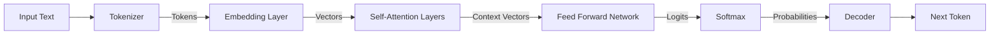

# Large Language Model (LLM) Architecture Reference

**Doc Version:** 1.0.0
**Role:** AI Systems Engineer
**Scope:** Transformers, Tokenization, and Inference

---

## 1. The Core Architecture: The Transformer

Modern LLMs (GPT, Claude, Llama) are based on the **Transformer Architecture** (Vaswani et al., 2017). Unlike RNNs that process text sequentially, Transformers process entire sequences in parallel using **Self-Attention**.

### The Mechanism of Attention
* "Attention" allows the model to weigh the importance of different words in a sentence relative to each other, regardless of distance.
* **Q, K, V Vectors**: Every token is split into Query, Key, and Value vectors.
  * *Query*: "What am I looking for?"
  * *Key*: "What do I contain?"
  * *Value*: "What information do I pass along if chosen?"

### Context Window
The "Short-term Memory" of the AI.
- **Fixed Limit**: Models have a hard limit (e.g., 8k, 32k, 128k tokens).
- **Quadratic Cost**: Attention mechanisms are traditionally $O(N^2)$ in complexity. Doubling the context window quadruples the compute required (though optimizations like FlashAttention exist).
- **Loss**: Information in the middle of a very long context window is sometimes "lost" (The *Lost in the Middle* phenomenon).

---

## 2. Tokenization: The Atomic Unit

LLMs do not see "words"; they see integers (Tokens).

### Byte-Pair Encoding (BPE)
Most models use BPE. It finds the most common pair of bytes and merges them.
- **Common words**: 1 token (e.g., "apple").
- **Rare words**: Split into sub-tokens (e.g., "DevOps" -> "Dev" + "Ops").
- **Code**: Whitespace is critical. 4 spaces might be 1 token.

> **Enterprise Implication**: 1,000 words is approximately 1,300 tokens. Pricing is per-token, not per-word. Malformed JSON with excessive whitespace wastes money.

---

## 3. Temperature & Sampling (Determinism)

LLMs are probabilistic, not deterministic. They output a probability distribution for the *next token*.

### Temperature ($T$)
Controls the randomness of the selection.
- **$T = 0$ (Greedy Decoding)**: Always pick the highest probability token. Used for **Code Generation** and **JSON extraction** where precision matters.
- **$T > 1$ (Creative)**: Flattens the distribution, allowing lower probability words to be chosen. Used for brainstorming.

### Top-P (Nucleus Sampling)
An alternative to Temperature.
- **Top-P = 0.9**: Consider only the top tokens that cumulatively make up 90% of the probability. Cuts off the "long tail" of nonsense words.

---

## 4. Visualizing the Inference Models

> **DevOps Relevance**: When integrating LLMs into pipelines (e.g., auto-generating changelogs), you MUST set **Temperature = 0** to ensure the pipeline is idempotent and reproducible.
