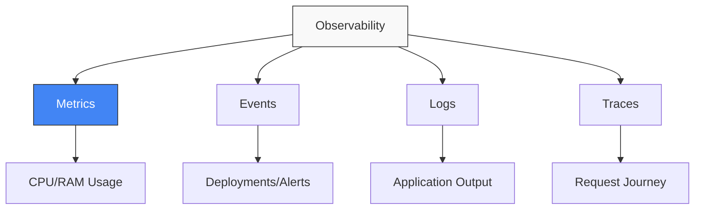

# 🟢 Part 1: The Signals

> **"You can't manage what you can't measure."**

## 📖 Overview

This part focuses on the theoretical foundations of Observability. We dive deep into the **MELT** framework—the four pillars of data that tell you everything about your system's behavior.

---

## 📊 The Four Pillars (MELT)

---

## 🎯 Learning Objectives

- ✅ Define **Metrics** (Aggregatable numbers).
- ✅ Define **Logs** (Discrete events).
- ✅ Define **Traces** (Causal chains).
- ✅ Understand when to use which signal.

---

## 🗺️ Included Modules

1. **[01-MELT-Introduction](./01-MELT-Introduction/README.md)**: A deep dive into the 4 pillars.

---

**Next Step**: Learn the pillars in **[01-MELT-Introduction](./01-MELT-Introduction/README.md)** 🚀
