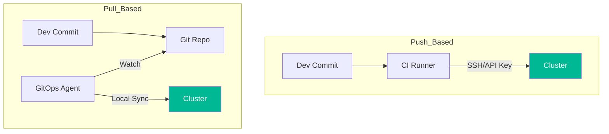

# 📉 GitOps Fundamentals (Beginner)

> **"Your Git repository is the single source of truth for your desired infrastructure state."**

## 📚 Overview

GitOps is an operational framework that takes DevOps best practices used for application development, such as version control, collaboration, compliance, and CI/CD, and applies them to infrastructure automation.

## Core Concept: The Reconciliation Loop
**[REFERENCE: GitOps Architecture](REFERENCE/GitOps-Architecture-Ref.md)**

GitOps is not just "storing YAML in Git". It is an active control loop.
- **Desired State**: What is in Git.
- **Current State**: What is in the Cluster.
- **The Operator**: A software agent (like ArgoCD) that constantly calculates `diff(Desired, Current)` and applies fixes.

> See **[GitOps-Architecture-Ref.md](REFERENCE/GitOps-Architecture-Ref.md)** for the security benefits of the Pull Model.

## 🎯 Learning Objectives

- ✅ Understand the core principle: **Git as Source of Truth**.
- ✅ Differentiate between **CI** (Continuous Integration) and **CD** (Continuous Deployment/Delivery).
- ✅ Learn the difference between **Push-based** and **Pull-based** deployments.
- ✅ Understand how "Drift" is detected and remediated.

---

## 🗺️ Curriculum Structure

| Part | Topic | Description |
| :--- | :--- | :--- |
| **[🟢 Part 1](./Part-01-The-Core-Philosophy/)** | **Philosophy** | Declarative configuration and Git principles. |
| **[🟡 Part 2](./Part-02-Architecture-Models/)** | **Architecture** | Push vs. Pull models and security implications. |

---

## 🏗️ Visual: Push vs. Pull Architectures

## 📋 Professional Pattern: Declarative Everything

Never use `kubectl edit` or `ansible-playbook` manually on production nodes. If you want to change the system, change the code in Git, and let the system reconcile itself.

---

**Next Step**: Start with **[Part 1: The Core Philosophy](./Part-01-The-Core-Philosophy/README.md)** 🚀
