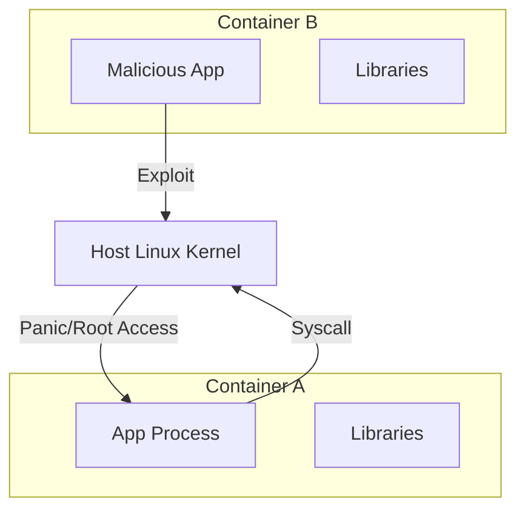

# Container Runtime Security Reference

**Doc Version:** 1.0.0
**Role:** Container Security Specialist
**Scope:** Kernel Isolation & Attack Surface

---

## 1. Containers Are Not Micro-VMs

A VM has its own Kernel. A Container shares the Host Kernel.
**The Risk**: If an attacker breaks out of a Container, they own the Host (and all other containers on it).

### Isolation Mechanisms
*   **Namespaces**: What you can *see*. (PID, Network, Mount).
*   **Cgroups**: What you can *use*. (CPU, Memory).
*   **Capabilities**: What you can *do*. (NET_ADMIN, CHOWN).

> **Governance Rule**: Never run containers as `root`. If root breaks out, they are root on the host.

---

## 2. Default Linux Capabilities

By default, Docker grants 14 capabilities (like `CHOWN`, `NET_BIND_SERVICE`).
**Best Practice**: Drop ALL, then add back only what is needed.

```yaml
securityContext:
  capabilities:
    drop:
      - ALL
    add:
      - NET_BIND_SERVICE
```

---

## 3. The Supply Chain (Image Provenance)

**The Problem**: `FROM user/image:latest`. Who is `user`?
**The Solution**: Image Signing (Cosign / Notary).

1.  **Build**: Create image.
2.  **Sign**: Sign the SHA256 digest with a private key.
3.  **Verify**: Kubernetes Admission Controller verifies the signature before allowing the pod to start.

---

## 4. Visualizing the Layers


