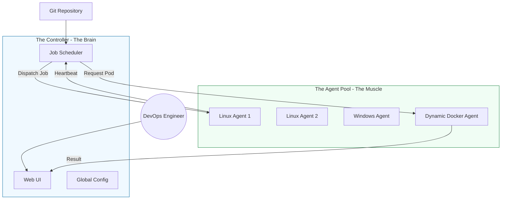

# 🏗️ Jenkins Architecture: The Brain and the Muscle

> **"Scaling Jenkins isn't just about adding more RAM; it's about distributed intelligence. A professional Jenkins setup is a well-orchestrated cluster, not a lonely monolith."**

---

## 🧠 The Mental Model: The Architect & The Builders

**The Newbie Struggle**: Running everything on one server. When a build fails or consumes too much memory, the entire Jenkins UI crashes, and no one can work.

**The Engineer Solution**: Use the **Controller-Agent Model**.

Think of it like a **Construction Site**:
1.  **The Controller (The Architect)**: Sits in the office, manages the blueprints (Pipelines), schedules the work, and ensures everyone has the right tools (Plugins). The Architect NEVER carries bricks.
2.  **The Agents (The Builders)**: They are out on the field doing the heavy lifting (Compiling code, running Docker builds, linting). If a Builder gets injured (Agent crashes), the Architect simply hires another one. The office remains safe and functional.

---

### 🎨 Visual: Master-Agent Workflow

---

## 🆚 Junior Way vs. Engineer Way

| Feature | The Junior Way (Problematic) | The Engineer Way (Production-ready) |
|:---|:---|:---|
| **Build Location** | Build on the Controller (dangerous) | Builds ONLY on remote Agents |
| **Agent Scaling** | Static VMs always running (Full cost) | Dynamic/Ephemeral Agents (Start on demand) |
| **Executors** | 50 executors on one machine | Distributed executors across a cluster |
| **OS Support** | Only builds for Linux | Mixed Agent pool (Linux, Windows, MacOS) |
| **Security** | Controller UI open to the internet | Controller behind VPN; Agents in private subnet |
| **Isolation** | Jobs share the same workspace | Every job runs in an isolated container |

---

## 🏗️ Core Architectural Components

### 1. The Controller (Central Nervous System)
*   **Role**: Monitoring, Scheduling, and Configuration.
*   **Security Tip**: **Executor Count = 0**. Set the decimal of executors on the Controller to zero to force it to use Agents for everything.

### 2. The Agents (The Workers)
*   **Workspaces**: Temporary storage for the code during the build.
*   **Executors**: The individual "threads" or slots available on an agent to run a job.
*   **Connectivity Options**:
    *   **SSH**: The most secure and common for Linux.
    *   **JNLP (Inbound)**: Best for Windows or agents behind a firewall/NAT.

---

## 🎤 Interview Preparation

### 🎯 Core Concepts
1. **Q: Why should you avoid running builds on the Jenkins Controller?**
   - *A: Resource exhaustion (CPU/RAM) and security risk. A malicious build script could easily access system-level Jenkins configurations or secrets if run directly on the Controller.*

2. **Q: What is the difference between an "Agent" and a "Node"?**
   - *A: In Jenkins terminology, a **Node** is any machine that can run a job (this includes the Controller and Agents). An **Agent** specifically refers to the remote worker machine.*

3. **Q: How do you handle a scenario where you have 50 teams needing to run builds at the same time?**
   - *A: Implement **Dynamic Cloud Agents**. Configure Jenkins to spin up Docker containers or Kubernetes pods on-demand using plugins like the "Kubernetes Plugin" or "Amazon EC2 Plugin".*

### 🚀 Advanced Questions
4. **Q: What is a "Sticky Agent" and why might it be bad?**
   - *A: A sticky agent is one where builds consistently run on the same persistent VM. This can lead to "Workspace Drift" where old files from previous builds affect new ones. Ephemeral (one-time use) agents are preferred for purity.*

5. **Q: How does the "Remoting" protocol work in Jenkins?**
   - *A: It is a Java-based communication layer that allows the Controller to send commands and file payloads to the Agents. It requires Java to be installed on both the Controller and all Agents.*

---

## 📝 Knowledge Check

1. **What is the primary role of the Jenkins Controller?**
   - [ ] a) Running shell scripts
   - [x] b) Orchestration and Configuration
   - [ ] c) Storing build artifacts

2. **True/False: An agent can have multiple executors.**
   - [x] **True**. They can run jobs in parallel based on CPU capability.

3. **Which connection method is best for an agent inside a private network without a public IP?**
   - [x] JNLP / Inbound Agent.

---

## 🎯 Next Steps
*   **[Installation and Setup](../03-Installation-and-Setup/README.md)**: Putting theory into practice with Docker.
