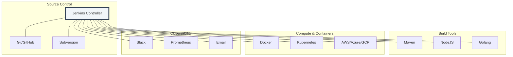

# 🏗️ Integrations & Plugins: The Ecosystem Hub

> **"Jenkins is a skeleton; plugins are the muscles, nerves, and skin. Without them, it's just a scheduler. With them, it's a global orchestration engine."**

---

## 🧠 The Mental Model: The Ecosystem Hub

**The Junior Struggle**: Installing every plugin they see. This leads to "Plugin Hell," where updates break the system, security vulnerabilities are common, and the UI becomes slow and cluttered.

**The Engineer Solution**: Use the **Selective Integration** approach.

Think of Jenkins Plugins like **Apps on a Smartphone**:
1.  **Native Features (The OS)**: Simple scheduling and shell execution.
2.  **Essential Apps (The Plugins)**: You need a browser (Git), a camera (Docker), and messaging (Slack).
3.  **Vetting (Security)**: You don't install a flashlight app that asks for your contact list. Similarly, you only install highly-rated, maintained Jenkins plugins to keep the platform secure.

---

### 🎨 Visual: The Integration Map



---

## 🆚 Junior Way vs. Engineer Way

| Feature | The Junior Way (Problematic) | The Engineer Way (Production-ready) |
|:---|:---|:---|
| **Plugin Count** | 200+ (Slow, insecure, unmanaged) | 30-50 (Lean, vetted, essential) |
| **Updates** | Never update / Update in production | Staged updates in a test environment |
| **Secrets** | Hardcoded in scripts or files | **Jenkins Credentials Store** (Masked) |
| **Triggers** | Polling every 1 minute (Heavy load) | **Webhooks** (Instant, event-driven) |
| **Notifications**| Email flood (Ignored by everyone) | Targeted Slack/Discord notifications |
| **Plugins** | Installed via GUI only | Defined in a `plugins.txt` for automation |

---

## 🔐 The "Secrets" Strategy: Credentials Manager

The Credentials Manager is the most critical part of Jenkins integrations. It allows you to store sensitive data (SSH keys, API tokens, Passwords) and inject them into pipelines without them ever appearing in the logs.

### Production Pattern: Using Secrets in your Jenkinsfile
```groovy
pipeline {
    agent any
    stages {
        stage('Deploy to Cloud') {
            steps {
                // withCredentials masks the secret in the console output!
                withCredentials([string(credentialsId: 'PROD_API_KEY', variable: 'API_KEY')]) {
                    sh "curl -X POST -H 'Authorization: Bearer ${API_KEY}' https://api.cloud.com/deploy"
                }
            }
        }
    }
}
```

---

## 🎤 Interview Preparation

### 🎯 Core Concepts
1. **Q: What is a Jenkins Plugin and how does it extend functionality?**
   - *A: A plugin is a Java-based module that interfaces with the Jenkins core to add new features, such as connecting to a specific SCM, adding a new UI theme, or integrating with a cloud provider.*

2. **Q: How do you handle secrets (like AWS keys) in Jenkins without exposing them?**
   - *A: By using the **Credentials Store**. We save the secret as a specific credential type (Secret text, Username/Password, etc.) and assign it a unique ID. We then use the `withCredentials` wrapper in our pipeline to inject it as an environment variable.*

3. **Q: Why are Webhooks preferred over SCM Polling?**
   - *A: Polling is inefficient; it consumes resources by constantly checking the repo for changes. Webhooks are **Push-based**; the Git server notifies Jenkins the instant a change happens, resulting in lower latency and less server load.*

### 🚀 Advanced Questions
4. **Q: Explain the "Plugin Dependency Hell" and how to avoid it.**
   - *A: This happens when one plugin requires version A of a library and another requires version B. To avoid this, we use a "Staging Jenkins" to test updates and use tools like the "Configuration as Code" plugin to maintain an immutable list of compatible plugin versions.*

5. **Q: How do you verify the health and security of a plugin before installing it?**
   - *A: Check the **Jenkins Security Advisories**. Look for the "Security Warning" badge in the marketplace, verify the "Last Released" date, and check the number of active installs to ensure it is a community-standard tool.*

---

## 📝 Knowledge Check

1. **Which plugin is required to allow Jenkins to spin up agents in Kubernetes?**
   - [ ] a) Git Plugin
   - [x] b) Kubernetes Plugin
   - [ ] c) Pipeline Plugin

2. **True/False: Jenkins will automatically hide (mask) credentials if they are printed in the build logs using 'echo'.**
   - [x] **True**. If managed via the Credentials Store, Jenkins will replace the value with `****` in the console.

3. **What is the standard URL suffix for a Jenkins GitHub Webhook?**
   - [x] `/github-webhook/`

---

## 🎯 Next Steps
*   **[GitHub Actions Foundations](../../02-GitHub-Actions-Foundations/README.md)**: Learning the cloud-native alternative to Jenkins.
*   **[GitLab CI Basics](../../03-GitLab-CI-Basics/README.md)**: Handling the entire lifecycle in one platform.
