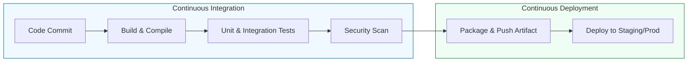

# 🏗️ CI/CD Foundations: The Software Factory Engine
> **"Development is the act of creation. CI/CD is the act of replication and delivery. In a modern enterprise, if it isn't in a pipeline, it doesn't exist."**

---

## 🧠 The Mental Model: The Automated Pizza Shop

**The Newbie Struggle**: "I can just run `npm build` and `scp` the file to my server. Why do I need to learn Jenkins or GitHub Actions? It seems like a lot of YAML for something I can do in 2 minutes."

**The Engineer Solution**: You realize that while you *can* do it in 2 minutes, you can't do it 100 times a day consistently without making a mistake. You also can't do it while you are sleeping.

Think of it like a **Pizza Shop**:
1.  **The Order (Git Commit)**: A developer places an order by pushing code.
2.  **The Prep (Continuous Integration)**: The dough is rolled, the sauce is added (Code is compiled, dependencies are downloaded).
3.  **The Quality Check (Testing)**: The pizza is inspected (Unit tests, Linting, Security scans). If it's burnt, it never leaves the kitchen.
4.  **The Delivery (Continuous Deployment)**: The pizza is boxed and sent to the customer (The code is containerized and shipped to the Cloud).

---

## 📋 CI/CD Tool Comparison
| Feature | Jenkins | GitHub Actions | GitLab CI |
| :--- | :--- | :--- | :--- |
| **Philosophy** | The "Swiss Army Knife" (Customizable) | The "Native Integrated" (Fast) | The "All-in-One" (Consistent) |
| **Hosting** | Self-Managed (Your Server) | SaaS (GitHub Managed) | SaaS or Self-Managed |
| **Logic** | Groovy Scripts (Jenkinsfile) | YAML Workflows | YAML Pipelines |
| **Scale** | Master/Agent Architecture | Runner Pools | GitLab Runner |

---

## 🛠️ The Standard Pipeline Flow

---

## 🏗️ Core Concept: The DAG Execution Model
**[REFERENCE: Pipeline Orchestration Patterns](./REFERENCE/Pipeline-Orchestration-Patterns-Ref.md)**

Modern CI/CD is not a linear script; it's a **Directed Acyclic Graph (DAG)**.
- **Parallelization**: Jobs with no dependencies (e.g., testing on Linux and Windows) execute simultaneously, reducing total pipeline time.
- **Fan-Out/Fan-In**: Matrix testing spawns dozens of parallel jobs that converge into a single reporting job.
- **Artifact Passing**: Jobs are isolated. To share data, you MUST explicitly upload/download artifacts.

> [!TIP]
> **The 10-Minute Rule**: A Senior SRE aims for a full CI cycle (commit to test result) of under 10 minutes. If it takes longer, developers lose focus and productivity drops.

---

## 🛡️ Enterprise Governance & Security
**[REFERENCE: Jenkins Architecture](./REFERENCE/Jenkins-Architecture-Deep-Dive-Ref.md)** | **[REFERENCE: Artifact Registry](./REFERENCE/Artifact-Registry-Governance-Ref.md)**

At scale, CI/CD is a **trust boundary**:
- **Controller Isolation**: The Jenkins Controller must NEVER execute builds (RCE risk). Only agents run untrusted code.
- **Immutable Artifacts**: Once `app-1.0.0.jar` is published to Nexus, it cannot be overwritten. This guarantees reproducibility.
- **Credential Segregation**: Use service accounts with minimal permissions. Rotate tokens quarterly.
- **Snapshot Prohibition**: NEVER deploy `-SNAPSHOT` versions to production. They are mutable and non-reproducible.

---

## 🗺️ Curriculum Path

### 🏗️ 01. Jenkins Mastery
The industry-standard orchestrator for self-managed enterprise pipelines.
*   **[Introduction to CI/CD](./01-Jenkins-Mastery/01-Introduction-to-CI-CD/README.md)**: Core theory and tool comparison.
*   **[Jenkins Architecture](./01-Jenkins-Mastery/02-Jenkins-Architecture/README.md)**: Scaling the brain and the muscle.
*   **[Installation & Setup](./01-Jenkins-Mastery/03-Installation-and-Setup/README.md)**: Docker vs. Native deployment.
*   **[Pipelines as Code](./01-Jenkins-Mastery/04-Pipelines-as-Code/README.md)**: Mastering the `Jenkinsfile`.
*   **[Integrations & Plugins](./01-Jenkins-Mastery/05-Integrations-and-Plugins/README.md)**: Webhooks, Secrets, and Tooling.

### 🌐 02. GitHub Actions Foundations
*   **[YAML Workflows](./02-GitHub-Actions-Foundations/README.md)**: Modern, cloud-native automation directly inside GitHub.
*   **[CHALLENGES](./02-GitHub-Actions-Foundations/CHALLENGES.md)**: Matrix builds and Conditional releases.

### 🦊 03. GitLab CI Basics
*   **[Integrated DevOps](./03-GitLab-CI-Basics/README.md)**: Handling the entire lifecycle in one platform.
*   **[CHALLENGES](./03-GitLab-CI-Basics/CHALLENGES.md)**: Artifact passing and Environments.

### 📦 04. Artifact Registry Management
*   **[JFrog & Nexus](./04-Artifact-Registry-Management/README.md)**: Storing and versioning binaries safely.
*   **[CHALLENGES](./04-Artifact-Registry-Management/CHALLENGES.md)**: Local Nexus setup and Retention policies.

---

## 🚀 Why does a DevOps Engineer care?
As a DevOps engineer, you are measured by the **Cycle Time** (time from code commit to production).
> [!NOTE]
> If a critical bug is found in production at 5:00 PM, a robust CI/CD pipeline allows the team to push a fix in minutes. Without it, the "Friday Afternoon Outage" becomes a weekend-ruining nightmare.

---

## 🎯 Getting Started
Begin with the **[Introduction to CI/CD Foundations](./01-Jenkins-Mastery/01-Introduction-to-CI-CD/README.md)** to understand the high-level theory.
