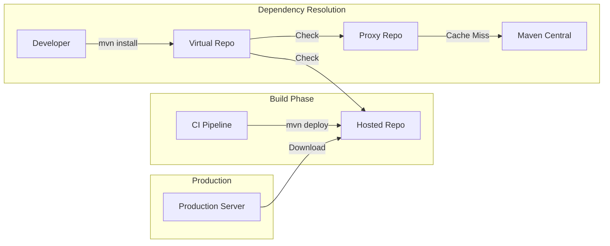

# Artifact Registry Governance Reference

**Doc Version:** 1.0.0
**Role:** Release Engineer
**Scope:** Binary Repository Management & Supply Chain Security

---

## 1. The Role of Artifact Registries

An **Artifact Registry** (Nexus, Artifactory, GitHub Packages) is the **Single Source of Truth** for compiled binaries.

### Why Not Git?
Git is for **source code**, not **binaries**:
- **Size**: A 500MB Docker image bloats Git history forever
- **Versioning**: Git tracks changes; registries track releases
- **Access Control**: Different teams need different permissions (Developers can read, only CI can write)

---

## 2. Repository Types

### A. Hosted (Internal)
Stores artifacts built by your organization.
- **Use Case**: Your company's JARs, Docker images, NPM packages
- **Write Access**: CI/CD pipelines only
- **Read Access**: Developers, production servers

### B. Proxy (Cache)
Mirrors external repositories (Maven Central, Docker Hub).
- **Use Case**: Cache third-party dependencies
- **Benefits**:
  - **Speed**: Download once, serve locally
  - **Stability**: If Maven Central goes down, your builds still work
  - **Security**: Scan/block malicious packages at the proxy level

### C. Virtual (Aggregator)
Combines multiple repositories into a single endpoint.
- **Use Case**: Developers configure one URL, get access to both internal and proxied artifacts

---

## 3. Immutability & Versioning

### Release Repositories
- **Rule**: Once published, a version is **immutable**
- **Example**: `myapp-1.0.0.jar` can NEVER be overwritten
- **Enforcement**: Nexus/Artifactory reject re-uploads of existing versions
- **Benefit**: Reproducibility. If you deploy `1.0.0` today and rollback to `1.0.0` next year, it's the **exact same bytes**

### Snapshot Repositories
- **Rule**: Versions ending in `-SNAPSHOT` are **mutable**
- **Example**: `myapp-1.0.0-SNAPSHOT.jar` can be overwritten 100 times
- **Use Case**: Development/testing only
- **Governance**: **NEVER** deploy snapshots to production

---

## 4. Access Control & Security

### Authentication
- **Service Accounts**: CI/CD pipelines use dedicated accounts (not personal credentials)
- **Token-Based**: Use short-lived tokens, not passwords
- **Rotation**: Rotate credentials quarterly

### Authorization (RBAC)
| Role | Hosted Repo | Proxy Repo | Virtual Repo |
|:---|:---|:---|:---|
| **Developer** | Read | Read | Read |
| **CI Pipeline** | Read + Write | Read | Read |
| **Admin** | Full | Full | Full |

### Vulnerability Scanning
Modern registries integrate with scanners (Trivy, Grype):
1. Artifact is uploaded
2. Registry triggers scan
3. If Critical CVE found, mark artifact as "Quarantined"
4. Block downloads of quarantined artifacts

---

## 5. Retention Policies

Storage is expensive. Define lifecycle rules:
- **Snapshots**: Delete after 30 days
- **Releases**: Keep forever (or 7 years for compliance)
- **Docker Images**: Keep last 10 tags per image

---

## 6. Visualizing the Flow

> **Enterprise Pattern**: Use **Promotion Pipelines**. Artifacts move from `dev-repo` → `qa-repo` → `prod-repo`. Each promotion is an audit event, creating a paper trail for compliance.
