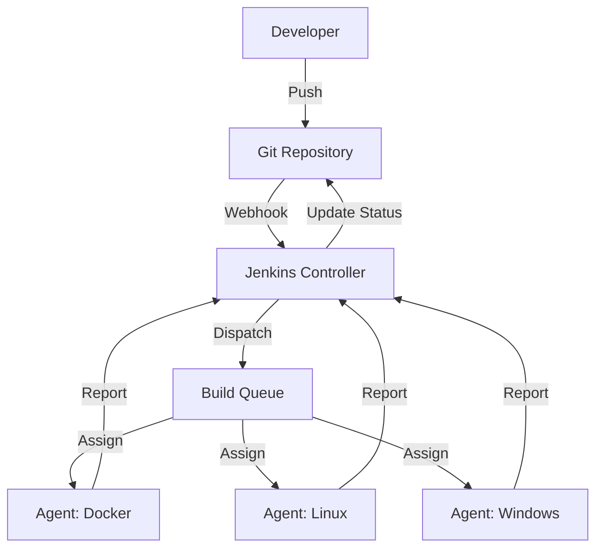

# Jenkins Architecture Deep Dive Reference

**Doc Version:** 1.0.0
**Role:** Jenkins Administrator
**Scope:** Master/Agent, Plugin Ecosystem, and Groovy DSL

---

## 1. The Master/Agent Architecture

Jenkins uses a **distributed build system** to scale horizontally.

### The Controller (Master)
- **Responsibilities:**
  - Serves the Web UI
  - Manages build queue and scheduling
  - Stores build history and logs
  - Handles authentication/authorization
  - Distributes jobs to agents
- **Security Rule**: The Controller should **NEVER** execute builds directly. Executing untrusted code on the Controller is a Remote Code Execution (RCE) vulnerability.

### The Agent (Node/Slave)
- **Responsibilities:**
  - Checks out source code
  - Executes build scripts
  - Uploads artifacts
  - Reports status back to Controller
- **Connection Methods:**
  - **SSH**: Controller initiates SSH connection to agent
  - **JNLP**: Agent initiates connection to Controller (firewall-friendly)
  - **Docker**: Ephemeral agents spawned on-demand

---

## 2. The Plugin Ecosystem

Jenkins is essentially a **plugin execution framework**. The core is minimal; all functionality comes from plugins.

### Critical Plugins
| Plugin | Purpose | Security Note |
|:---|:---|:---|
| **Git** | SCM integration | Credentials stored in Jenkins Credential Store |
| **Pipeline** | Jenkinsfile support | Groovy sandbox prevents arbitrary code execution |
| **Docker** | Container-based agents | Requires Docker socket access (privileged) |
| **Blue Ocean** | Modern UI | Deprecated in favor of new UI |
| **Credentials** | Secret management | Encrypted at rest, decrypted at runtime |

### Plugin Security
- **Update Regularly**: Plugins are the #1 attack vector. CVEs are published frequently.
- **Minimize**: Only install what you need. Each plugin increases attack surface.

---

## 3. Declarative vs. Scripted Pipelines

### Declarative (Recommended)
Structured, opinionated syntax. Enforces best practices.
```groovy
pipeline {
    agent any
    stages {
        stage('Build') {
            steps {
                sh 'mvn clean package'
            }
        }
    }
}
```

### Scripted (Advanced)
Full Groovy programming. Maximum flexibility, maximum risk.
```groovy
node {
    stage('Build') {
        sh 'mvn clean package'
    }
}
```

**Governance**: Declarative pipelines run in a **Groovy Sandbox** that restricts dangerous operations. Scripted pipelines require admin approval for non-whitelisted methods.

---

## 4. The Workspace Lifecycle

Each build gets a **workspace** directory on the agent:
- **Path**: `${JENKINS_HOME}/workspace/${JOB_NAME}`
- **Persistence**: Workspace persists between builds (for caching)
- **Cleanup**: Use `cleanWs()` to delete workspace after build

**Anti-Pattern**: Relying on workspace state between builds. This creates non-reproducible builds.

---

## 5. Credential Management

Jenkins stores secrets in an encrypted credential store.

### Types
- **Username/Password**: Basic auth
- **SSH Key**: For Git/SSH connections
- **Secret Text**: API tokens
- **Certificate**: TLS client certs

### Access Control
Credentials can be scoped:
- **System**: Available to all jobs
- **Folder**: Available only to jobs in specific folder
- **Job**: Available only to specific job

**Security**: Credentials are injected as environment variables at runtime and masked in logs (`****`).

---

## 6. Visualizing the Architecture



> **Enterprise Pattern**: Use **Ephemeral Docker Agents** for maximum isolation. Each build gets a fresh container, preventing cross-contamination and configuration drift.
