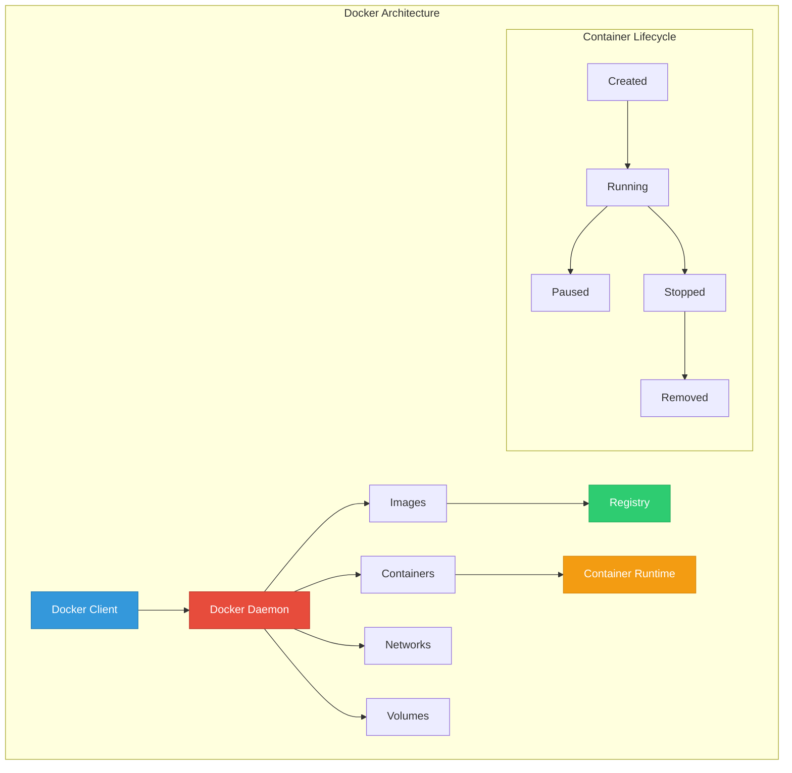

# Docker: Interview Questions, Quiz & Scenarios

Master containerization fundamentals and prepare for DevOps technical interviews.

---

## ❓ Interview Questions (Docker Fundamentals)

1. **What is Docker and how does it differ from virtual machines?**
   - *Answer*: Docker is a containerization platform that packages applications with their dependencies. Unlike VMs that virtualize hardware, containers share the host OS kernel, making them lighter and faster to start.

2. **Explain the difference between Docker images and containers.**
   - *Answer*: A Docker **image** is a read-only template used to create containers. A **container** is a running instance of an image with its own filesystem, network, and process space.

3. **What is a Dockerfile and what are its key instructions?**
   - *Answer*: A Dockerfile is a text file with instructions to build Docker images. Key instructions include `FROM` (base image), `RUN` (execute commands), `COPY/ADD` (copy files), `EXPOSE` (ports), `CMD/ENTRYPOINT` (startup commands).

4. **How do Docker networks work and what are the different types?**
   - *Answer*: Docker networks enable container communication. Types include **bridge** (default, isolated network), **host** (uses host networking), **overlay** (multi-host), **macvlan** (MAC addresses), and **none** (no networking).

5. **What are Docker volumes and why are they important?**
   - *Answer*: Volumes provide persistent data storage for containers. They exist outside the container lifecycle, enabling data persistence, sharing between containers, and backup/restore operations.

6. **Explain Docker Compose and its use cases.**
   - *Answer*: Docker Compose is a tool for defining and running multi-container applications using YAML files. It's used for development environments, testing, and simple production deployments.

7. **What is the difference between CMD and ENTRYPOINT?**
   - *Answer*: **CMD** provides default arguments that can be overridden. **ENTRYPOINT** defines the main command that always runs. They can be used together where ENTRYPOINT is the command and CMD provides default arguments.

8. **How do you optimize Docker images for production?**
   - *Answer*: Use multi-stage builds, minimize layers, use specific tags, remove unnecessary packages, use .dockerignore, choose minimal base images (Alpine), and scan for vulnerabilities.

9. **What are Docker registries and how do they work?**
   - *Answer*: Registries store and distribute Docker images. Docker Hub is the default public registry. Private registries like AWS ECR, Azure ACR provide secure image storage with access controls.

10. **How do you handle secrets in Docker containers?**
    - *Answer*: Use Docker secrets (Swarm mode), environment variables (for non-sensitive config), external secret management (Vault, AWS Secrets Manager), or mount secret files as volumes.

11. **What is Docker Swarm and how does it compare to Kubernetes?**
    - *Answer*: Docker Swarm is Docker's native orchestration tool. It's simpler than Kubernetes but less feature-rich. Kubernetes offers more advanced scheduling, networking, and ecosystem support.

12. **Explain Docker security best practices.**
    - *Answer*: Run as non-root user, use minimal base images, scan for vulnerabilities, limit container capabilities, use read-only filesystems, implement network segmentation, and keep Docker updated.

13. **What are multi-stage builds and their benefits?**
    - *Answer*: Multi-stage builds use multiple FROM statements in a Dockerfile to create smaller final images. Benefits include reduced image size, separation of build and runtime dependencies, and improved security.

14. **How do you troubleshoot container networking issues?**
    - *Answer*: Use `docker network ls`, `docker inspect`, check port mappings, verify firewall rules, test connectivity with `docker exec`, and examine container logs for network errors.

15. **What is the difference between COPY and ADD instructions?**
    - *Answer*: **COPY** simply copies files/directories. **ADD** has additional features like extracting tar files and downloading from URLs, but COPY is preferred for simple file copying due to transparency.

16. **How do you implement health checks in Docker?**
    - *Answer*: Use the `HEALTHCHECK` instruction in Dockerfile or `--health-cmd` flag. Health checks test if the container is working properly and can trigger automatic restarts or load balancer removal.

17. **What are Docker build contexts and why do they matter?**
    - *Answer*: Build context is the set of files sent to Docker daemon during build. Large contexts slow builds and increase image size. Use .dockerignore to exclude unnecessary files.

18. **Explain Docker layer caching and how to optimize it.**
    - *Answer*: Docker caches each layer during builds. To optimize: order instructions from least to most frequently changing, combine RUN commands, use specific COPY commands, and leverage build cache.

19. **How do you monitor Docker containers in production?**
    - *Answer*: Use `docker stats`, container logs (`docker logs`), monitoring tools (Prometheus, Grafana), log aggregation (ELK stack), and health checks. Monitor CPU, memory, network, and disk usage.

20. **What are the limitations of Docker and when might you choose alternatives?**
    - *Answer*: Limitations include security concerns with shared kernel, complexity in networking, and orchestration needs. Alternatives include Podman (rootless), containerd (minimal runtime), or VMs for stronger isolation.

---

## 🧠 Docker Knowledge Quiz (20+ Questions)

<b>1. What is the default network driver for Docker containers?</b>

Show Answer

Answer: bridge

<b>2. Which command creates a new Docker container from an image?</b>

Show Answer

Answer: docker run

<b>3. What does the -d flag do in docker run?</b>

Show Answer

Answer: Runs the container in detached mode (background)

<b>4. Which instruction in Dockerfile sets the working directory?</b>

Show Answer

Answer: WORKDIR

<b>5. What is the purpose of .dockerignore file?</b>

Show Answer

Answer: Excludes files and directories from the build context

<b>6. Which command shows running Docker containers?</b>

Show Answer

Answer: docker ps

<b>7. What is the difference between docker stop and docker kill?</b>

Show Answer

Answer: docker stop sends SIGTERM (graceful), docker kill sends SIGKILL (immediate)

<b>8. Which port mapping flag exposes container port 80 to host port 8080?</b>

Show Answer

Answer: -p 8080:80

<b>9. What does docker exec -it container_name bash do?</b>

Show Answer

Answer: Opens an interactive bash shell inside the running container

<b>10. Which Docker Compose command starts services in detached mode?</b>

Show Answer

Answer: docker-compose up -d

<b>11. What is the purpose of EXPOSE instruction in Dockerfile?</b>

Show Answer

Answer: Documents which ports the container listens on (doesn't actually publish)

<b>12. Which command removes all stopped containers?</b>

Show Answer

Answer: docker container prune

<b>13. What is the default restart policy for Docker containers?</b>

Show Answer

Answer: no (containers don't restart automatically)

<b>14. Which volume type persists data on the Docker host?</b>

Show Answer

Answer: Named volumes or bind mounts

<b>15. What does the --rm flag do in docker run?</b>

Show Answer

Answer: Automatically removes the container when it exits

<b>16. Which command shows Docker container logs?</b>

Show Answer

Answer: docker logs

<b>17. What is the purpose of multi-stage builds?</b>

Show Answer

Answer: Create smaller final images by separating build and runtime environments

<b>18. Which instruction sets environment variables in Dockerfile?</b>

Show Answer

Answer: ENV

<b>19. What does docker system prune do?</b>

Show Answer

Answer: Removes unused containers, networks, images, and build cache

<b>20. Which network mode gives containers direct access to host networking?</b>

Show Answer

Answer: host

<b>21. What is the purpose of HEALTHCHECK instruction?</b>

Show Answer

Answer: Defines how to test if the container is working properly

<b>22. Which command builds a Docker image from a Dockerfile?</b>

Show Answer

Answer: docker build

<b>23. What does the -v flag do in docker run?</b>

Show Answer

Answer: Mounts a volume or bind mount

<b>24. Which Docker Compose file version is recommended for production?</b>

Show Answer

Answer: Version 3.x (latest stable)

<b>25. What is the purpose of USER instruction in Dockerfile?</b>

Show Answer

Answer: Sets the user for subsequent RUN, CMD, and ENTRYPOINT instructions

---

## 🏗️ Real-Life Scenarios

### Scenario 1: The Bloated Image Problem
**Problem**: Development team's Docker image is 2GB, causing slow deployments and high storage costs.
**Investigation**: Image contains full OS, development tools, and source code.
**Solution**: Implemented multi-stage build, used Alpine base image, and optimized layer caching. Reduced image size to 200MB (90% reduction).

### Scenario 2: Container Memory Leak
**Problem**: Production containers consuming increasing memory until host runs out of resources.
**Investigation**: Application has memory leak, no resource limits set on containers.
**Solution**: Added memory limits (`--memory=512m`), implemented health checks, and configured restart policies. Set up monitoring to track memory usage trends.

### Scenario 3: Networking Connectivity Issues
**Problem**: Containers can't communicate with each other in production environment.
**Investigation**: Using default bridge network, containers on different hosts.
**Solution**: Created custom bridge network for single-host communication, implemented overlay network for multi-host setup, and configured proper DNS resolution.

### Scenario 4: Data Loss After Container Restart
**Problem**: Database data lost when container restarts during maintenance.
**Investigation**: Database files stored in container filesystem, not using volumes.
**Solution**: Implemented named volumes for data persistence, set up backup procedures, and documented volume management practices.

### Scenario 5: Security Vulnerability Exposure
**Problem**: Security scan revealed critical vulnerabilities in production containers.
**Investigation**: Using outdated base images, running as root user, unnecessary packages installed.
**Solution**: Updated to latest base images, created non-root user, removed unnecessary packages, implemented vulnerability scanning in CI/CD pipeline.

---

## 📊 Docker Architecture Diagram

---

## ✅ Knowledge Check
- [ ] Understand Docker architecture and components
- [ ] Master Dockerfile best practices and optimization
- [ ] Configure Docker networking and volumes
- [ ] Implement security best practices
- [ ] Troubleshoot common Docker issues
- [ ] Use Docker Compose for multi-container applications