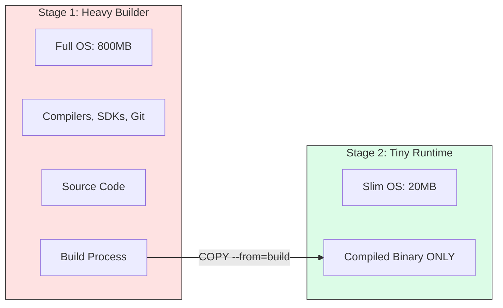

# 🏗️ Module 16: Multi-Stage Build Mastery

> **"A Dockerfile is not just a script; it's an assembly line. You use heavy machinery at the start to build the product, but you only ship the finished box to the customer."**



## 📚 Overview

Why do our production images contain compilers, source code, and secrets? They shouldn't. **Multi-Stage Builds** allow you to use a "Heavy" image to compile your code and a "Tiny" image to actually run it. This reduces your image size by up to **90%**, speeds up deployments, and drastically improves security by removing build-time attack tools.

## 🎓 Learning Objectives

By the end of this module, you will:
- ✅ Eliminate "Image Bloat" using the **`AS`** and **`COPY --from`** keywords.
- ✅ Master the **Binary Extraction** pattern (Go, Rust).
- ✅ Implement **Layer Caching** for lightning-fast builds.
- ✅ Use **Targeted Builds** for Dev, Test, and Prod in one file.
- ✅ Deploy **Distroless** images for maximum security.

---

## 🏗️ The Multi-Stage Anatomy

### The "Before" (Single Stage)
```dockerfile
FROM golang:1.21
WORKDIR /app
COPY . .
RUN go build -o main .
CMD ["./main"] 
# Result: 800MB (Image contains Go SDK, Git, cache, etc.)
```

### The "After" (Multi-Stage)
```dockerfile
# STAGE 1: The Builder
FROM golang:1.21-alpine AS builder
WORKDIR /build
COPY . .
RUN go build -o my-app .

# STAGE 2: The Final Product
FROM alpine:3.18
WORKDIR /app
COPY --from=builder /build/my-app .
CMD ["./my-app"]
# Result: 15MB (Image contains ONLY the binary and a tiny OS)
```

---

## 🚀 Professional Pattern: Multi-Target Build

You can use one Dockerfile for your entire development lifecycle by naming your stages and building only up to a specific one.

```dockerfile
FROM node:18 AS base
WORKDIR /app
COPY package.json .

FROM base AS development
RUN npm install
COPY . .
CMD ["npm", "run", "dev"]

FROM base AS production
RUN npm ci --only=production
COPY src . 
CMD ["node", "app.js"]
```
**Usage**:
```bash
docker build --target development -t app:dev .
```

---

## 🏆 Real-World DevOps Story: The Jenkins Server That Ran Out Of Disk

**The Scenario**: A company was building 50 microservices a day on a single Jenkins server. Each service used a traditional 1GB base image.
**The Crisis**: By Wednesday, the Jenkins server would crash because its SSD was 100% full of old build layers. 
**The Fix**: A DevOps Engineer converted the entire team to **Multi-Stage Builds** and **Alpine** bases. 
**The Discovery**: The final images dropped from 1GB to 40MB. The "Build-Push-Deploy" cycle went from 5 minutes to 45 seconds because there was so much less data to move over the network.
**The Lesson**: **Efficiency is a force multiplier.** Small images save disk, bandwidth, and money.

---

## 🚀 Professional Pattern: The Secret-Less Builder

Never bake your GitHub tokens or SSH keys into an image. Use **BuildKit Mounts** to inject secrets that vanish as soon as the build is done.

```dockerfile
RUN --mount=type=secret,id=my_token \
    TOKEN=$(cat /run/secrets/my_token) && \
    npm install
```
*Because this happened in a build stage that isn't the final one, even a hacker who gets the final image can't find the token.*

---

## ❓ Interview Preparation (Multi-Stage Builds)

1. **Q: What is the main security benefit of a multi-stage build?**
   *A: It reduces the 'Attack Surface'. By excluding compilers (gcc), package managers (apt), and source code from the final image, an attacker who gains access to the container has no tools available to compile exploits, scan the network, or steal secrets hidden in the code.*

2. **Q: How can you build an image from a Dockerfile that has 5 stages, but you only want the first 2?**
   *A: Use the `--target` flag with `docker build`. For example: `docker build --target test-stage -t my-app:test .`.*

3. **Q: Can you copy files from a completely different image into your final stage?**
   *A: Yes! You can use `COPY --from=nginx:latest /etc/nginx/nginx.conf /my-config/`. This is a powerful way to borrow configuration files or binaries from official images.*

4. **Q: Why should you use 'npm ci' instead of 'npm install' in a build stage?**
   *A: `npm ci` (Clean Install) is designed for automated environments. It is faster, more reliable (requires a lockfile), and ensures that you get the exact same versions every time the build runs.*

5. **Q: What does 'AS' do in the 'FROM' instruction?**
   *A: It gives a nickname to that build stage. You can then reference that nickname later in the Dockerfile using `--from=nickname` to pull artifacts out of it.*

---

## 📝 Knowledge Check

1. **Which keyword allows you to extract a file from a previous build stage?**
   - [ ] a) `MOVE`
   - [x] b) `COPY --from`
   - [ ] c) `EXTRACT`

2. **What is the primary goal of the "Last Stage" in a Multi-Stage Dockerfile?**
   - [ ] a) To compile the code
   - [x] b) To provide the smallest and most secure runtime environment possible
   - [ ] c) To install development tools

3. **In the instruction `FROM node:18 AS builder`, what is "builder"?**
   - [ ] a) A Docker command
   - [ ] b) The name of the final image
   - [x] c) An alias for that specific build stage

4. **True or False: Using a Multi-Stage build makes the final image pull faster from a registry.**
   - [x] True (Because it is significantly smaller)
   - [ ] False

5. **Which base image is almost always used in the final stage of a Go or Rust application to keep size minimal?**
   - [ ] a) `ubuntu`
   - [x] b) `alpine` or `scratch`
   - [ ] c) `python:slim`

---

## 🔗 Next Steps

The images are lean and mean. Now let's learn how to organize them in our own private vault.

Proceed to: **[Module 04: Private Registry](../04-Private-Registry/README.md)** →
