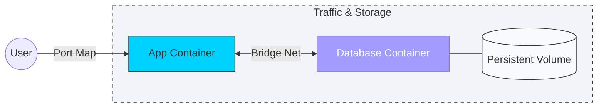

# 🌐 Module 01: Networking & Storage

> **"Containers are ephemeral. Data is forever. Networking is how they talk. Mastering these is the difference between a standalone script and a global system."**

## 📚 Overview

By default, Docker containers are "Islands"—isolated from the host and each other. While this is great for security, real-world applications need to talk to databases, store user uploads, and reach the public internet.

In this module, we transition from **Stateless** computing to **Stateful** systems. We learn how to manage the "Virtual Bridges" of Docker networking and the "External Hard Drives" of Docker Volumes.

## 🎯 Learning Objectives

- ✅ Implement **Service Discovery** using Docker's internal DNS.
- ✅ Protect sensitive data using **Volume Persistance**.
- ✅ Reduce image sizes by 90% using **Multi-Stage Builds**.
- ✅ Deploy a **Private Registry** to keep corporate IP secure.
- ✅ Configure **Nginx** as a secure gateway for containerized traffic.

## 🆚 Junior Way vs. Engineer Way

| Feature | The Junior Way (Problematic) | The Engineer Way (Production-ready) |
|:---|:---|:---|
| **Storage** | Storing files inside containers | **Docker Volumes** (Managed persistence) |
| **Configs** | Hardcoded inside images | **Bind Mounts** or Environment Variables |
| **Networking** | Using container IPs (Change constantly) | **Service Discovery** (Using container names) |
| **Ports** | Opening everything to the public | Internal networks with **Reverse Proxies** |
| **Cleanup** | `docker system prune` deletes all data | **Named Volumes** persist across prunes |
| **Backups** | "Manual SCP" from running container | Automated **Volume Backups** |

---

## 💾 Storage: Bind Mounts vs. Volumes

This is the most frequent decision a DevOps engineer makes.

1.  **Volumes (The Preferred Way)**: Managed by Docker. They are stored in a part of the host filesystem (`/var/lib/docker/volumes/` on Linux) that is managed by Docker and isolated from the rest of the host. 
    *   *Best for*: Production databases, logs, and shared storage between containers.
2.  **Bind Mounts (The Development Way)**: You map a specific folder on your laptop (e.g., `~/Desktop/my-code`) into the container. 
    *   *Best for*: Development, where you want the container to see code changes instantly without rebuilding the image.

---

## 🚀 Professional Pattern: Externalizing State

**The Golden Rule of Docker**: Never store data inside the container's writable layer.

In a professional environment, containers are **Disposable**. They can be killed and replaced at any second. If your database stores its data inside the container, that data vanishes when the container stops. Professional architects map every piece of persistent data (DB files, Logs, Uploads) to **Docker Volumes** or **Bind Mounts**.

---

## 🏆 Real-World DevOps Story: The 30-Day Data Loop

**The Scenario**: A startup launched a wiki for their employees using a Dockerized database. They ran it for 30 days without issues.
**The Crisis**: The server ran out of disk space. A junior engineer ran `docker system prune -a` to clean up. Because the database wasn't using a volume, all the company's internal documentation was stored in the container's ephemeral layer. It was deleted instantly.
**The Discovery**: They had no backups because they thought the "image" saved the data.
**The Fix**: They had to rebuild the wiki from scratch and immediately implemented **Named Volumes** with daily backups.
**The Lesson**: **If it's not in a volume, it doesn't exist.**

---

## 🗺️ Included Sub-Modules

1. **[01-Docker-Networking](./01-Docker-Networking/README.md)**: Connecting containers and DNS magic.
2. **[02-Docker-Volumes](./02-Docker-Volumes/README.md)**: Ensuring your data survives the "cull."
3. **[03-Multi-Stage-Builds](./03-Multi-Stage-Builds/README.md)**: Speeding up deployment with tiny images.
4. **[04-Private-Registry](./04-Private-Registry/README.md)**: Building your own "Docker Hub."
5. **[05-Backup-Restore-Migration](./05-Backup-Restore-Migration/README.md)**: Moving data between servers.
6. **[06-Nginx-SSL](./06-Nginx-SSL/README.md)**: The professional front door.

---

## 🎤 Interview Preparation (Networking & Storage)

### 🎯 Core Concepts
1. **Q: What is a Docker Volume and why is it preferred over Bind Mounts in production?**
   - *A: A Volume is a managed directory on the host. It's preferred in production because it's isolated from host OS changes, can be managed via the Docker CLI, and its performance is optimized for container runtimes.*

2. **Q: How does service discovery work between two containers on the same custom bridge network?**
   - *A: Docker has an internal DNS server. If two containers are on the same user-defined network, they can talk to each other using their **Container Names** as hostnames (e.g., `curl http://db-service:5432`).*

3. **Q: Explain the 'Bridge' network vs. 'Host' network.**
   - *A: The **Bridge** network is the default; it provides an isolated virtual network for containers. The **Host** network removes isolation, allowing the container to use the host's networking stack directly (useful for high-performance apps but less secure).*

### 🚀 Advanced Questions
4. **Q: What happens if two containers on the default bridge network try to talk to each other via hostname?**
   - *A: It fail. Service discovery only works on **User-Defined** bridge networks. On the default network, you would have to use IP addresses or the `--link` flag (which is deprecated).*

5. **Q: How do you share data between two running containers in real-time?**
   - *A: By mounting the **same named volume** to both containers. Both can read and write to the same shared directory simultaneously.*

6. **Q: What is a "Dangling Volume" and how do you clean it up?**
   - *A: A dangling volume is a volume that is no longer associated with any container. You can clean them up using `docker volume prune`.*

---

## 📝 Knowledge Check

1. **Which command creates a new named volume?**
   - [ ] a) `docker run --volume`
   - [x] b) `docker volume create`
   - [ ] c) `docker mkdir`

2. **True/False: On a custom bridge network, you can use the container IP to reliably connect services.**
   - [ ] True
   - [x] **False**. IPs change when containers restart; use **Container Names** instead.

3. **Which storage type is best for live-reloading code during development?**
   - [x] Bind Mounts.

---

## 🎯 Next Steps

Start with **[01-Docker-Networking](./01-Docker-Networking/README.md)** 🚀
