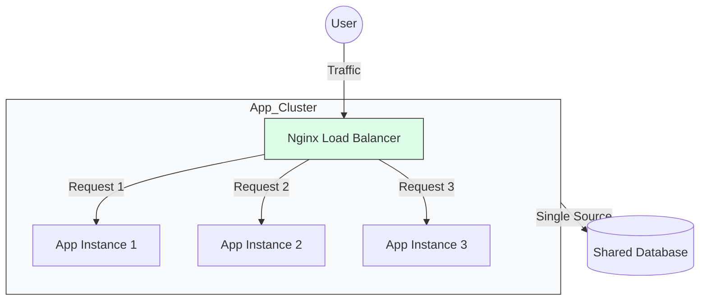

# 🚀 Module 20: Scaling & Production Compose

> **"Scaling is the ultimate test of an architecture. If your system can't grow by simply adding more resources, it's not a solution; it's a bottleneck."**



## 📚 Overview

So far, we have run one container per service. In production, this is a **Single Point of Failure**. If your app container crashes, your site stays down. In this module, we learn how to "Multiply" our containers (Scaling), how to update them without turning the site off (Blue-Green), and how to monitor their health to catch issues before your customers do.

## 🎓 Learning Objectives

By the end of this module, you will:

- ✅ **Scale Services** horizontally using the `--scale` flag.
- ✅ Implement **Load Balancing** between scaled instances.
- ✅ Orchestrate **Zero-Downtime Updates** using Blue-Green patterns.
- ✅ Manage **Node Affinity** and placement constraints.
- ✅ Build a **Production Monitoring Stack** (Prometheus & Grafana sidecars).

---

## 📈 Horizontal Scaling

If your website is slow because of traffic, don't buy a bigger server—start more containers.

**The Scale Command**:
```bash
docker compose up -d --scale web=5
```
*Note: If your 'web' service has a hardcoded host port (e.g., "80:80"), this command will fail because only one container can own port 80. You must use a Load Balancer (like Nginx) to handle this.*

---

## 🔄 Zero-Downtime: The Blue-Green Shuffle

How do you update your code without showing a "Maintenance" page?

1.  **Blue**: Your current running application.
2.  **Green**: Your new version, running on a different port/internal name.
3.  **Switch**: Update the Load Balancer to point traffic to **Green**.
4.  **Cleanup**: Delete the old **Blue** instances.

---

## 🏆 Real-World DevOps Story: The Viral Success Outage

**The Scenario**: A clothing brand launched a limited-edition sneaker. They expected 1,000 users. Because of a celebrity tweet, 100,000 users showed up at 9:00 AM.
**The Crisis**: The single app container hit 100% CPU and stopped responding. The server was fine, but the container was choked.
**The Fix**: A DevOps Engineer logged in and ran: `docker compose up -d --scale app=10`. 
**The Discovery**: Because they had a Load Balancer (Nginx) already configured to use the service name `app`, it immediately started sending traffic to the 9 new instances. The site came back online in 15 seconds.
**The Lesson**: **Be ready to grow.** Even if you only need one container today, design your stack to be scalable from day one.

---

## 🚀 Professional Pattern: The Healthy Restart

In production, never use `restart: always` for everything.
- **For Databases**: Use `unless-stopped`.
- **For Fragile Apps**: Use `on-failure` with a limit.
- **For Setup Tasks**: Use `no` (once it's done, it's done).

---

## ❓ Interview Preparation (Production Scaling)

1. **Q: Why can't you scale a service that has a host port mapping (e.g., `- 80:80`)?**
   *A: On a single host machine, only one process can bind to a specific port at a time. If you try to start a second container with the same '80:80' mapping, the host OS will reject the request. To scale, you must map the service to an internal port and use a Load Balancer.*

2. **Q: What is 'Session Stickiness' and why is it important for scaling?**
   *A: If a user logs into Instance A, and their next request goes to Instance B, Instance B might not know they are logged in. 'Stickiness' (Affinity) ensures a user stays with the same container for their entire session, or you must use a shared session store like Redis.*

3. **Q: How does the 'docker compose up --build' command help with production updates?**
   *A: It forces Docker to check for changes and rebuild the images before starting the containers. This ensures that the code running in production is exactly what is in your current directory, preventing 'stale' image deployments.*

4. **Q: What is a 'Downtime Window'?**
   *A: It's the period during which a service is unavailable to users. The goal of DevOps is to reduce this to zero using strategies like Blue-Green or Rolling Updates.*

5. **Q: How do you monitor container health in a production cluster?**
   *A: Use a combination of Docker Healthchecks (for immediate status) and a monitoring stack like Prometheus/cAdvisor (for long-term metrics like CPU and Memory trends).*

---

## 📝 Knowledge Check

1. **Which command scales the 'worker' service to 3 instances?**
   - [ ] a) `docker grow worker 3`
   - [x] b) `docker compose up -d --scale worker=3`
   - [ ] c) `docker compose split worker 3`

2. **In a scalable architecture, where should user 'Session' data be stored?**
   - [ ] a) Inside the container's memory
   - [x] b) In a shared external store like Redis
   - [ ] c) On the container's local disk

3. **Which deployment strategy switches all traffic from an old version to a new version at once?**
   - [ ] a) Rolling Update
   - [x] b) Blue-Green
   - [ ] c) Canary

4. **True or False: Docker Compose can automatically balance traffic across multiple hosts.**
   - [ ] True
   - [x] False (That requires Docker Swarm or Kubernetes)

5. **What is the main purpose of a Load Balancer in a Docker stack?**
   - [x] a) To distribute incoming requests across multiple containers
   - [ ] b) To make the code run faster
   - [ ] c) To back up the database

---

## 🔗 Next Steps

You've mastered the orchestra. Now it's time to see the big picture—the entire world of Container Orchestration across thousands of servers.

Proceed to: **[Module 02: Orchestration Deep-Dive](../02-Orchestration/README.md)** →
