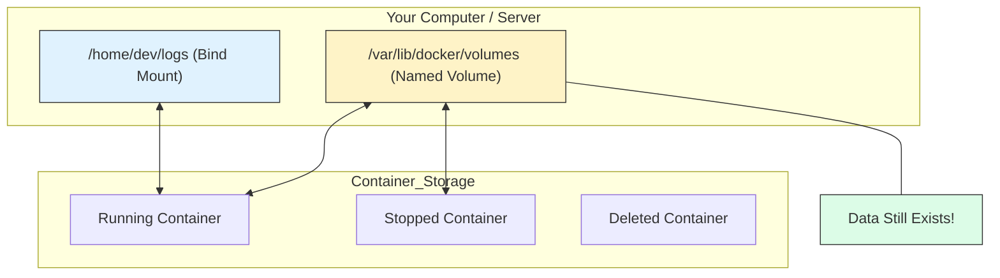

# 💾 Module 06: Data Persistence & Volumes

> **"Containers are ephemeral; they live and die in seconds. But your data is the soul of your application—it must live forever. Volumes are the anchor that keeps that soul safe."**



## 📚 Overview

By default, everything you do inside a container is **temporary**. If you write a file to a database and then run `docker compose down`, that file is gone. To prevent this, we use **Volumes** and **Bind Mounts** to "tunnel" data from the isolated container back into the persistent world of your host machine.

## 🎓 Learning Objectives

By the end of this module, you will:
- ✅ Differentiate between **Named Volumes** and **Bind Mounts**.
- ✅ Persist database files across container restarts.
- ✅ Implement **Live Reloading** for development environments.
- ✅ Secure your host with **Read-Only (`:ro`)** mounts.
- ✅ Master the dangerous but necessary **`docker compose down -v`** command.

---

## 🏗️ The Storage Spectrum

| Type | Best For | DevOps Context |
| :--- | :--- | :--- |
| **Named Volumes** | Production Databases | Managed by Docker. Encapsulated and high-performance. |
| **Bind Mounts** | Development / Configs | Directly maps a folder on your laptop to the container. |
| **Anonymous** | Temp Files / Caching | Created automatically by some images. Hard to manage. |

---

## 🛠️ Implementation Patterns

### 1. The Database Anchor (Named Volume)
Use this for Postgres, MySQL, or MongoDB.
```yaml
services:
  db:
    image: postgres
    volumes:
      - db-data:/var/lib/postgresql/data # [NAME]:[LOCATION_INSIDE]

volumes:
  db-data: # Must be declared here!
```

### 2. The Dev Mirror (Bind Mount)
Use this so you don't have to rebuild the image every time you change a line of code.
```yaml
services:
  web:
    build: .
    volumes:
      - ./src:/app/src # [RELATIVE_HOST_PATH]:[CONTAINER_PATH]
```

---

## 🏆 Real-World DevOps Story: The Database That Wasn't There

**The Scenario**: A junior engineer set up a production app using Docker Compose. They forgot to add a `volumes` block for the database. For 2 weeks, the site worked perfectly.
**The Crisis**: The engineer decided to update the database image version. They ran `docker compose down` and then `docker compose up`. 
**The Discovery**: Because they used `down` (which destroys containers), and there was no volume, the 2 weeks of production customer data were wiped out instantly. There was no backup.
**The Fix**: They immediately implemented **Named Volumes** and a nightly backup script that runs `docker exec` to dump the database to an external storage.
**The Lesson**: **Container destruction is a feature, not a bug.** If you don't have a volume, assume your data will be deleted.

---

## 🚀 Professional Pattern: Read-Only Configs

Many apps need configuration files (like `nginx.conf`). If you mount these as a standard volume, a hacker who compromises your app could modify your web server config to redirect traffic.

**The Solution**: Mount configurations as **Read-Only**.
```yaml
services:
  proxy:
    image: nginx
    volumes:
      - ./nginx.conf:/etc/nginx/nginx.conf:ro # :ro makes it immutable for the container
```
Even if a hacker gets "root" inside the container, they cannot change the `nginx.conf` file because the Host OS protects it.

---

## ❓ Interview Preparation (Volumes)

1. **Q: Where do 'Named Volumes' actually live on the host system?**
   *A: On Linux, they are stored in `/var/lib/docker/volumes/`. Docker manages this area, and you should generally avoid touching these files manually.*

2. **Q: What is the risk of using 'Bind Mounts' in a production cluster?**
   *A: Bind mounts rely on the specific file structure of the host. If you move your app to a new server that doesn't have the directory `/home/dev/logs`, the container will fail to start. Named Volumes are more portable.*

3. **Q: What does the command `docker compose down -v` do?**
   *A: The `-v` flag tells Compose to not only stop the containers but also **delete all attached volumes**. This is extremely dangerous in production but helpful for 'cleaning the slate' in development.*

4. **Q: Can two different containers share the same volume?**
   *A: Yes. This is a common pattern for 'Log Aggregation' (where one container writes logs and another container reads/ships them) or 'Shared Assets' (like images uploaded by users).*

5. **Q: Why are Bind Mounts preferred over Volumes for development?**
   *A: Bind mounts provide 'Live Synchronization'. When you save a file in VS Code on your laptop, the change is instantly reflected inside the container, allowing for real-time code testing.*

---

## 📝 Knowledge Check

1. **Which type of storage is managed entirely by Docker and is generally more portable?**
   - [ ] a) Bind Mount
   - [x] b) Named Volume
   - [ ] c) Local Folder

2. **In the short syntax `./data:/app/data`, what does the left side represent?**
   - [x] a) The source folder on your laptop (Host)
   - [ ] b) The destination folder inside the container
   - [ ] c) The name of the volume

3. **What flag makes a volume "untouchable" for the container?**
   - [ ] a) `:read`
   - [x] b) `:ro` (Read-Only)
   - [ ] c) `:lock`

4. **True or False: A Named Volume must be declared in the top-level `volumes:` section.**
   - [x] True
   - [ ] False

5. **Which command would you use to see all volumes currently taking up space on your system?**
   - [ ] a) `docker ps`
   - [x] b) `docker volume ls`
   - [ ] c) `docker storage list`

---

## 🔗 Next Steps

The memory is set. Now let's learn how to organize the communication lines.

Proceed to: **[Module 03: Databases in Compose](../03-Database-Storage/README.md)** →