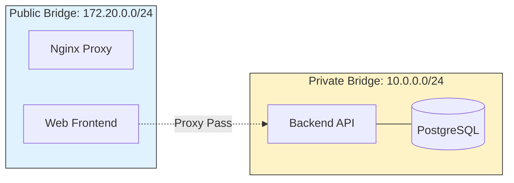

# 🏗️ Module 18: Advanced Networks & Volumes

> **"A complex system is many simple things working in harmony. Advanced Networking and Volume drivers are the invisible threads that weave individual containers into a resilient fabric."**



## 📚 Overview

By now, you know how to use Docker's default networks and volumes. But what if you need a specific IP range to comply with corporate security? What if you need to share a database volume between two different Compose files? This module covers the "Hard Parts" of container infrastructure: managing custom subnets, connecting to external networks, and scaling storage across hosts.

## 🎓 Learning Objectives

By the end of this module, you will:

- ✅ Design **Dual-Homed Architecture** (DMZ pattern).
- ✅ Configure **Custom Subnets and Gateways**.
- ✅ Connect to **External Networks** pre-created outside Compose.
- ✅ Implement **Cloud & NFS Volume Drivers**.
- ✅ Master **IPAM (IP Address Management)** configurations.

---

## 🌐 Custom Network IPAM

Sometimes you need specific IP addresses for legacy compatibility or firewall rules.

```yaml
networks:
  secure-tier:
    driver: bridge
    ipam:
      config:
        - subnet: 172.28.0.0/16
          gateway: 172.28.0.1

services:
  database:
    image: postgres
    networks:
      secure-tier:
        ipv4_address: 172.28.0.100
```

---

## 📦 Connecting to the Outside World (External)

If you have a global database container running outside your current Compose project, you can't just reference its name—you must tell Compose to "join" its network.

```yaml
networks:
  production-db-net:
    external: true # Compose won't create this; it expects it to exist.

services:
  web:
    image: my-app
    networks:
      - production-db-net
```

---

## 🏆 Real-World DevOps Story: The Rogue IP Address

**The Scenario**: A company had a hardcoded legacy check in their application that only allowed requests from the `10.0.5.x` subnet. 
**The Crisis**: When they moved to Docker, the default bridge assigned them `172.17.x.x`. The application refused to start, thinking it was being "attacked" from an unknown network.
**The Fix**: Instead of rewriting the application, the DevOps Engineer used **IPAM Configuration** in the Compose file to force the Docker network to use the `10.0.5.0/24` subnet.
**The Discovery**: They also realized they could use this to prevent IP conflicts with the local corporate VPN.
**The Lesson**: **Infrastructure should bend to the app's needs.** Docker's networking is flexible enough to mimic almost any physical data center.

---

## 🚀 Professional Pattern: The DMZ (Dual-Homing)

Protect your database by keeping it on a network that the Frontend cannot even see.

1.  **Network A (Public)**: Connects Nginx and Frontend.
2.  **Network B (Private)**: Connects Frontend and Backend/DB.

*The Frontend acts as a "Bridge," but the DB has no physical path to the public Nginx container.*

---

## ❓ Interview Preparation (Advanced Infrastructure)

1. **Q: What is 'IPAM' in Docker?**
   *A: IPAM stands for IP Address Management. It is the configuration block that allows you to define custom subnets, IP ranges, and gateways for your Docker networks instead of letting Docker choose them automatically.*

2. **Q: Why would you mark a network as 'external: true'?**
   *A: This is used when a network is created outside of the current Compose lifecycle (e.g., via `docker network create` manually or by another Compose project). It allows multiple separate projects to communicate with each other.*

3. **Q: What is a 'Volume Driver' and why use one?**
   *A: A volume driver (like `rexray` or `cloudstor`) allows Docker to use non-local storage, such as AWS EBS volumes, Azure Files, or NFS shares. This is critical for High Availability (HA) where a container needs to access the same data even if it moves to a different physical server.*

4. **Q: How can you prevent two services in the same Compose file from talking to each other?**
   *A: Put them on different networks and do not connect them. Isolation is the default state if they don't share a network.*

5. **Q: What is 'Promiscuous Mode' in the context of Macvlan?**
   *A: Special network card mode required for Macvlan to work. It allows the card to accept packets for multiple MAC addresses (the host + all the containers), which some cloud providers and virtual switches block for security.*

---

## 📝 Knowledge Check

1. **Which key allows a Compose project to use a network created by another team?**
   - [ ] a) `shared: true`
   - [x] b) `external: true`
   - [ ] c) `import: true`

2. **What does IPAM stand for?**
   - [ ] a) Internal Port Access Method
   - [x] b) IP Address Management
   - [ ] c) Internet Protocol Archiving Module

3. **In the DMZ pattern, which service should be connected to BOTH the public and private networks?**
   - [ ] a) The Database
   - [x] b) The Backend/Gateway
   - [ ] c) The Nginx Proxy

4. **True or False: You can assign a static IPv4 address to a container that is part of the default bridge.**
   - [ ] True
   - [x] False (Static IPs require a user-defined network)

5. **Which protocol is most commonly used to share volumes across different physical servers?**
   - [ ] a) HTTP
   - [x] b) NFS
   - [ ] c) FTP

---

## 🔗 Next Steps

The pathways are set. Now let's learn how to handle the "Sensitive" stuff: secrets and configurations.

Proceed to: **[Module 19: Secrets & Configs](../03-Secrets-Configs/README.md)** →
