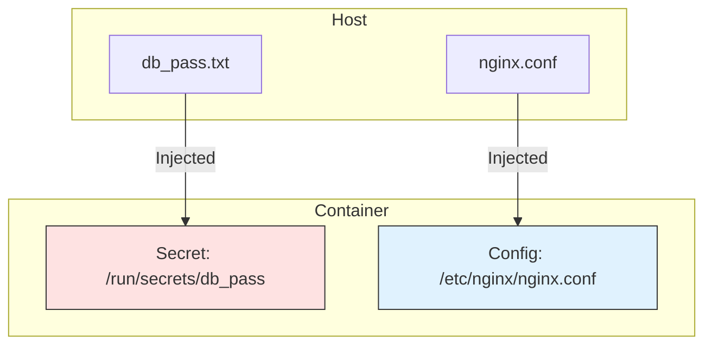

# 🔐 Module 19: Secrets & Configs

> **"If your password is in a Dockerfile, it's public knowledge. If it's in an Environment Variable, it's a leaked secret. If it's in a Docker Secret, it's professional."**



## 📚 Overview

How do you give a container a password without putting it in your code? While many people use `.env` files, Docker has a more secure way: **Secrets**. In this module, we explore the difference between "Configs" (non-sensitive things like Nginx settings) and "Secrets" (sensitive things like API keys). You will learn how to mount these into your containers so the application can read them without them ever appearing in `docker inspect`.

## 🎓 Learning Objectives

By the end of this module, you will:

- ✅ Differentiate between **Environment Variables** and **Docker Secrets**.
- ✅ Securely inject database passwords using **`/run/secrets/`**.
- ✅ Use **Docker Configs** to manage application settings independently.
- ✅ Implement **External Secrets** for multi-project security.
- ✅ Master the **Sidecar Pattern** for secret rotation.

---

## 🛡️ Secrets vs. Environment Variables

| Feature | Environment Variables | Docker Secrets |
| :--- | :--- | :--- |
| **Visibility** | Visible in `docker inspect` | **Hidden** from inspect (mounted as files). |
| **Storage** | Clear text in process memory | In-memory filesystem (`/run/secrets`). |
| **Leaking** | High risk (logs, child processes) | Low risk (application must read file). |

### Implementation in Compose
```yaml
services:
  db:
    image: postgres
    secrets:
      - db_password

secrets:
  db_password:
    file: ./db_pass.txt # The actual password is in this file
```
*Inside the container, the password is found at `/run/secrets/db_password`.*

---

## ⚙️ Docker Configs: Pure Configuration

Configs are like secrets but for non-sensitive data. They allow you to update your app's behavior without rebuilding the image.

```yaml
services:
  web:
    image: nginx:alpine
    configs:
      - source: my_nginx_config
        target: /etc/nginx/nginx.conf

configs:
  my_nginx_config:
    file: ./custom_nginx.conf
```

---

## 🏆 Real-World DevOps Story: The $10,000 GitHub Mistake

**The Scenario**: A developer was in a rush. They hardcoded an AWS Secret Key into their `docker-compose.yml` and pushed it to a public GitHub repo. 
**The Crisis**: Within 10 minutes, a bot discovered the key and started 100 high-end "GPU" servers for crypto-mining in the company's AWS account. By the time the developer realized, the bill was $10,000.
**The Fix**: They invalidated the key and moved all sensitive data into **Docker Secrets** and **`.env`** files (which were added to `.gitignore`).
**The Discovery**: They also learned that by using Secrets, they could share the same Dockerfile across Dev, Staging, and Prod while only changing the secret files on the host.
**The Lesson**: **Code and Secrets should never touch.** Treat your credentials like toxic waste—keep them in specialized containers.

---

## 🚀 Professional Pattern: The Config Center

Instead of mounting individual files, senior engineers often use a **Sidecar** (like HashiCorp Vault or AWS Secrets Manager) to fetch secrets at runtime. Docker Compose Secrets act as the bridge until you reach that level of complexity.

---

## ❓ Interview Preparation (Secrets & Configs)

1. **Q: Why are Environment Variables considered insecure for passwords?**
   *A: Any user with access to the Docker CLI can run `docker inspect` and see the password in plain text. Additionally, child processes and error logs often print all environment variables, leading to accidental leaks.*

2. **Q: Where are Docker Secrets mounted inside a container?**
   *A: By default, they are mounted as files in the `/run/secrets/` directory. The application must be programmed to read the content of these files instead of looking for an environment variable.*

3. **Q: What happens if you update a 'Config' file on the host?**
   *A: In standard Docker Compose, the container won't automatically see the change unless it is restarted. In Docker Swarm, secrets and configs are immutable; you must create a new version to trigger a rolling update.*

4. **Q: How can you use a secret in a 'One-Off' container?**
   *A: You can't use the `secrets` top-level key for a simple `docker run` command easily. This feature is specific to Docker Compose and Docker Swarm. For `docker run`, you are limited to volume mounts or environment variables.*

5. **Q: What is the benefit of 'External' secrets?**
   *A: External secrets allow multiple Compose files to refer to the same pre-existing secret on the host. This ensures that different services (e.g., an API and a Backup job) all use the exact same database password without duplicating the file.*

---

## 📝 Knowledge Check

1. **Which directory is the default mount point for Docker Secrets?**
   - [ ] a) `/var/secrets`
   - [x] b) `/run/secrets`
   - [ ] c) `/etc/docker/secrets`

2. **Which Compose key is used for non-sensitive data like Nginx configurations?**
   - [ ] a) `secrets`
   - [x] b) `configs`
   - [ ] c) `volumes`

3. **True or False: Secrets are visible in the output of `docker inspect`.**
   - [ ] True
   - [x] False (Environment variables are)

4. **Which file should you ALWAYS add to your `.gitignore`?**
   - [ ] a) `docker-compose.yml`
   - [x] b) `.env`
   - [ ] c) `Dockerfile`

5. **What is the primary advantage of using a 'Secret' file over a 'Hardcoded' string?**
   - [x] a) Security and Portability
   - [ ] b) Faster build times
   - [ ] c) Smaller image size

---

## 🔗 Next Steps

The vault is locked. Now let's learn how to take all these pieces and run them in a high-stakes production environment.

Proceed to: **[Module 01: Production Ready](../../Advanced/01-Production/README.md)** →
