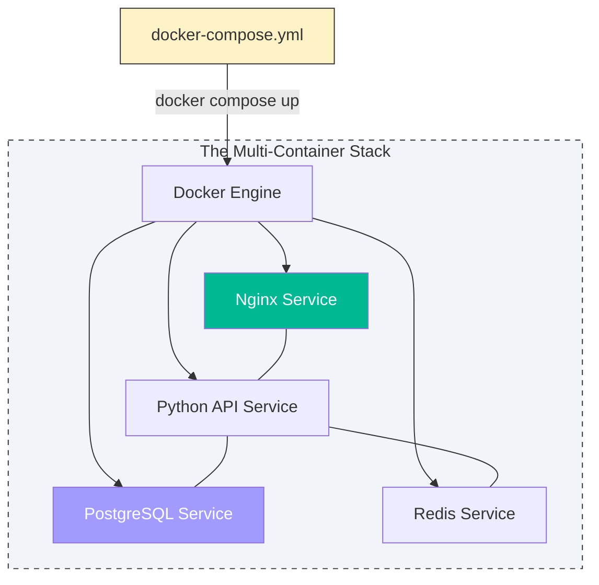

# 🐙 Module 02: Docker Compose

> **"If a Dockerfile is the blueprint for a single brick, Docker Compose is the architectural plan for the entire building."**

## 📚 Overview

Modern applications are rarely just one process. They are a collection of services working together. **Docker Compose** is the "Orchestrator for Developers." It allows you to define your entire stack—networks, volumes, and services—in a single, human-readable YAML file.

Instead of typing 10 `docker run` commands with 100 flags, you simply type `docker compose up`.

## 🎯 Learning Objectives

- ✅ Master the **YAML Syntax** of the `docker-compose.yml` file.
- ✅ Understand the difference between **Building** images and **Pulling** them in Compose.
- ✅ Implement **Inter-Service Communication** without hardcoding IP addresses.
- ✅ Use **Environment Variables** and `.env` files for configuration.
- ✅ Control service startup order using **`depends_on`**.

## 🆚 Junior Way vs. Engineer Way

| Feature | The Junior Way (Problematic) | The Engineer Way (Production-ready) |
|:---|:---|:---|
| **Execution** | 10 separate `docker run` commands | Single `docker compose up` command |
| **Logic** | Imperative shell scripts | **Declarative** YAML manifest |
| **Persistence** | Forgot to map volumes manually | Defined in the `volumes:` block |
| **Networking** | Tricky `--link` or manual bridge | Automatic **Service Discovery** DNS |
| **Environment** | Hardcoded `-e` flags in shell | Clean **`.env`** file integration |
| **Cleanup** | `docker rm -f` leaving nets/vols | `docker compose down` clean sweep |

---

## 🏗️ The Declarative Shift: "What vs. How"

In the "Junior Way," you tell Docker **how** to do things: "Build this, then run that, then connect them."

In the "Engineer Way," you tell Docker **what** you want: "I want an environment with these 3 services, this network, and this volume." 

This is the foundation of **Infrastructure as Code (IaC)**. If you delete your entire local system, you can recreate the exact same production-like environment in seconds just by having the `docker-compose.yml` file.

---

## 🚀 Professional Pattern: Declarative Infrastructure

In the old days, we wrote "Imperative" scripts: *"Step 1: Create network. Step 2: Run container A. Step 3: Wait 5 seconds..."* If Step 2 failed, the script broke and left a mess.

Docker Compose is **Declarative**. You define the **Desired State** (*"I want 1 Web container and 1 DB container connected on this network"*), and Docker handles the "how." If a container is already running and matches the definition, Compose leaves it alone. If it's missing, Compose starts it.

---

## 🏆 Real-World DevOps Story: The Onboarding Weekend

**The Scenario**: A new developer joined a fintech team. The legacy app had 5 services (Auth, SQL, Redis, Frontend, API).
**The Crisis**: On the legacy setup, it took the developer **3 days** to install all the correct versions of Postgres, Redis, and Node on their local Mac, only to find the app still wouldn't connect because of a network config error.
**The Discovery**: A Senior DevOps engineer spent 2 hours "Compose-ifying" the app.
**The Fix**: The next developer who joined ran one command: `docker compose up`. In **2 minutes**, the entire stack was running perfectly.
**The Lesson**: **If onboarding takes more than 10 minutes, you need Docker Compose.**

---

## 🗺️ Curriculum

### 🟢 Beginner

1. **[01-Basics](./Beginner/01-Basics/README.md)**: Service definitions and core commands (`up`, `down`, `ps`).
2. **[02-Volumes](./Beginner/02-Volumes/README.md)**: Mounting local code for real-time development.
3. **[03-Database-Storage](./Beginner/03-Database-Storage/README.md)**: Securely persisting DB data in Compose.

### 🟡 Intermediate

1. **[01-Advanced-Features](./Intermediate/01-Advanced-Features/README.md)**: Profiles, healthchecks, and resource limits.
2. **[02-Networks-Volumes](./Intermediate/02-Networks-Volumes/README.md)**: Customizing the communication layers.
3. **[03-Secrets-Configs](./Intermediate/03-Secrets-Configs/README.md)**: Handling passwords and configuration files cleanly.

### 🔴 Advanced

1. **[01-Production](./Advanced/01-Production/README.md)**: Moving from Compose to Cloud-ready configurations.
2. **[02-Orchestration](./Advanced/02-Orchestration/README.md)**: Scaling services and managing complex dependencies.

---

## 🎤 Interview Preparation (Docker Compose)

### 🎯 Core Concepts
1. **Q: What is the primary purpose of Docker Compose?**
   - *A: To define and run multi-container applications. It uses a YAML file to configure application services, networks, and volumes, making it easy to start a complete stack with a single command.*

2. **Q: Explain the 'depends_on' flag and its limitations.**
   - *A: `depends_on` defines the startup order of services (e.g., "start DB before Web"). However, it only waits for the container to start, not for the application inside (like Postgres) to be fully ready. For that, you need 'Healthchecks'.*

3. **Q: How does Docker Compose handle environment variables?**
   - *A: It can pull variables from the host's shell, from a `.env` file in the same directory, or from an `env_file:` definition inside the YAML. This allows for clear separation between code and configuration.*

### 🚀 Advanced Questions
4. **Q: What is the difference between `docker compose up` and `docker compose start`?**
   - *A: `up` attempts to bring the entire stack to the desired state (building/pulling images, creating nets/vols if missing). `start` only starts existing containers that were previously stopped.*

5. **Q: Can you use Docker Compose for production?**
   - *A: While primarily a development tool, it is used in production for smaller, single-host deployments (e.g., a "Docker Swarm" cluster). For large-scale production, Kubernetes is the industry standard.*

6. **Q: How do you scale a specific service (like a 'worker') using Compose?**
   - *A: Use the `--scale` flag: `docker compose up --scale worker=5`. Note that this only works if you haven't hardcoded host ports that would conflict (like port 80).*

---

## 📝 Knowledge Check

1. **What is the default filename that Docker Compose looks for?**
   - [ ] a) `docker.yaml`
   - [x] b) `docker-compose.yml`
   - [ ] c) `stack.conf`

2. **True/False: Docker Compose automatically creates a private network for your services to communicate.**
   - [x] **True**. Services can talk to each other using their service names.

3. **Which command stops all containers and REMOVES the networks created by Compose?**
   - [ ] a) `docker compose stop`
   - [x] b) `docker compose down`
   - [ ] c) `docker compose rm`

---

## 🎯 Next Steps

Start with **[Beginner: Basics](./Beginner/01-Basics/README.md)** 🚀
