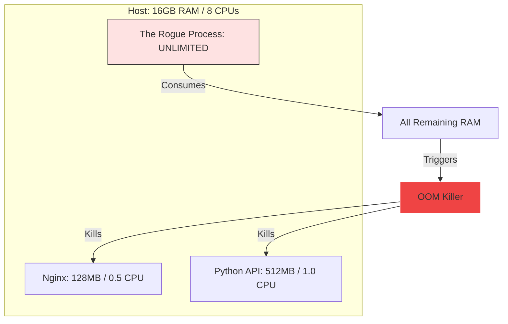

# ⚖️ Module 13: Docker Resource Management

> **"A container without limits is like an elephant in a glass shop. It only takes one memory leak to bring down the entire building."**



## 📚 Overview

In a development environment, we rarely worry about resources. But in production, you might run 50 containers on a single server. If one container has a memory leak, it will grow until it consumes all the server's RAM, causing the Linux Kernel to panic and start killing innocent processes (including your database!). This module teaches you how to put "Guardrails" on your containers.

## 🎓 Learning Objectives

By the end of this module, you will:
- ✅ Differentiate between **Hard Limits** and **Soft Reservations**.
- ✅ Throttle CPU usage to prevent "Noisy Neighbors."
- ✅ Understand the **OOM (Out of Memory) Killer** mechanics.
- ✅ Monitor containers in real-time using **`docker stats`**.
- ✅ Optimize Java/Node heap settings for container environments.

---

## 🏗️ Memory: The Guardrails

There are two ways to limit memory in Docker Compose:

1.  **Limits (Hard)**: The absolute maximum. If the app tries to use more, it is killed.
2.  **Reservations (Soft)**: The "Guaranteed" amount. Docker will always make sure the app has this much, but it can use more if the host is idle.

```yaml
services:
  app:
    deploy:
      resources:
        limits:
          memory: 512M      # Hard Cap
        reservations:
          memory: 128M      # Guaranteed baseline
```

---

## ⚡ CPU: The Throttling

Unlike memory (which is a fixed amount), CPU is about **Time**. You can limit a container to "Half a CPU core" (0.5).

```bash
docker run --cpus="0.5" my-heavy-app
```
*Docker uses Cgroups to pause the container for milliseconds at a time to ensure it never exceeds its 50% allowance.*

---

## 🏆 Real-World DevOps Story: The Java Heap Monster

**The Scenario**: A dev team containerized a Java Spring Boot app. They didn't set any Docker limits. The server had 32GB of RAM.
**The Crisis**: Java (by default) looks at the *host* memory to decide its maximum heap size. It saw 32GB and decided it could take 8GB for itself.
**The Discovery**: When 5 instances of the app were launched, they all tried to take 8GB. The server hit 40GB demand on a 32GB machine. The Linux **OOM Killer** woke up and, seeing the database was the largest process, killed the **PostgreSQL Database** to save the system.
**The Fix**: They set Docker memory limits to 1GB and used the Java flag `-XX:MaxRAMPercentage=75.0`. 
**The Lesson**: **Apps must be enlightened.** If you don't tell the app it's in a container, it will try to eat the whole host.

---

## 🚀 Professional Pattern: The 80% Rule

Never allocate 100% of your host's memory to containers.
**The Rule**: Leave **20%** of your RAM for the Host OS, the Docker Daemon, and background monitoring tasks (like Datadog or Prometheus). If your server has 10GB, your total container limits should not exceed 8GB.

---

## 📊 Monitoring with `docker stats`

To see exactly who is eating the most RAM right now:
```bash
docker stats --format "table {{.Name}}\t{{.CPUPerc}}\t{{.MemUsage}}\t{{.NetIO}}"
```
This provided a live dashboard of your "Elephants" and "Ants."

---

## ❓ Interview Preparation (Resource Management)

1. **Q: What happens to a container when it hits its 'Memory Limit'?**
   *A: The Linux kernel marks it for the OOM Killer. The container will usually exit with 'Exit Code 137'. You can verify this by running `docker inspect` and looking at the state.*

2. **Q: What is the difference between '--cpus' and '--cpu-shares'?**
   *A: `--cpus` is a hard throttle (e.g., 1.5 CPUs). The container can never go faster. `--cpu-shares` is a 'Weight'. If the host is busy, a container with 1024 shares gets double the CPU time of a container with 512 shares. If the host is idle, both can go full speed.*

3. **Q: Why is 'OOM Score' important?**
   *A: Every process has a score from -1000 to 1000. The higher the score, the more likely the OOM Killer is to target it. You can adjust a container's score (`--oom-score-adj`) to make your database 'harder to kill' than your frontend.*

4. **Q: How can you limit the disk writing speed of a container?**
   *A: Use the `--device-write-bps` or `--device-read-iops` flags. This prevents a database container with a massive data import from slowing down the entire server's SSD for other containers.*

5. **Q: Is it possible to update resource limits on a running container without stopping it?**
   *A: Yes, using the `docker update` command. For example: `docker update --cpu-shares 512 <container_id>`. Note that some limits might require a restart depending on the kernel version.*

---

## 📝 Knowledge Check

1. **Which exit code indicates a container was killed because of an OOM (Out of Memory) error?**
   - [ ] a) 1
   - [ ] b) 127
   - [x] c) 137

2. **Which Compose key guarantees a specific amount of memory for a container?**
   - [ ] a) `limits`
   - [x] b) `reservations`
   - [ ] c) `guarantee`

3. **True or False: A container limited to `cpus: 0.5` will take longer to complete a task than an unlimited one.**
   - [x] True (It is being throttled)
   - [ ] False

4. **What is the command to see real-time CPU and Memory usage of all containers?**
   - [ ] a) `docker ps`
   - [x] b) `docker stats`
   - [ ] c) `docker top`

5. **Which operating system feature does Docker use to enforce resource limits?**
   - [ ] a) Namespaces
   - [x] b) Control Groups (Cgroups)
   - [ ] c) AppArmor

---

## 🔗 Next Steps

The engine is tuned. Now let's learn how to prep for the big move: taking our containers into a real-world production environment.

Proceed to: **[Module 14: Production Considerations](../03-Production-Considerations/README.md)** →
翻
