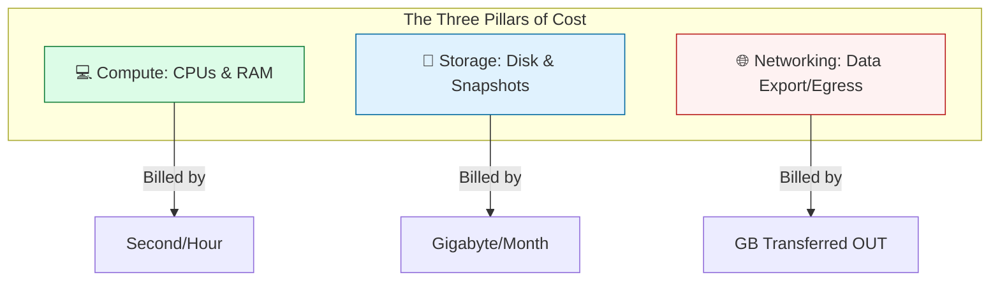
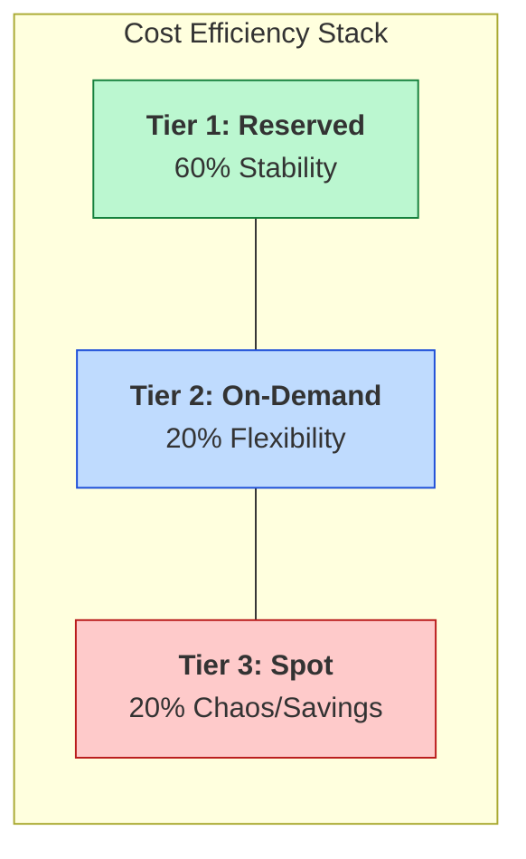

# 💳 Part 02: Cloud Billing Basics

> **"A cloud bill is like a restaurant receipt for a million tiny snacks. If you don't know the price of the ingredients, you'll be shocked when the bill arrives."**

## 📚 Overview

Cloud billing is complex because it is **granular**. Unlike a monthly Netflix subscription, a cloud bill changes every second based on how many users hit your site, how much data they download, and how many logs your application generates. This module teaches you how to decipher the "Taxonomy of Spend" and avoid common billing traps.

## 💼 Career Impact: The "Efficiency Architect"

Mastering cloud billing transforms you from an engineer who consumes resources to one who manages them as a portfolio.

- **Architectural Authority**: You gain the ability to veto expensive, inefficient designs before they reach production.
- **Visibility**: Your optimization efforts (e.g., migrating to Spot or RIs) translate directly into "saved revenue" on the company's P&L statement.
- **Leadership Track**: Cost management is a key differentiator for Principal and Staff engineer roles.

## 🎓 Learning Objectives

By the end of this module, you will:

- ✅ Deconstruct the three main **Cost Pillars** (Compute, Storage, Network).
- ✅ Differentiate between **On-Demand, Reserved, and Spot** pricing models.
- ✅ Identify the "Hidden Tax": **Data Egress** (Outbound transfer).
- ✅ Navigate the **Free Tier** without getting charged.
- ✅ Understand **Regional Pricing** variations.

---

## 🏗️ The Pricing Hierarchy

### 1. On-Demand (The "Retail" Price)

The default. You pay for what you use by the second.

- **Best for**: New apps, unpredictable spikes, and spikes.
- **Analogy**: A hotel room booked at the front desk.

### 2. Spot / Preemptible (The "Clearance" Price)

You bid for spare capacity. It's up to **90% cheaper**, but the cloud provider can take it back with a 2-minute notice.

- **Best for**: Batch processing, CI/CD runners, and stateless apps.
- **Analogy**: A standby flight ticket.

### 3. Reserved Instances / Savings Plans (The "Subscription")

You commit to a 1 or 3-year term.

- **Best for**: Databases and core production services.
- **Analogy**: Leasing an apartment for a year.

---

## 🚀 Professional Pattern: The 3-Tier Strategy

Senior Cloud Architects never put everything on "On-Demand." They use a mix:

- **Baseline (Stable)**: Reserved Instances (e.g., Databases).
- **Scale (Variable)**: On-Demand (e.g., Handling traffic spikes).
- **Batch (Disposable)**: Spot Instances (e.g., Nightly data processing).

---

## 🏆 Real-World DevOps Story: The $5,000 NAT Gateway

**The Scenario**: A company moved their application to a private subnet for security. To give the app internet access (to download updates), they deployed a **Managed NAT Gateway**.
**The Crisis**: The app's logging system was accidentally misconfigured to upload 10TB of raw debug logs to a public S3 bucket every day through that NAT Gateway.
**The Bill**: NAT Gateways charge per GB processed ($0.045/GB). The 10TB/day upload resulted in a **$450/day** charge, totaling **$3,150** in one week, plus standard S3 egress fees.
**The Fix**: They replaced the NAT Gateway path with an **S3 VPC Endpoint** (which is free) for all S3 traffic.
**The Lesson**: **"Invisible" networking components are often the most expensive.** Always look for "Endpoints" inside your cloud provider's network to avoid external transit fees.

---

## 🌐 The Hidden Tax: Egress

Most cloud providers have a "Hotel California" policy:

- **Data Inbound**: Free.
- **Data Outbound (To Internet)**: **Expensive ($0.09/GB)**.
- **Cross-Region/Zone**: **Expensive ($0.02/GB)**.

*If your database is in `us-east-1a` and your app is in `us-east-1b`, you might be paying just to talk between them!*

---

## 🆚 Junior Way vs. Engineer Way

| Feature | The Junior Way (Problematic) | The Engineer Way (Production-ready) |
|:---|:---|:---|
| **Database Compute** | Runs 24/7 on On-Demand pricing | Uses **Reserved Instances** or Savings Plans |
| **Storage Choice** | Generic "GP2/GP3" for everything | Tiered storage (**Standard, Infrequent, Glacier**) |
| **Networking** | Data flows through NAT Gateways | Uses **VPC Endpoints** (Interface/Gateway) |
| **Orchestration** | One size fits all (Same instance) | **Spot Fleets** for non-critical workers |
| **Cleanup** | Manually deletes old snapshots | Automated **Lifecycle Policies** |

---

## 🏗️ The "Hidden Taxes" of Cloud

A senior engineer knows that the base price of an EC2 instance is only half the story. The truly massive bills come from the things you can't see.

1.  **Data Egress**: Moving data *out* to the internet or across regions. (The Hotel California effect).
2.  **NAT Gateway Processing**: Charging per GB just to let a private instance talk to the internet.
3.  **Unattached EBS Volumes**: Paying for a $50/month disk that belongs to a server you deleted weeks ago.
4.  **Zombie Snapshots**: Keeping every daily backup of a database for 5 years without a lifecycle policy.
5.  **Provisioned IOPS**: Choosing "I want 10,000 IOPS" regardless of whether your app is actually doing any I/O.

---

## 🎤 Interview Preparation (Cloud Billing)

### 🎯 Core Concepts
1. **Q: What is the single most effective way to reduce costs for a database that runs 24/7?**
   - *A: Purchase a Reserved Instance (RI) or a Savings Plan. Committing to a 1 or 3-year term can save between 30% and 72% over the On-Demand price.*

2. **Q: A developer wants to use Spot Instances for a production database. Why is this a bad idea?**
   - *A: Spot instances are 'preemptible,' meaning they can be terminated by the cloud provider at any time. Databases require high stability and persistence; losing the server abruptly could lead to downtime or corruption.*

3. **Q: Explain 'Egress' and how it impacts a global application.**
   - *A: Egress is data moving OUT of the cloud provider's network. For a global app, if users in Europe download data from a US server, the company pays per GB. Solutions include CDNs or local region replicas.*

4. **Q: What is the 'Free Tier' trap?**
   - *A: Many services are only free for 12 months or up to a specific limit. Exceeding the limit or using a non-eligible instance type triggers automatic billing.*

5. **Q: How does 'Regional Pricing' affect infrastructure planning?**
   - *A: Different regions have different operational costs. For example, AWS `us-east-1` (N. Virginia) is usually the cheapest, while `af-south-1` (Cape Town) is significantly more expensive.*

### 🚀 Advanced Questions
6. **Q: What is the difference between an 'S3 Gateway Endpoint' and an 'Interface Endpoint' in terms of cost?**
   - *A: Gateway Endpoints (for S3 and DynamoDB) are **free**. Interface Endpoints (powered by PrivateLink) charge an hourly fee plus a per-GB processing fee. Use Gateway Endpoints whenever possible.*

7. **Q: How can you use 'Spot Fleets' to maintain availability while saving money?**
   - *A: A Spot Fleet allows you to specify multiple instance types. If one type is reclaimed by the provider, the fleet automatically shifts the workload to another available type in the pool.*

8. **Q: What is 'EBS Volume Type Evolution' and how does it save money?**
   - *A: Upgrading from older types (like GP2) to newer types (like GP3) often provides a lower price per GB and allows you to provision throughput and IOPS independently.*

9. **Q: Explain 'Cross-AZ' data transfer charges.**
   - *A: Even within the same region, moving data between two Availability Zones (Data Centers) costs money (usually $0.01/GB). High-traffic apps should be designed to keep traffic within the same AZ when possible.*

10. **Q: What is the 'Hotel California' pricing model?**
    - *A: Data entering the cloud is free (you can check in any time you like), but data leaving is expensive (but you can never leave—without a large bill).*

---

## 📝 Knowledge Check

1. **Which pricing model offers the highest discount (up to 90%)?**
   - [x] Spot.

2. **Usually, is data transfer INTO the cloud provider's network free?**
   - [x] Yes.

3. **What is the name of the service that allows internal communication with S3 without using a NAT Gateway?**
   - [x] VPC Endpoint.

4. **True/False: A 3-Year Reserved Instance commitment typically offers a higher discount than a 1-year commitment.**
   - [x] True.

5. **Which pillar of cost is billed by 'Gigabyte per Month' (storage volume)?**
   - [x] Storage.

6. **Which networking component charges per GB of data processed?**
   - [x] NAT Gateway.

7. **What happens to a Spot Instance if the price exceeds your bid?**
   - [x] It is terminated or stopped by the provider (after a 2-minute notice).

8. **Which S3 storage class is best for data accessed once a year?**
   - [x] Glacier Deep Archive.

9. **What is an 'Orphaned Snapshot'?**
   - [x] A backup of a volume that no longer exists.

10. **Which region is typically the least expensive in AWS?**
    - [x] `us-east-1` (N. Virginia).

---

## 🔗 Next Steps

The bill is no longer a mystery. Now let's learn how to label every single dollar using Tagging and Reporting.

Proceed to: **[Part 03: Cost Visibility](../Part-03-Cost-Visibility/README.md)** →
