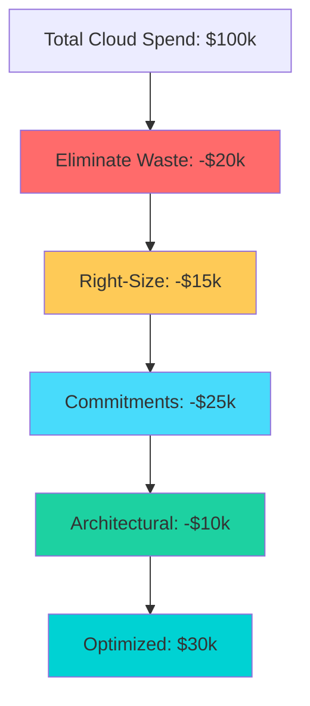

# Cloud Cost Optimization Strategies Reference

**Doc Version:** 1.0.0
**Role:** Cloud Cost Engineer
**Scope:** Right-Sizing, Waste Elimination, and Architectural Patterns

---

## 1. The Four Pillars of Cost Optimization

### A. Right-Sizing (Eliminate Over-Provisioning)
**Problem**: Developers request "large" instances "just in case."

**Solution**: Monitor actual usage and downsize.
- **CPU**: If average CPU < 20%, downsize instance type
- **Memory**: If memory usage < 50%, downsize
- **Disk**: Delete unused EBS volumes (orphaned after instance termination)

**Tools**: AWS Compute Optimizer, Azure Advisor

**Governance**: Implement **auto-scaling** instead of static over-provisioning.

### B. Waste Elimination (Zombie Resources)
**Common Waste**:
- **Stopped Instances**: Still paying for EBS storage
- **Unattached EBS Volumes**: Orphaned after instance deletion
- **Old Snapshots**: Retained forever by default
- **Idle Load Balancers**: $20/month even with zero traffic
- **Unused Elastic IPs**: $3.60/month if not attached

**Automation**: Schedule Lambda functions to detect and delete zombies.

### C. Commitment Discounts (Reserved Capacity)
**Hierarchy** (most to least flexible):
1. **Savings Plans**: Commit to $/hour, flexible across instance families
2. **Reserved Instances**: Commit to specific instance type
3. **Spot Instances**: Bid on spare capacity (up to 90% discount, but can be terminated)

**Strategy**: 
- **Baseline**: Use RIs/Savings Plans for predictable workloads
- **Burst**: Use On-Demand for unpredictable spikes
- **Batch**: Use Spot for fault-tolerant jobs

### D. Architectural Optimization
**Serverless**: Pay only when code runs (Lambda, Cloud Functions)
- **Anti-Pattern**: Running a web server 24/7 to handle 10 requests/day
- **Pattern**: Use API Gateway + Lambda

**Storage Tiering**: Move infrequently accessed data to cheaper tiers
- **S3 Standard**: $0.023/GB/month (frequent access)
- **S3 Glacier**: $0.004/GB/month (archival)

---

## 2. The 80/20 Rule (Pareto Principle)

**Observation**: 20% of resources account for 80% of costs.

**Strategy**: Focus optimization efforts on the top 20%.
1. Run cost report sorted by spend
2. Identify top 10 resources
3. Optimize those first

**Example**: A single RDS instance might cost $5k/month. Right-sizing it saves more than optimizing 100 small EC2 instances.

---

## 3. Auto-Scaling Patterns

### Horizontal Scaling (Add/Remove Instances)
**Metrics**: CPU, Memory, Request Count
**Example**: Scale from 2 to 10 instances during business hours

### Vertical Scaling (Change Instance Size)
**Limitation**: Requires restart (downtime)
**Use Case**: Databases that can't horizontally scale

### Schedule-Based Scaling
**Pattern**: Turn off dev/test environments at night
- **Savings**: 50% (12 hours/day off)
- **Automation**: AWS Instance Scheduler, Azure Automation

---

## 4. The Cost-Performance Trade-off

Not all optimization is good.

**Example**: 
- Switching from `m5.large` ($70/month) to `t3.micro` ($7/month) saves $63
- But if the app becomes 10x slower, you lose customers

**Metric**: **Cost per Transaction** or **Cost per User**
- Optimize for business value, not just absolute cost

---

## 5. Visualizing the Optimization Funnel

> **Enterprise Pattern**: Establish a **FinOps Review Board** that meets monthly. Review top spenders, approve RI purchases, and track optimization KPIs (cost per user, RI coverage %).
