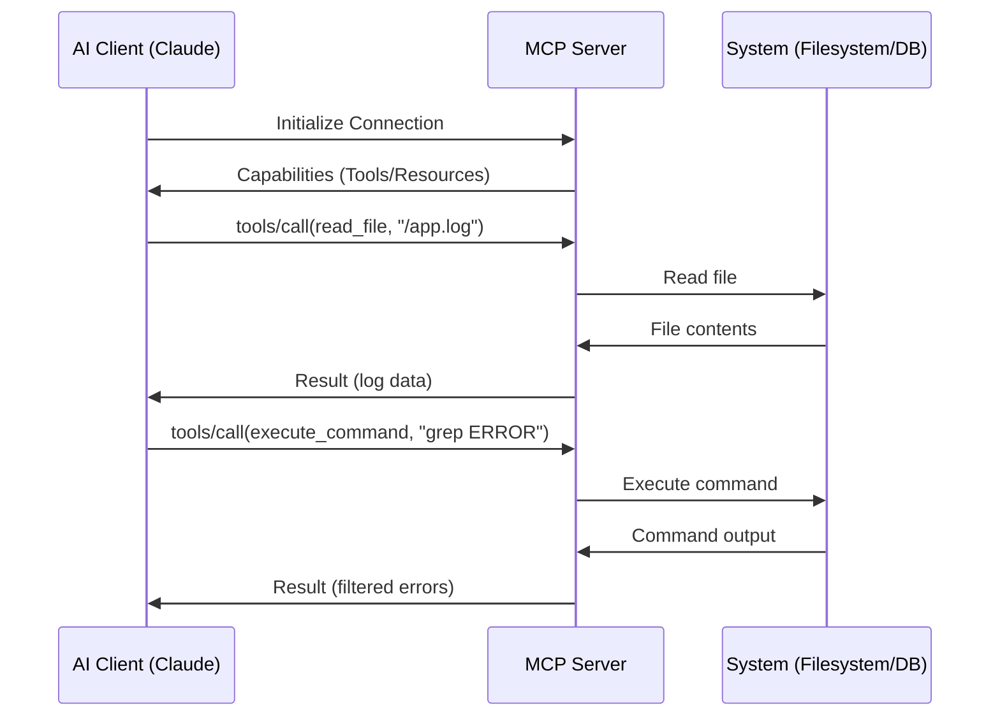

# MCP Protocol Architecture Reference

**Doc Version:** 1.0.0
**Role:** AI Systems Architect
**Scope:** JSON-RPC, Primitives, and Bidirectional Communication

---

## 1. The Protocol Stack

MCP is built on **JSON-RPC 2.0**, a lightweight remote procedure call protocol.

### Why JSON-RPC?
- **Stateless**: Each request is independent
- **Bidirectional**: Both client and server can initiate requests
- **Language Agnostic**: Works with any language that can parse JSON
- **Standardized**: Well-defined error codes and message formats

### The Message Flow
```json
// Client → Server (Request)
{
  "jsonrpc": "2.0",
  "id": 1,
  "method": "tools/call",
  "params": {
    "name": "read_file",
    "arguments": {"path": "/var/log/app.log"}
  }
}

// Server → Client (Response)
{
  "jsonrpc": "2.0",
  "id": 1,
  "result": {
    "content": "ERROR: Database connection failed..."
  }
}
```

---

## 2. The Three Primitives

MCP defines three core abstractions:

### A. Resources (Read-Only Data)
**Purpose**: Provide context to the AI.
**Examples**:
- File contents (`file:///path/to/config.yaml`)
- Database schemas (`postgres://localhost/schema`)
- API documentation (`https://api.example.com/docs`)

**Characteristics**:
- **URI-based**: Each resource has a unique identifier
- **Cacheable**: Clients can cache resource contents
- **Versioned**: Resources can include ETags for change detection

### B. Tools (Actions)
**Purpose**: Allow the AI to perform operations.
**Examples**:
- `execute_command(cmd: string)` → Run shell command
- `create_file(path: string, content: string)` → Write file
- `query_database(sql: string)` → Execute SQL

**Characteristics**:
- **Parameterized**: Tools accept structured arguments (JSON Schema)
- **Idempotent (Recommended)**: Same input → Same output
- **Auditable**: All tool calls should be logged

### C. Prompts (Templates)
**Purpose**: Provide reusable prompt templates.
**Examples**:
- `debug_error(error_message: string)` → "Analyze this error and suggest fixes"
- `code_review(diff: string)` → "Review this code change for security issues"

**Characteristics**:
- **Composable**: Prompts can reference resources
- **Parameterized**: Accept dynamic inputs
- **Versioned**: Teams can maintain a library of approved prompts

---

## 3. The Discovery Mechanism

When a client connects to a server, it performs **capability negotiation**:

1. **Client**: "What tools/resources do you provide?"
2. **Server**: Returns a manifest:
```json
{
  "tools": [
    {
      "name": "read_file",
      "description": "Read contents of a file",
      "inputSchema": {
        "type": "object",
        "properties": {
          "path": {"type": "string"}
        },
        "required": ["path"]
      }
    }
  ]
}
```
3. **Client**: Now knows it can call `read_file(path="/etc/hosts")`

**Governance**: This dynamic discovery allows servers to be updated without client changes.

---

## 4. Security Model

### Sandboxing
MCP servers should restrict access:
```typescript
// Good: Scoped to project directory
const allowedPath = "/home/user/project";
if (!requestedPath.startsWith(allowedPath)) {
  throw new Error("Access denied");
}

// Bad: No restrictions
fs.readFileSync(requestedPath);
```

### Authentication
- **Local Servers**: Typically trust the local user (no auth)
- **Remote Servers**: Use API keys or OAuth tokens
- **Enterprise**: Integrate with SSO (SAML, OIDC)

### Audit Logging
Every tool call should be logged:
```json
{
  "timestamp": "2026-01-29T01:49:00Z",
  "user": "alice@example.com",
  "tool": "execute_command",
  "arguments": {"cmd": "rm -rf /tmp/cache"},
  "result": "success"
}
```

---

## 5. Visualizing the Architecture



> **Enterprise Pattern**: Implement a **Gateway Server** that proxies all MCP requests. This allows centralized authentication, rate limiting, and audit logging without modifying individual MCP servers.
