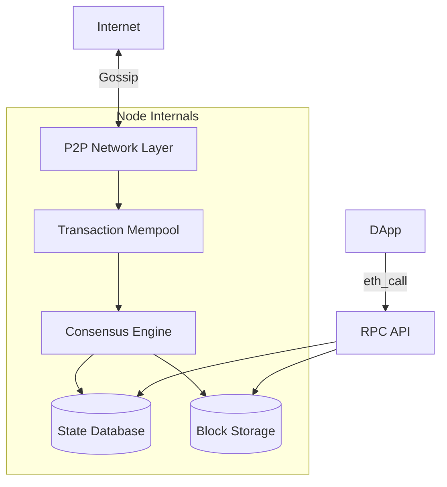

# Blockchain Node Architecture Reference

**Doc Version:** 1.0.0
**Role:** Web3 Infrastructure Engineer
**Scope:** Node Types, Consensus, and P2P Networking

---

## 1. Node Classification

Blockchain nodes exist on a spectrum from "lightweight" to "archival."

### A. Light Nodes (SPV - Simplified Payment Verification)
**Storage**: ~1 GB
**Function**: Verify transactions without storing full blockchain
**Mechanism**: Download block headers only, request Merkle proofs from full nodes
**Use Case**: Mobile wallets, IoT devices

**Limitation**: Trusts full nodes. Cannot independently verify all rules.

### B. Full Nodes
**Storage**: 500 GB - 2 TB (Ethereum), 500 GB (Bitcoin)
**Function**: Store entire blockchain, validate all transactions and blocks
**Mechanism**: Maintain complete UTXO set (Bitcoin) or state trie (Ethereum)
**Use Case**: Personal sovereignty, DApp backends, RPC providers

**Critical**: Full nodes are the "source of truth." They enforce consensus rules.

### C. Archive Nodes
**Storage**: 12+ TB (Ethereum), 500 GB (Bitcoin)
**Function**: Full node + complete historical state
**Mechanism**: Store every state change since genesis block
**Use Case**: Block explorers, analytics platforms, smart contract debugging

**Cost**: Extremely high disk I/O and storage requirements.

### D. Validator Nodes (Proof-of-Stake)
**Storage**: Same as Full Node
**Function**: Full node + block production capability
**Mechanism**: Stake tokens, participate in consensus, earn rewards
**Use Case**: Network security, earning yield

**Risk**: Slashing (penalties for downtime or malicious behavior).

---

## 2. The P2P Network Layer

Blockchain nodes communicate via **peer-to-peer gossip protocols**.

### Discovery Mechanisms

#### A. Bootstrap Nodes (Hardcoded)
- New nodes connect to a list of well-known "seed" nodes
- Example: Ethereum has ~10 bootstrap nodes maintained by the foundation

#### B. DHT (Distributed Hash Table)
- Kademlia-based routing (used by Ethereum, IPFS)
- Nodes maintain a routing table of peers
- Queries propagate through the network to find specific peers

#### C. DNS Discovery
- Query DNS records for peer lists
- Example: `dig TXT _dnsaddr.bootstrap.libp2p.io`

### Gossip Protocol
When a node receives a new transaction:
1. Validate transaction
2. Forward to 8-10 randomly selected peers
3. Peers repeat the process
4. Within seconds, the entire network knows

**Efficiency**: Exponential propagation. 10 hops reach 10^10 nodes.

---

## 3. Consensus Mechanisms

### A. Proof-of-Work (PoW)
**Examples**: Bitcoin, Ethereum Classic
**Mechanism**: Miners compete to solve cryptographic puzzles
**Energy**: Extremely high (Bitcoin uses ~150 TWh/year)
**Finality**: Probabilistic (6 confirmations ≈ 99.9% certainty)

**DevOps Impact**: Mining nodes require GPUs/ASICs, not just CPUs.

### B. Proof-of-Stake (PoS)
**Examples**: Ethereum (post-Merge), Cardano, Polkadot
**Mechanism**: Validators are chosen based on staked tokens
**Energy**: 99.95% less than PoW
**Finality**: Deterministic (after 2 epochs ≈ 12.8 minutes)

**DevOps Impact**: Validator nodes must maintain 99.9%+ uptime to avoid slashing.

### C. Byzantine Fault Tolerance (BFT)
**Examples**: Cosmos (Tendermint), Hyperledger Fabric
**Mechanism**: Validators vote on blocks in rounds
**Finality**: Instant (1-2 seconds)
**Limitation**: Requires known validator set (not permissionless)

---

## 4. State Management

### The State Explosion Problem
Ethereum's state grows by ~50 GB/year. This is unsustainable.

#### Solutions
1. **State Pruning**: Delete old state (keep only recent N blocks)
2. **State Expiry**: Charge rent for storage, expire unused accounts
3. **Stateless Clients**: Nodes don't store state, rely on witnesses (Merkle proofs)

**Trade-off**: Pruned nodes cannot serve historical queries.

---

## 5. Visualizing Node Architecture

> **Enterprise Pattern**: Run **multiple geographically distributed full nodes** behind a load balancer. This provides:
> - **High Availability**: If one node crashes, traffic routes to others
> - **DDoS Resistance**: Distribute attack surface
> - **Low Latency**: Serve users from nearest region
