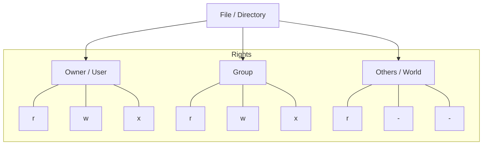

# Linux Permissions & Security Hardening

In Linux, security is governed by a simple but powerful permission model. Every file and directory is owned by a **User** and a **Group**, with specific access rights defined for them and everyone else.

---

## 🔐 The Permission Model (rwx)

Permissions are divided into three categories:
1.  **Read (r)**: View file content or list directory files.
2.  **Write (w)**: Modify file content or create/delete files in a directory.
3.  **Execute (x)**: Run a file as a program or `cd` into a directory.



### 🔢 Numeric vs Symbolic Modes

| Permission | Numeric Value | Symbolic |
| :--- | :--- | :--- |
| Read | 4 | `r--` |
| Write | 2 | `-w-` |
| Execute | 1 | `--x` |
| **Full Access** | **7** | **`rwx`** |

**Common Combinations:**
- **755 (`rwxr-xr-x`)**: Owner can do everything; others can only read and execute (standard for scripts/dirs).
- **644 (`rw-r--r--`)**: Owner can read/write; others can only read (standard for config files).
- **600 (`rw-------`)**: Only the owner can read/write (standard for SSH keys).

---

## 🚀 Special Permissions (The Secret Sauce)

Beyond standard `rwx`, Linux has special bits for specific use cases:

1.  **SUID (Set User ID)**: When set on an executable, it runs with the privileges of the **file owner** (usually root). Example: `passwd` command.
2.  **SGID (Set Group ID)**: New files created in a directory inherit the **group** of that directory. Essential for collaborative team folders.
3.  **Sticky Bit**: Users can only delete files they **own** within a directory, even if they have write access. Standard on `/tmp`.

---

## 🛡️ SRE Best Practices: The Principle of Least Privilege

1.  **Avoid `chmod 777`**: Never grant full permissions to everyone. It is a major security risk.
2.  **Secure SSH Keys**: Private keys MUST be `600`. SSH will refuse to work if they are too open.
3.  **Use `sudo`**: Never log in as `root`. Use a standard user and elevate privileges only when necessary.
4.  **Audit Regularly**: Use `find / -perm -o+w` to find world-writable files that might be exploited.

---

## 🌟 Real-Life SRE Scenario: The Web Server Permission Denied

**Situation**: You deploy a new PHP application to `/var/www/html`, but users get a `403 Forbidden` error.

**Tracing the Issue**:
1.  **Check Permissions**: `ls -ld /var/www/html` shows `700`. Only root can access it.
2.  **Check User**: The web server runs as `www-data`.
3.  **The Fix**:
    ```bash
    # Change ownership to the web server user
    sudo chown -R www-data:www-data /var/www/html
    # Set directories to 755 and files to 644
    find /var/www/html -type d -exec chmod 755 {} \;
    find /var/www/html -type f -exec chmod 644 {} \;
    ```

---

## 🔗 Related Resources
- [Essential Linux Commands](../03-commands/readme.md)
- [Linux Filesystem Mastery](../02-filesystem/readme.md)
- [SSH Mastery](../ssh/readme.md)
