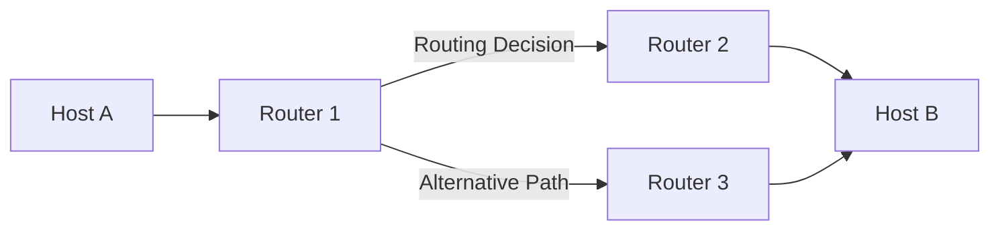

# Network Layer (Layer 3) - OSI Model

## Overview

The Network Layer is responsible for routing data packets between different networks. It determines the best path for data transmission across multiple networks and handles logical addressing using IP addresses.

## Key Functions

### 1. Logical Addressing

- **IP Addressing**: Assigns unique logical addresses to devices
- **IPv4**: 32-bit addresses (e.g., 192.168.1.1)
- **IPv6**: 128-bit addresses (e.g., 2001:db8::1)

### 2. Routing

- **Path Determination**: Finds optimal route between source and destination
- **Routing Tables**: Maintain information about network paths
- **Routing Algorithms**: OSPF, BGP, RIP, EIGRP

### 3. Packet Forwarding

- **Packet Switching**: Forwards packets based on destination IP
- **Load Balancing**: Distributions traffic across multiple paths
- **Quality of Service (QoS)**: Prioritizes different types of traffic



## Network Layer Protocols

### Internet Protocol (IP)

```bash
# IPv4 Header Structure
Version (4 bits) | IHL (4 bits) | Type of Service (8 bits) | Total Length (16 bits)
Identification (16 bits) | Flags (3 bits) | Fragment Offset (13 bits)
Time to Live (8 bits) | Protocol (8 bits) | Header Checksum (16 bits)
Source Address (32 bits)
Destination Address (32 bits)
Options (variable) | Padding (variable)
```

### Internet Control Message Protocol (ICMP)

```bash
# ICMP Message Types
Type 0: Echo Reply (ping response)
Type 3: Destination Unreachable
Type 8: Echo Request (ping)
Type 11: Time Exceeded
Type 12: Parameter Problem

# ICMP Tools
ping google.com                    # Test connectivity
traceroute google.com             # Trace packet path
mtr google.com                    # Continuous traceroute
```

### Address Resolution Protocol (ARP)

```bash
# ARP Commands
arp -a                            # Display ARP table
arp -d 192.168.1.1               # Delete ARP entry
arp -s 192.168.1.1 00:11:22:33:44:55  # Static ARP entry

# ARP Process
1. Host needs MAC address for IP
2. Broadcasts ARP request
3. Target responds with MAC address
4. Requesting host caches the mapping
```

## Routing Concepts

### Static vs Dynamic Routing

```bash
# Static Routing (Linux)
ip route add 192.168.2.0/24 via 192.168.1.1
route add -net 192.168.2.0/24 gw 192.168.1.1

# View routing table
ip route show
route -n
netstat -rn
```

### Routing Protocols

#### OSPF (Open Shortest Path First)

```bash
# OSPF Configuration (Cisco)
router ospf 1
network 192.168.1.0 0.0.0.255 area 0
network 10.0.0.0 0.255.255.255 area 1

# OSPF Verification
show ip ospf neighbor
show ip ospf database
show ip route ospf
```

#### BGP (Border Gateway Protocol)

```bash
# BGP Configuration
router bgp 65001
neighbor 203.0.113.1 remote-as 65002
network 192.168.1.0 mask 255.255.255.0

# BGP Verification
show ip bgp summary
show ip bgp neighbors
show ip route bgp
```

## Subnetting and VLSM

### Subnet Calculation

```bash
# Network: 192.168.1.0/24
# Subnets needed: 4
# Hosts per subnet: 60

# Subnet mask: /26 (255.255.255.192)
Subnet 1: 192.168.1.0/26   (192.168.1.1-62)
Subnet 2: 192.168.1.64/26  (192.168.1.65-126)
Subnet 3: 192.168.1.128/26 (192.168.1.129-190)
Subnet 4: 192.168.1.192/26 (192.168.1.193-254)
```

### CIDR (Classless Inter-Domain Routing)

```bash
# CIDR Notation Examples
/8  = 255.0.0.0     (16,777,214 hosts)
/16 = 255.255.0.0   (65,534 hosts)
/24 = 255.255.255.0 (254 hosts)
/30 = 255.255.255.252 (2 hosts - point-to-point)
```

## Network Address Translation (NAT)

### NAT Types

```bash
# Static NAT (1:1 mapping)
ip nat inside source static 192.168.1.10 203.0.113.10

# Dynamic NAT (pool mapping)
ip nat pool POOL1 203.0.113.1 203.0.113.10 netmask 255.255.255.0
ip nat inside source list 1 pool POOL1

# PAT/NAPT (Port Address Translation)
ip nat inside source list 1 interface fastethernet0/0 overload
```

## Quality of Service (QoS)

### Traffic Classification

```bash
# DiffServ Code Points (DSCP)
EF (Expedited Forwarding): Voice traffic
AF (Assured Forwarding): Critical data
BE (Best Effort): Default traffic

# Traffic Shaping
tc qdisc add dev eth0 root handle 1: htb default 30
tc class add dev eth0 parent 1: classid 1:1 htb rate 100mbit
tc class add dev eth0 parent 1:1 classid 1:10 htb rate 80mbit ceil 100mbit
```

## Network Security at Layer 3

### Access Control Lists (ACLs)

```bash
# Standard ACL (Cisco)
access-list 10 permit 192.168.1.0 0.0.0.255
access-list 10 deny any

# Extended ACL
access-list 100 permit tcp 192.168.1.0 0.0.0.255 any eq 80
access-list 100 permit tcp 192.168.1.0 0.0.0.255 any eq 443
access-list 100 deny ip any any

# Apply ACL to interface
interface fastethernet0/0
ip access-group 10 in
```

### IPSec VPN

```bash
# IPSec Configuration
crypto isakmp policy 10
encryption aes 256
hash sha256
authentication pre-share
group 14

crypto ipsec transform-set MYSET esp-aes 256 esp-sha256-hmac
crypto map MYMAP 10 ipsec-isakmp
set peer 203.0.113.1
set transform-set MYSET
match address 101
```

## Troubleshooting Network Layer

### Common Tools

```bash
# Connectivity Testing
ping -c 4 8.8.8.8                # Test connectivity
ping6 -c 4 2001:4860:4860::8888  # IPv6 ping

# Path Tracing
traceroute google.com             # Trace route
tracepath google.com              # Alternative to traceroute
mtr --report google.com           # Network diagnostic tool

# Route Analysis
ip route get 8.8.8.8             # Show route to destination
ss -rn                           # Display routing table
```

### Network Layer Issues

```bash
# Common Problems and Solutions

# 1. Routing Loops
show ip route                     # Check for inconsistent routes
debug ip routing                  # Monitor routing updates

# 2. MTU Issues
ping -M do -s 1472 google.com    # Test MTU size
ip link set dev eth0 mtu 1500     # Set MTU size

# 3. TTL Expiration
ping -t 1 google.com             # Set TTL value
tcpdump -i eth0 icmp             # Monitor ICMP messages
```

## DevOps Integration

### Infrastructure as Code

```yaml
# Terraform - VPC and Subnets
resource "aws_vpc" "main" {
  cidr_block           = "10.0.0.0/16"
  enable_dns_hostnames = true
  enable_dns_support   = true
}

resource "aws_subnet" "public" {
  vpc_id                  = aws_vpc.main.id
  cidr_block              = "10.0.1.0/24"
  availability_zone       = "us-west-2a"
  map_public_ip_on_launch = true
}

resource "aws_route_table" "public" {
  vpc_id = aws_vpc.main.id
  
  route {
    cidr_block = "0.0.0.0/0"
    gateway_id = aws_internet_gateway.main.id
  }
}
```

### Monitoring and Automation

```bash
# Network monitoring with Prometheus
# /etc/prometheus/prometheus.yml
global:
  scrape_interval: 15s

scrape_configs:
  - job_name: 'snmp'
    static_configs:
      - targets: ['192.168.1.1:161']
    metrics_path: /snmp
    params:
      module: [if_mib]
    relabel_configs:
      - source_labels: [__address__]
        target_label: __param_target
      - source_labels: [__param_target]
        target_label: instance
      - target_label: __address__
        replacement: localhost:9116
```

## Best Practices

### 1. IP Address Management

- Use private IP ranges (RFC 1918)
- Implement proper subnetting
- Document IP allocations
- Use DHCP reservations for servers

### 2. Routing Design

- Implement redundant paths
- Use route summarization
- Configure route filtering
- Monitor routing table size

### 3. Security

- Implement network segmentation
- Use ACLs for traffic filtering
- Enable logging and monitoring
- Regular security audits

### 4. Performance Optimization

- Optimize routing metrics
- Implement QoS policies
- Monitor bandwidth utilization
- Use traffic engineering

---

### ⏭️ Next Step

Move up to [Layer 4: Transport Layer](readme.md).
