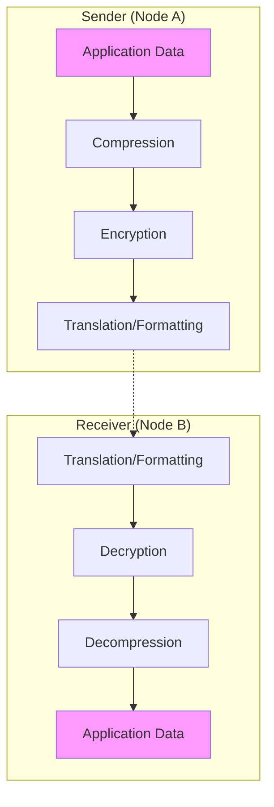

# Presentation Layer (Layer 6) - OSI Model

## Overview

The Presentation Layer is the sixth layer of the OSI model. It is responsible for **Translation**, **Encryption**, and **Compression**. It ensures that the data sent by the Application Layer of one system can be read by the Application Layer of another.

It acts as the **Translator** or **Interpreter** of the network stack.

---

## Key Functions

### 1. Data Translation
Computers use different methods to represent data (e.g., ASCII vs. UTF-8 for text). The Presentation layer translates these varying formats so they are compatible.
- **Example**: Converting an EBCDIC-coded file to an ASCII-coded file.

### 2. Encryption and Decryption
To keep data secure, it can be scrambled (encrypted) at the source and unscrambled (decrypted) at the destination.
- **Example**: SSL/TLS (used in HTTPS) operates at this layer to secure web traffic.

### 3. Compression
Reduces the number of bits that need to be transmitted, which improves network efficiency and speed.
- **Example**: Compressing a large image (JPEG) or video (MPEG) before sending it over the wire.

---

## Common Presentation Layer Standards

The Presentation layer isn't just about protocols; it's about **formats**:

- **Text**: ASCII, EBCDIC, UTF-8.
- **Images**: JPEG, GIF, TIFF, PNG.
- **Video/Audio**: MPEG, MIDI, QuickTime.
- **Security**: SSL (Secure Sockets Layer), TLS (Transport Layer Security).

---

## Why it matters for DevOps
- **Security Scans**: DevOps engineers must ensure data is encrypted at rest and in transit (TLS).
- **Serialization**: When microservices talk to each other, they often "serialize" data into formats like **JSON**, **YAML**, or **Protocol Buffers** (Protobuf)—this is effectively a Presentation layer task.
- **Performance**: Implementing Gzip or Brotli compression on a web server (like Nginx) reduces load times and bandwidth costs.

---

### ⏭️ Next Step
Move up to the final layer: [Layer 7: Application Layer](readme.md).