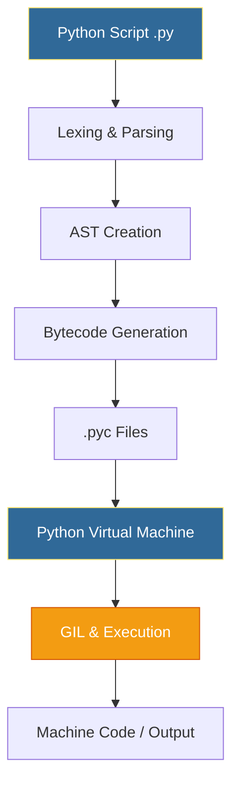

# 🐍 Python Fundamentals: The Foundation of DevOps Automation

> **"Bash is the glue for the OS, but Python is the glue for the Cloud. It turns complex infrastructure into manageable, readable code."**


---

## 🧠 The Mental Model: Python as the Universal Translator

**The Junior Struggle**: "I know Bash. Why do I need Python?"

**The Engineer Solution**: Bash is perfect for **simple automation** (5-10 lines). Python is essential for **complex automation** (100+ lines) that needs error handling, data structures, and maintainability.

### 🏗️ The Infrastructure Analogy

Think of Python like a **Swiss Army Knife** for infrastructure:

| Tool | Bash Equivalent | Python Advantage |
|:-----|:----------------|:-----------------|
| **Knife** | Basic commands (`ls`, `grep`) | Built-in data structures (lists, dicts) |
| **Screwdriver** | Text processing (`sed`, `awk`) | String methods, regex, JSON parsing |
| **Pliers** | Loops and conditionals | Exception handling, type safety |
| **Saw** | File manipulation | Context managers, atomic operations |
| **Magnifying Glass** | Debugging (`set -x`) | Debugger, logging, stack traces |

**The Key Insight**: Just like a Swiss Army Knife replaces multiple single-purpose tools, Python replaces dozens of Bash utilities with a single, coherent language.

---

## 📚 Why This Module Matters for Juniors

**Before this module**, you might think:
- "Python is just for web developers"
- "Bash can do everything I need"
- "Learning Python syntax is enough"

**After this module**, you'll understand:
- Python is the **primary language** of DevOps automation
- Python handles **complex data** (JSON, YAML) better than Bash
- **Production-ready code** requires type hints, error handling, and style guides
- Python interacts with **system resources** (env vars, processes, files)

**The Difference**: You'll write maintainable automation that scales from 10 servers to 10,000.

---

## 🎯 Learning Objectives

By the end of this module, you will:

- ✅ **Understand the Python Execution Model**: Interpreter lifecycle, bytecode, GIL
- ✅ **Master Type Hints**: Write self-documenting, production-ready code
- ✅ **Perform String Operations**: Parse logs, configs, and CLI output
- ✅ **Interact with the System**: Read environment variables, get system info
- ✅ **Follow PEP 8 Standards**: Write code that passes CI/CD linting
- ✅ **Apply Guard Clauses**: Avoid deep nesting, write readable code
- ✅ **Use F-Strings**: Modern string formatting for dynamic output

---

## 🏗️ Part 1: Python Execution Architecture

### 🧠 The Mental Model: The Assembly Line

**The Junior Question**: "How does Python actually run my code?"

**The Engineer Answer**: Python goes through multiple stages, like an assembly line transforming raw materials into a finished product.

### 🎨 Visual: The Interpreter Lifecycle



### 🔧 Detailed Breakdown

1. **Lexing & Parsing**: The interpreter reads your `.py` file and breaks it into "tokens"
   - **Catches**: Missing colons, bad indentation, syntax errors
   - **Error**: `SyntaxError: invalid syntax`

2. **AST (Abstract Syntax Tree)**: Python builds a logical map of your code
   - **Used by**: Linters (flake8), security scanners (Bandit)
   - **Purpose**: Understand code structure without executing it

3. **Bytecode Compilation**: Code is converted to platform-independent bytecode
   - **Stored in**: `__pycache__/*.pyc` files
   - **Purpose**: Speed up subsequent runs (no need to re-parse)

4. **PVM (Python Virtual Machine)**: The engine that executes bytecode
   - **Similar to**: JVM for Java, CLR for C#
   - **Purpose**: Platform independence (same bytecode runs on Windows/Linux/Mac)

5. **GIL (Global Interpreter Lock)**: Only one thread executes Python bytecode at a time
   - **Impact**: CPU-bound tasks are slow (use multiprocessing instead)
   - **Advantage**: I/O-bound tasks (API calls) are fast (thread releases GIL while waiting)

### 💡 Pro Tip: Why This Matters for DevOps

**The Scenario**: Your script calls 100 cloud APIs to get server status.

- ❌ **Sequential**: Takes 100 seconds (1 second per API call)
- ✅ **Threading**: Takes ~1 second (all calls happen simultaneously)
- ✅ **Async**: Takes ~1 second (even more efficient than threading)

The GIL doesn't hurt here because API calls are **I/O-bound** (waiting for network), not CPU-bound.

---

## 🚀 Part 2: Variables & Type Hints

### 🧠 The Mental Model: The Label Maker

**The Junior Confusion**: "Python is dynamically typed. Why use type hints?"

**The Engineer Answer**: Type hints are **documentation + validation**. They tell your team (and tools like mypy) what type of data a variable should hold.

### 🔧 Production-Ready Type Hints

```python
from typing import List, Dict, Optional, Tuple

# ━━━━━━━━━━━━━━━━━━━━━━━━━━━━━━━━━━━━━━━━━━━━━━━━━━━━━━
# Basic Types
# ━━━━━━━━━━━━━━━━━━━━━━━━━━━━━━━━━━━━━━━━━━━━━━━━━━━━━━

# Infrastructure metadata
region: str = "us-east-1"
instance_count: int = 5
cpu_limit: float = 0.75  # 75% vCPU
is_active: bool = True

# ━━━━━━━━━━━━━━━━━━━━━━━━━━━━━━━━━━━━━━━━━━━━━━━━━━━━━━
# Collection Types
# ━━━━━━━━━━━━━━━━━━━━━━━━━━━━━━━━━━━━━━━━━━━━━━━━━━━━━━

# List of server names
servers: List[str] = ["web-01", "web-02", "web-03"]

# Dictionary mapping server names to IPs
server_ips: Dict[str, str] = {
    "web-01": "10.0.1.5",
    "db-01": "10.0.1.10"
}

# Optional value (might be None)
backup_server: Optional[str] = None

# Tuple of (hostname, ip, port)
connection_info: Tuple[str, str, int] = ("web-01", "10.0.1.5", 8080)

# ━━━━━━━━━━━━━━━━━━━━━━━━━━━━━━━━━━━━━━━━━━━━━━━━━━━━━━
# Function Type Hints
# ━━━━━━━━━━━━━━━━━━━━━━━━━━━━━━━━━━━━━━━━━━━━━━━━━━━━━━

def get_server_status(server_name: str) -> Dict[str, str]:
    """
    Get the status of a server.
    
    Args:
        server_name: Name of the server to check
    
    Returns:
        Dictionary with server status information
    """
    return {
        "name": server_name,
        "status": "running",
        "ip": "10.0.1.5"
    }

def scale_instances(count: int, dry_run: bool = False) -> Optional[List[str]]:
    """
    Scale the number of instances.
    
    Args:
        count: Number of instances to scale to
        dry_run: If True, simulate without making changes
    
    Returns:
        List of instance IDs if successful, None if dry run
    """
    if dry_run:
        print(f"Would scale to {count} instances")
        return None
    
    # Actual scaling logic here
    return [f"i-{i}" for i in range(count)]
```

### 📊 The DevOps Type Hierarchy

| Python Type | DevOps Use Case | Example |
|:------------|:----------------|:--------|
| `str` | Hostnames, regions, status messages | `"us-east-1"` |
| `int` | Replica counts, port numbers | `3`, `8080` |
| `float` | CPU limits, percentages | `0.75`, `99.9` |
| `bool` | Feature flags, status checks | `True`, `False` |
| `List[str]` | Server lists, IP addresses | `["web-01", "web-02"]` |
| `Dict[str, str]` | Config maps, metadata | `{"env": "prod"}` |
| `Optional[str]` | Values that might be missing | `None` or `"value"` |

**💡 Pro Tip**: Use `mypy` to validate type hints in your CI/CD pipeline. It catches type errors before they reach production.

---

## 📝 Part 3: String Manipulation for DevOps

### 🧠 The Mental Model: The Text Processor

**The Reality**: 80% of DevOps work is parsing text (logs, configs, CLI output).

**The Solution**: Python's string methods are more powerful and readable than Bash's `sed`/`awk`.

### 🔧 Modern String Formatting: F-Strings

```python
# ━━━━━━━━━━━━━━━━━━━━━━━━━━━━━━━━━━━━━━━━━━━━━━━━━━━━━━
# F-Strings (Python 3.6+): The Gold Standard
# ━━━━━━━━━━━━━━━━━━━━━━━━━━━━━━━━━━━━━━━━━━━━━━━━━━━━━━

env = "production"
port = 8080
replicas = 3

# ✅ Clean, readable, fast
health_url = f"http://{env}.internal:{port}/health"
status_msg = f"Scaled to {replicas} replicas in {env}"

# ✅ Expressions inside f-strings
uptime_pct = 99.95
print(f"Uptime: {uptime_pct:.2f}%")  # "Uptime: 99.95%"

# ✅ Calling functions inside f-strings
import datetime
print(f"Deployed at: {datetime.datetime.now().isoformat()}")

# ❌ Old way (avoid)
old_way = "http://%s.internal:%d/health" % (env, port)
old_way2 = "http://{}.internal:{}/health".format(env, port)
```

### 🚀 Professional Pattern: Log Parsing

```python
import re
from typing import Dict, Optional

def parse_nginx_log(log_line: str) -> Optional[Dict[str, str]]:
    """
    Parse an Nginx access log line.
    
    Args:
        log_line: Raw log line from Nginx
    
    Returns:
        Dictionary with parsed fields, or None if invalid
    
    Example:
        >>> log = '10.0.1.5 - - [31/Jan/2026:10:00:00 +0000] "GET /api/health HTTP/1.1" 200 42'
        >>> result = parse_nginx_log(log)
        >>> result['ip']
        '10.0.1.5'
    """
    # Nginx log pattern
    pattern = r'(?P<ip>[\d.]+) .* \[(?P<timestamp>[^\]]+)\] "(?P<method>\w+) (?P<path>\S+) .*" (?P<status>\d+) (?P<bytes>\d+)'
    
    match = re.match(pattern, log_line)
    if not match:
        return None
    
    return match.groupdict()


# 🎯 Usage
log_line = '10.0.1.5 - - [31/Jan/2026:10:00:00 +0000] "GET /api/health HTTP/1.1" 200 42'
parsed = parse_nginx_log(log_line)

if parsed:
    print(f"IP: {parsed['ip']}")
    print(f"Path: {parsed['path']}")
    print(f"Status: {parsed['status']}")
```

### 🔧 Common String Operations

```python
# ━━━━━━━━━━━━━━━━━━━━━━━━━━━━━━━━━━━━━━━━━━━━━━━━━━━━━━
# Cleaning & Normalizing
# ━━━━━━━━━━━━━━━━━━━━━━━━━━━━━━━━━━━━━━━━━━━━━━━━━━━━━━

raw_log = "  [2026-01-31] [ERROR] Database timeout  \n"

# Remove whitespace
clean = raw_log.strip()  # "[2026-01-31] [ERROR] Database timeout"

# Convert case
lower = clean.lower()  # "[2026-01-31] [error] database timeout"
upper = clean.upper()  # "[2026-01-31] [ERROR] DATABASE TIMEOUT"

# ━━━━━━━━━━━━━━━━━━━━━━━━━━━━━━━━━━━━━━━━━━━━━━━━━━━━━━
# Splitting & Joining
# ━━━━━━━━━━━━━━━━━━━━━━━━━━━━━━━━━━━━━━━━━━━━━━━━━━━━━━

# Split on whitespace
parts = clean.split()  # ['[2026-01-31]', '[ERROR]', 'Database', 'timeout']

# Split on specific delimiter
csv_line = "web-01,10.0.1.5,running"
fields = csv_line.split(",")  # ['web-01', '10.0.1.5', 'running']

# Join list into string
servers = ["web-01", "web-02", "web-03"]
server_list = ", ".join(servers)  # "web-01, web-02, web-03"

# ━━━━━━━━━━━━━━━━━━━━━━━━━━━━━━━━━━━━━━━━━━━━━━━━━━━━━━
# Searching & Replacing
# ━━━━━━━━━━━━━━━━━━━━━━━━━━━━━━━━━━━━━━━━━━━━━━━━━━━━━━

config = "server_name=localhost;port=8080"

# Check if substring exists
if "localhost" in config:
    print("Using localhost")

# Replace substring
prod_config = config.replace("localhost", "prod.example.com")

# Check prefix/suffix
if config.startswith("server_name"):
    print("Valid config")

if config.endswith("8080"):
    print("Using port 8080")
```

**💡 Pro Tip**: Use `splitlines()` instead of `split('\n')` for cross-platform compatibility (handles `\n`, `\r\n`, and `\r`).

---

## 🖥️ Part 4: System Interaction

### 🧠 The Mental Model: The System Inspector

**The Use Case**: Your script needs to know the hostname, read environment variables, or get system information.

**The Solution**: Python's `os` and `sys` modules provide system interaction.

### 🔧 Reading Environment Variables

```python
import os
from typing import Optional

def get_env_var(key: str, default: Optional[str] = None) -> str:
    """
    Safely get an environment variable.
    
    Args:
        key: Environment variable name
        default: Default value if not found
    
    Returns:
        Environment variable value or default
    
    Raises:
        ValueError: If variable not found and no default provided
    """
    value = os.environ.get(key, default)
    
    if value is None:
        raise ValueError(f"Environment variable '{key}' not found")
    
    return value


# 🎯 Usage: 12-Factor App Configuration
try:
    db_host = get_env_var("DB_HOST", "localhost")
    db_port = int(get_env_var("DB_PORT", "5432"))
    db_password = get_env_var("DB_PASSWORD")  # Required, no default
    
    print(f"Connecting to {db_host}:{db_port}")
except ValueError as e:
    print(f"❌ Configuration error: {e}")
    exit(1)
```

### 🚀 Professional Pattern: System Information Script

```python
import os
import sys
import platform
import socket
from typing import Dict

def get_system_info() -> Dict[str, str]:
    """
    Gather system information for diagnostics.
    
    Returns:
        Dictionary with system information
    """
    return {
        "hostname": socket.gethostname(),
        "platform": platform.system(),
        "platform_release": platform.release(),
        "platform_version": platform.version(),
        "architecture": platform.machine(),
        "processor": platform.processor(),
        "python_version": sys.version.split()[0],
        "python_executable": sys.executable,
        "current_user": os.getenv("USER", "unknown"),
        "home_directory": os.path.expanduser("~"),
        "current_directory": os.getcwd(),
    }


# 🎯 Usage: Health Check Script
if __name__ == "__main__":
    print("System Information:")
    print("=" * 50)
    
    info = get_system_info()
    for key, value in info.items():
        print(f"{key:20s}: {value}")
```

**Output**:
```
System Information:
==================================================
hostname            : web-server-01
platform            : Linux
platform_release    : 5.15.0-91-generic
platform_version    : #101-Ubuntu SMP
architecture        : x86_64
processor           : x86_64
python_version      : 3.11.7
python_executable   : /usr/bin/python3
current_user        : ubuntu
home_directory      : /home/ubuntu
current_directory   : /opt/app
```

**💡 Pro Tip**: Include system info in error logs to help debug environment-specific issues.

---

## 🛡️ Part 5: Guard Clauses & Control Flow

### 🧠 The Mental Model: The Bouncer

**The Problem**: Deep nesting makes code hard to read (the "Arrowhead Antipattern").

**The Solution**: Guard clauses exit early when conditions aren't met.

### 🔧 The Arrowhead Antipattern

```python
# ❌ Deep Nesting (Hard to read, hard to maintain)
def deploy_to_server(server):
    if server is not None:
        if server.is_active:
            if server.has_credentials:
                if server.ping():
                    if server.disk_space > 10:
                        # Actual deployment logic buried 5 levels deep
                        print(f"Deploying to {server.name}")
                        return True
                    else:
                        print("Insufficient disk space")
                        return False
                else:
                    print("Server not reachable")
                    return False
            else:
                print("Missing credentials")
                return False
        else:
            print("Server not active")
            return False
    else:
        print("Server is None")
        return False
```

### ✅ The Engineer Way: Guard Clauses

```python
# ✅ Guard Clauses (Clean, readable, professional)
def deploy_to_server(server):
    """
    Deploy application to a server.
    
    Args:
        server: Server object to deploy to
    
    Returns:
        True if deployment succeeded, False otherwise
    """
    # Guard clause: Check for None
    if server is None:
        print("❌ Server is None")
        return False
    
    # Guard clause: Check if active
    if not server.is_active:
        print(f"❌ Server {server.name} is not active")
        return False
    
    # Guard clause: Check credentials
    if not server.has_credentials:
        print(f"❌ Server {server.name} missing credentials")
        return False
    
    # Guard clause: Check connectivity
    if not server.ping():
        print(f"❌ Server {server.name} not reachable")
        return False
    
    # Guard clause: Check disk space
    if server.disk_space <= 10:
        print(f"❌ Server {server.name} has insufficient disk space")
        return False
    
    # ✅ All checks passed, do the actual work
    print(f"✅ Deploying to {server.name}")
    # Deployment logic here
    return True
```

**💡 Pro Tip**: Guard clauses make code **self-documenting**. Each check is a clear requirement.

---

## 🎨 Part 6: PEP 8 Style Guide

### 🧠 The Mental Model: The Code Review Checklist

**The Reality**: Code is read 10x more than it's written.

**The Solution**: PEP 8 ensures all Python code looks consistent.

### 📊 PEP 8 Quick Reference

| Rule | Example | Why |
|:-----|:--------|:----|
| **Indentation** | 4 spaces (not tabs) | Consistency across editors |
| **Line Length** | Max 79 characters | Readable in split-screen |
| **Imports** | One per line, grouped | Easy to scan |
| **Naming** | `snake_case` for functions/variables | Pythonic convention |
| **Constants** | `UPPER_CASE` | Clearly identifies constants |
| **Classes** | `PascalCase` | Distinguishes from functions |
| **Blank Lines** | 2 between functions | Visual separation |

### 🔧 Before & After: PEP 8 Transformation

```python
# ❌ "Hacker" Script (Violates PEP 8)
import os,sys,json
def GetServerIP(ServerName):
 if ServerName=="web-01":return "10.0.1.5"
 else:return None
MYSERVERS=["web-01","db-01"]
for s in MYSERVERS:print(GetServerIP(s))

# ✅ "Engineer" Script (Follows PEP 8)
import json
import os
import sys

# Constants use UPPER_CASE
DEFAULT_SERVERS = ["web-01", "db-01"]


def get_server_ip(server_name: str) -> str:
    """
    Get the IP address for a server.
    
    Args:
        server_name: Name of the server
    
    Returns:
        IP address or "unknown" if not found
    """
    server_ips = {
        "web-01": "10.0.1.5",
        "db-01": "10.0.1.10"
    }
    
    return server_ips.get(server_name, "unknown")


# Main execution
if __name__ == "__main__":
    for server in DEFAULT_SERVERS:
        ip = get_server_ip(server)
        print(f"{server}: {ip}")
```

### 🚀 Professional Pattern: CI/CD Linting

```yaml
# .github/workflows/lint.yml
name: Lint Python Code

on: [push, pull_request]

jobs:
  lint:
    runs-on: ubuntu-latest
    steps:
      - uses: actions/checkout@v2
      
      - name: Set up Python
        uses: actions/setup-python@v2
        with:
          python-version: '3.11'
      
      - name: Install linters
        run: |
          pip install flake8 black mypy
      
      - name: Run flake8
        run: flake8 . --max-line-length=100
      
      - name: Run black (check only)
        run: black --check .
      
      - name: Run mypy
        run: mypy . --ignore-missing-imports
```

**💡 Pro Tip**: Use `black` to auto-format code. It's "uncompromising" - no configuration needed.

---

## 🏆 Part 7: Real-World DevOps Story

### 📖 The Migration Normalizer

**The Scenario**: A financial firm had 1,000+ server configs in various formats. Some used `SERVER_NAME`, others `HostName`, with inconsistent capitalization. Migrating to Terraform was impossible.

**The Discovery**: Bash scripts using `sed` and `awk` became a "regex nightmare" that nobody could maintain.

**The Solution**: A Python script that:
1. Used `os.walk()` to find all config files
2. Parsed each file line-by-line
3. Normalized keys to `snake_case`
4. Validated data types using type hints
5. Output a single, unified JSON inventory

**The Code**:
```python
import os
import json
from typing import Dict, List

def normalize_key(key: str) -> str:
    """Convert any key format to snake_case."""
    return key.lower().replace("-", "_").replace(" ", "_")

def normalize_config_file(filepath: str) -> Dict[str, str]:
    """Parse and normalize a config file."""
    config = {}
    
    with open(filepath, 'r') as f:
        for line in f:
            if '=' in line:
                key, value = line.strip().split('=', 1)
                normalized_key = normalize_key(key)
                config[normalized_key] = value.strip()
    
    return config

def migrate_all_configs(root_dir: str) -> List[Dict[str, str]]:
    """Migrate all config files in a directory tree."""
    all_configs = []
    
    for dirpath, _, filenames in os.walk(root_dir):
        for filename in filenames:
            if filename.endswith('.conf'):
                filepath = os.path.join(dirpath, filename)
                config = normalize_config_file(filepath)
                all_configs.append(config)
    
    return all_configs

# 🎯 Usage
configs = migrate_all_configs('/etc/servers')
with open('unified_inventory.json', 'w') as f:
    json.dump(configs, f, indent=2)
```

**The Outcome**: Migration completed in **1 week** instead of 3 months. Zero configuration drift.

---

## ❓ Interview Preparation

### 🎯 Core Concepts

1. **Q: What is the Python Global Interpreter Lock (GIL)?**
   - **A**: A mutex that allows only one thread to execute Python bytecode at a time. This prevents race conditions but limits multi-threaded performance for CPU-intensive tasks. For I/O-bound tasks (API calls), use threading or asyncio.

2. **Q: Why use type hints if Python is dynamically typed?**
   - **A**: Type hints provide documentation, enable static analysis with mypy, improve IDE autocomplete, and catch type errors before runtime. They're especially important in production code.

3. **Q: What is "EAFP" vs "LBYL"?**
   - **A**: EAFP (Easier to Ask Forgiveness than Permission) uses try/except. LBYL (Look Before You Leap) uses if statements. Python prefers EAFP because it's safer in concurrent environments (avoids race conditions).

4. **Q: Explain the difference between `list.append()` and `list.extend()`.**
   - **A**: `append()` adds the object as a single item. `extend()` iterates through the object and adds each element individually. For merging lists, use `extend()`.

5. **Q: Why should you avoid global variables?**
   - **A**: Global variables create hidden dependencies and make code hard to test. If a variable changes unexpectedly, it's hard to trace which function modified it. Use function arguments and return values instead.

### 🚀 Advanced Questions

6. **Q: What is bytecode and where is it stored?**
   - **A**: Bytecode is platform-independent intermediate code. It's stored in `__pycache__/*.pyc` files to speed up subsequent runs by skipping the parsing stage.

7. **Q: How does the GIL affect I/O-bound vs CPU-bound tasks?**
   - **A**: For I/O-bound tasks (API calls, file I/O), the GIL is released while waiting, so threading/async work well. For CPU-bound tasks (data processing), use multiprocessing to bypass the GIL.

8. **Q: What's the difference between `os.environ.get()` and `os.environ[]`?**
   - **A**: `os.environ[]` raises KeyError if the variable doesn't exist. `os.environ.get()` returns None (or a default) instead, making it safer for optional variables.

9. **Q: Why use f-strings over `.format()` or `%` formatting?**
   - **A**: F-strings are faster, more readable, and allow expressions inside `{}`. They're the modern standard (Python 3.6+).

10. **Q: What is the purpose of `if __name__ == "__main__":`?**
    - **A**: It allows a file to be both imported as a module and run as a script. Code inside this block only runs when the file is executed directly, not when imported.

---

## 📝 Knowledge Check

### 🧠 Beginner Level

1. **Which part of the interpreter handles syntax errors?**
   - [ ] a) PVM
   - [x] b) Lexer/Parser
   - [ ] c) Bytecode compiler
   - [ ] d) GIL

2. **What is the Big-O complexity of dictionary lookups?**
   - [x] a) O(1) - Constant time
   - [ ] b) O(n) - Linear time
   - [ ] c) O(log n) - Logarithmic time
   - [ ] d) O(n²) - Quadratic time

3. **Which tool automatically formats Python code to PEP 8?**
   - [ ] a) Flake8
   - [x] b) Black
   - [ ] c) Mypy
   - [ ] d) Bandit

4. **What is the result of `f"{5 + 5}"`?**
   - [ ] a) `"5+5"`
   - [x] b) `"10"`
   - [ ] c) `Error`
   - [ ] d) `10` (integer)

### 🚀 Intermediate Level

5. **True or False: The GIL makes Python bad for calling multiple APIs simultaneously.**
   - [ ] a) True
   - [x] b) False (API calls are I/O-bound; threads release the GIL while waiting)

6. **What does `os.environ.get("VAR", "default")` return if VAR doesn't exist?**
   - [ ] a) None
   - [x] b) "default"
   - [ ] c) KeyError
   - [ ] d) Empty string

7. **Which is the correct way to define a function with type hints?**
   - [ ] a) `def func(x: int) -> str:`
   - [x] b) `def func(x: int) -> str:`
   - [ ] c) `def func(x as int) returns str:`
   - [ ] d) `def func(int x) -> str:`

8. **What is a guard clause?**
   - [ ] a) A try/except block
   - [x] b) An early return that exits when conditions aren't met
   - [ ] c) A security check
   - [ ] d) A type validation

### 🏆 Advanced Level

9. **Where is Python bytecode stored?**
   - [ ] a) `.py` files
   - [x] b) `__pycache__/*.pyc` files
   - [ ] c) Memory only
   - [ ] d) `.pyo` files

10. **What is the purpose of `if __name__ == "__main__":`?**
    - [ ] a) Import the main module
    - [x] b) Run code only when file is executed directly, not when imported
    - [ ] c) Define the main function
    - [ ] d) Check if the file is the main script

---

## 🎯 Key Takeaways for Juniors

### 🧠 Mental Models Over Syntax

1. **Python = Swiss Army Knife**: Replaces dozens of Bash utilities
2. **Type Hints = Documentation**: Self-documenting code
3. **F-Strings = Modern Formatting**: Fast, readable, expressive
4. **Guard Clauses = Bouncer**: Exit early, keep code flat

### 🛡️ Safety Patterns

1. **Use type hints** for all function signatures
2. **Use `.get()` for environment variables** to provide defaults
3. **Use guard clauses** to avoid deep nesting
4. **Use f-strings** for all string formatting
5. **Follow PEP 8** to ensure code consistency

### 🚀 Production Rules

1. **Add type hints** to all production code
2. **Use `black` to auto-format** code
3. **Run `flake8` and `mypy`** in CI/CD
4. **Use guard clauses** for validation logic
5. **Read environment variables** for configuration (12-factor app)

---

## 🔗 Next Steps

Now that you understand Python fundamentals, you're ready to learn how to make decisions in your code.

**Proceed to**: [Control Flow →](../02-control-flow/readme.md)

---

## 📚 Additional Resources

- [Python Official Tutorial](https://docs.python.org/3/tutorial/)
- [PEP 8 Style Guide](https://pep8.org/)
- [PEP 484 Type Hints](https://www.python.org/dev/peps/pep-0484/)
- [Real Python: F-Strings](https://realpython.com/python-f-strings/)
- [Black Code Formatter](https://black.readthedocs.io/)

---

**🎓 Remember**: A newbie learns Python syntax. An engineer learns Python idioms, type hints, and production patterns. Master the fundamentals, and you'll write code that scales from 10 servers to 10,000.
