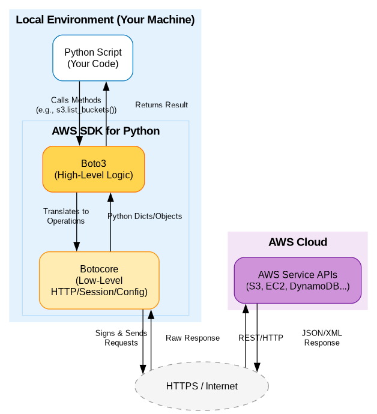
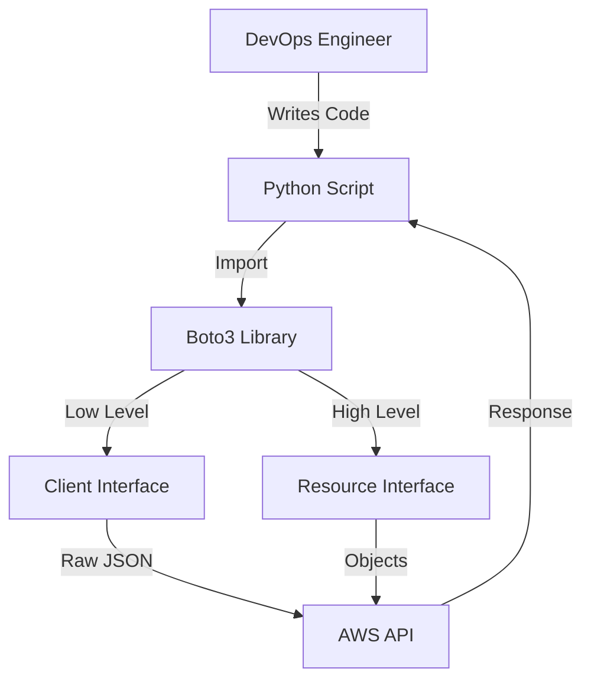
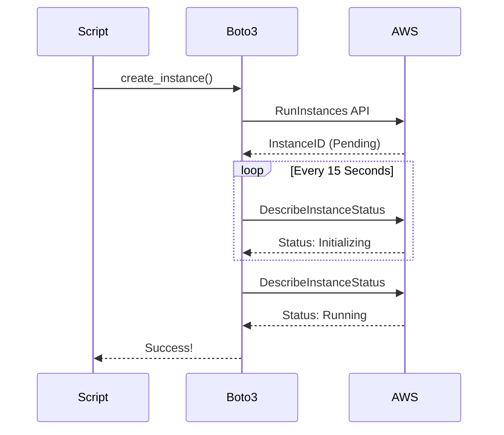

# ☁️ Cloud Automation with Boto3: Controlling the Sky

> **"If API calls are the language of the cloud, Boto3 is the translator that turns your Python logic into Infrastructure reality."**

---

## 📚 Overview



Automation isn't limited to your local machine. In a modern DevOps role, you are expected to manage tens of thousands of resources across global regions. **Boto3** is the official AWS SDK for Python, allowing you to create, configure, and delete AWS services programmatically.

This module bridges the gap between basic Python syntax and **Cloud Orchestration**.

---

## 💼 The Automation Why: Scaling Beyond the Console

**The Beginner's Question**: "I can just click 'Create Bucket' in the AWS Console. Why write code for it?"

**The Answer**: **The Console is for experiments. Code is for Infrastructure.**
You cannot click 'Create' 500 times for 500 গ্রাহক (customers). You cannot click 'Check Expiry' on 2,000 IAM keys every morning. Boto3 allows you to turn manual clicks into a **Scheduled Robot**.

### The TV Remote Analogy



Think of Boto3 as a **Universal TV Remote** for AWS:

1.  **The Client (Low-Level)** = **The "Service Menu"**
    - Access to every single sub-setting, pixel calibration, and hidden internal log.
    - _Usage_: Use when you need granular control or access to brand-new AWS features.
    - _Analogy_: Entering the factory settings menu to change the refresh rate.

2.  **The Resource (High-Level)** = **The "Volume & Power" Buttons**
    - Object-oriented, easy-to-read, and does the heavy lifting for you.
    - _Usage_: Use for everyday tasks like "List my buckets" or "Stop this server."
    - _Analogy_: Just hitting the 'Channel Up' button.

### Client vs Resource: At a Glance

| Feature         | Client                   | Resource                                  |
| :-------------- | :----------------------- | :---------------------------------------- |
| **Abstraction** | Low-level (1:1 with API) | High-level (Object-oriented)              |
| **Output**      | Dictionaries (JSON)      | Python Objects                            |
| **Speed**       | Faster (less overhead)   | Slower (more abstraction)                 |
| **Coverage**    | 100% of AWS Services     | Select Services (S3, EC2, DynamoDB, etc.) |

---

## 🎓 Learning Objectives

By the end of this module, you will:

- ✅ Configure **AWS Credentials** securely for Python scripts.
- ✅ Differentiate between **Clients** and **Resources** in Boto3.
- ✅ Automate **S3 Storage** (Lifecycles, Uploads, Audits).
- ✅ Manage **EC2 Compute** (Filtering by tags, State control).
- ✅ Audit **IAM Security** (Credential reports and key rotation).
- ✅ Implement **Waiters and Pagination** for production-grade reliability.

---

## 🏗️ The Cloud Connection: Setup & Auth

### 1. Installation

Boto3 is a third-party library. Always install it in a virtual environment:

```bash
pip install boto3
```

### 2. Authentication

Never hardcode your AWS Keys in a script! Python looks for credentials in your system's configuration files.

```bash
# Set up your local credentials (one-time setup)
aws configure
```

---

## 🚀 Professional Patterns for Cloud Automation

### Pattern A: The "ClientError" Shield

Cloud calls can fail for many reasons: Network issues, expired tokens, or insufficient permissions. Professional scripts use `botocore.exceptions`.

```python
import boto3
from botocore.exceptions import ClientError

s3 = boto3.client('s3')

try:
    s3.create_bucket(Bucket='my-production-logs')
except ClientError as e:
    if e.response['Error']['Code'] == 'BucketAlreadyOwnedByYou':
        print("Bucket exists, proceeding...")
    else:
        print(f"Critical S3 Error: {e}")
```

### Pattern B: The Waiter (Stop Polling Manually!)

Instead of writing `while not ready: sleep(10)`, use built-in **Waiters**. They poll AWS efficiently and exit exactly when the resource is ready.



```python
ec2 = boto3.client('ec2')

# Start the instance
ec2.start_instances(InstanceIds=['i-1234567890abcdef0'])

# ⏳ Wait until it's actually running before trying to SSH
print("Waiting for instance to reach 'running' state...")
waiter = ec2.get_waiter('instance_running')
waiter.wait(InstanceIds=['i-1234567890abcdef0'])
print("Instance is ready for work!")
```

### Pattern C: The Paginator (Handling 10,000+ Items)

AWS APIs usually return a maximum of 100-1000 items per call. If you have 5,000 S3 buckets, a single `list_buckets()` call will miss 4,000 of them. **Paginators** handle the "Next Page" tokens automatically.

```python
s3 = boto3.client('s3')
paginator = s3.get_paginator('list_objects_v2')

# Iterate through ALL files in a giant bucket
for page in paginator.paginate(Bucket='big-data-bucket'):
    for obj in page.get('Contents', []):
        print(obj['Key'])
```

---

## 🏆 Real-World DevOps Story: The Black Friday "Interactive" Hang-up

**The Scenario**: An e-commerce team had a script that provisioned 50 new EC2 servers for a flash sale. The script used `time.sleep(60)` to wait for servers to boot.

**The Disaster**: On Black Friday, AWS was under heavy load. Servers took 75 seconds to boot instead of 60. The script tried to configure the servers while they were still booting, failed, and crashed. The flash sale started with 0 servers.

**The Fix**: The team replaced `sleep(60)` with a Boto3 **Waiter**. The script now waits exactly as long as each individual server needs (whether 10 seconds or 10 minutes), ensuring 100% reliability regardless of cloud load.

---

## 🛡️ Security Best Practices

1.  **Never Commit Keys**: Use `.gitignore` to exclude `.env` or credentials files.
2.  **Use IAM Roles**: When running on EC2 or Lambda, use attached IAM Roles instead of hardcoded keys.
3.  **Least Privilege**: Your script's user should only have permissions for the specific task (e.g., `s3:ListBuckets`), not `AdministratorAccess`.

---

## ❓ Interview Preparation (Boto3)

1. **Q: What is the difference between a Client and a Resource in Boto3?**
   - _A: A Client is a low-level, 1-to-1 mapping with the AWS Service API. It returns raw dictionaries. A Resource is a high-level, object-oriented abstraction that handles pagination and attribute mapping for you._

2. **Q: How do you handle AWS API rate limiting (Throttling) in your scripts?**
   - _A: Boto3 has built-in retry logic (exponential backoff). If custom behavior is needed, I wrap calls in a try/except for `ClientError` and check for the `ThrottlingException` code._

3. **Q: Why should you avoid `time.sleep()` when waiting for an EC2 instance to start?**
   - _A: `time.sleep()` is "blind." It might wait too long (wasting time) or not long enough (causing failure). Boto3 Waiters are "aware" and poll the actual status of the resource._

4. **Q: How does Boto3 handle authentication if no keys are provided in the code?**
   - _A: It follows a credential chain: Environment Variables -> `~/.aws/credentials` -> `~/.aws/config` -> IAM Role (if on EC2/Lambda)._

---

## 🧠 Comprehensive Quiz (5 Questions)

<b>1. Which Boto3 interface provides an object-oriented way to interact with AWS?</b>

<details>
<summary>Show Answer</summary>
**Resource** (e.g., `s3.Bucket('name')`)
</details>

<b>2. True/False: You should hardcode your AWS Access Key and Secret Key in your Python script for easy access.</b>

<details>
<summary>Show Answer</summary>
**False**. This is a major security risk. Use environment variables or AWS profiles.
</details>

<b>3. What object handles the logic of "waiting for a resource to be ready"?</b>

<details>
<summary>Show Answer</summary>
**Waiter**
</details>

<b>4. If you need to list 5,000 objects from an S3 bucket, what feature must you use to get all of them?</b>

<details>
<summary>Show Answer</summary>
**Pagination** (Paginator)
</details>

<b>5. Which exception class captures most AWS-side errors in Boto3?</b>

<details>
<summary>Show Answer</summary>
`botocore.exceptions.ClientError`
</details>

---

## 🧪 Testing (Moto)

Don't test in production! Learn how to mock AWS services locally without spending a dime.

👉 **Read the Zero-Cost Testing Guide**

## 🔗 Next Steps

Ready to put your Python skills to work in the sky?

Proceed to: **[Time & Date Operations](../09-time-and-date/readme.md)** →
