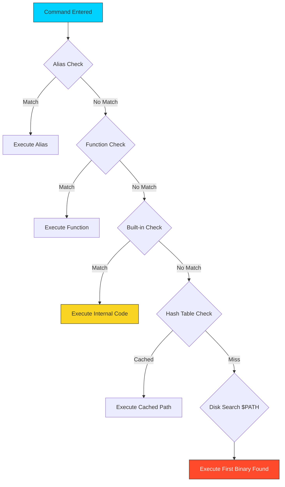

# 💻 Programs and Commands: The DevOps Execution Layer

> **"Linux is an orchestra of small, specialized programs. Mastering the shell means knowing how to conduct them with precision."**



## 📚 Overview

In the Linux ecosystem, a "command" is rarely a single monolithic entity. Modern infrastructure relies on the seamless interaction between **Shell Built-ins**, **Functions**, **Aliases**, and **External Binaries**.

As a DevOps engineer, your shell is your control center. To build reliable automation, you must understand how the shell identifies programs, how it prioritizes execution, and how to harness the "Power Toolkit" (`grep`, `sed`, `awk`, `curl`, `jq`) to transform raw data streams into actionable infrastructure insights.

---

## 💼 The Automation Why: Dependency Hell is Real

**The Beginner's Question**: "Why does my script work on my laptop but fail inside the Docker container?"

**The Answer**: **Because your laptop has everything installed. The container has almost nothing.**

### Real-World Production Incident: The Missing Dependencies

**Date**: 3:00 AM Alert  
**Incident**: New microservice deployment failing health checks.  
**The Script**:
```bash
#!/bin/bash
# Fetch config from API
CONFIG=$(curl -s http://config-service/init)
# Parse JSON
DB_HOST=$(echo $CONFIG | jq -r .database.host)
```
**The Error Log**:
```
./start.sh: line 5: curl: command not found
./start.sh: line 7: jq: command not found
```
**What Happened**: The developer tested on macOS (which has `curl` and `jq` installed). The Docker container was built on `alpine:latest` which is minimal and has neither.

**The Fix**:
1.  **Check Dependencies** (Pattern A below) at script start.
2.  **Explicitly Install** tools in the `Dockerfile`.
3.  **Use Built-ins** when possible (e.g., use `wget` if `curl` is missing, or python built-ins).

---

### The "Toolbelt vs. Warehouse" Analogy

Think of execution types like a **Construction Worker's Equipment**:

```
┌────────────────────────────────────────────────────────┐
│               EXECUTION HIERARCHY                      │
├────────────────────────────────────────────────────────┤
│                                                        │
│  1. ALIAS / FUNCTION (The Muscle Memory)               │
│     💪 Shortcuts you memorized (Fastest)               │
│     "ll" → "ls -alF"                                   │
│                                                        │
│  2. SHELL BUILT-IN (The Toolbelt)                      │
│     🔧 Tools attached to your waist (No delay)         │
│     cd, echo, export, read, test                       │
│     *Always available, massive performance*            │
│                                                        │
│  3. EXTERNAL BINARY (The Warehouse)                    │
│     🏭 Heavy machinery stored elsewhere (Slow startup) │
│     curl, grep, docker, python                         │
│     *Shell must Go Find It ($PATH), Load It, Run It*   │
│                                                        │
└────────────────────────────────────────────────────────┘
```

**Why It Matters**:
- Calling a **Built-in** (`echo`) is redundant 0ms cost.
- Calling a **Binary** (`python`) involves "fork/exec" overhead (~10-100ms).
- In a loop running 10,000 times, using a Binary instead of a Built-in can make a script take **minutes instead of seconds**.

**The $PATH Detective**:
When you ask for "Hammer" (binary), the shell runs to the Warehouse (`$PATH`). It checks aisle 1 (`/usr/local/bin`), then aisle 2 (`/usr/bin`), then aisle 3 (`/bin`). It grabs the *first* hammer it finds. If you have a toy hammer in aisle 1, you get the toy hammer.

---

## 🎓 Learning Objectives
By the end of this module, you will:

- ✅ Distinguish between **Internal (Built-in)** and **External** execution processes.
- ✅ Master the **Command Resolution Order** to prevent "Ghost Command" bugs.
- ✅ Deep dive into the **DevOps Power Toolkit** (sed, awk, jq).
- ✅ Implement **Defensive PATH management** for cross-environment consistency.
- ✅ Use `type`, `which`, and `hash` to audit execution sources and resolve conflicts.

---

## 🏗️ Execution Architecture: The Command Resolution Engine

When you type a command and hit `Enter`, the shell doesn't just "run" it. It triggers a complex resolution priority to determine which logic to execute. Understanding this order is essential for debugging misbehaving environments.

### 1. The Resolution Order (Priority List)

The shell checks for potential command matches in this strict order:

1. **Aliases**: Literal string substitutions (e.g., `alias k='kubectl'`).
2. **Functions**: Complex logic blocks stored in memory.
3. **Built-ins**: Commands internal to the shell binary (e.g., `cd`, `echo`, `export`).
4. **External Binaries**: Files located on the disk.

**DevOps Note**: Since shell functions have higher priority than built-ins, an engineer can "wrap" a built-in or external binary to add logging or safety checks.

### 2. Built-ins vs. Externals (The Memory Plane)

The choice between a built-in and an external binary is a choice of **System Resources**.

- **Shell Built-ins (Internal)**:
  - Executed directly by the shell process. No system `fork()` or memory overhead for a new process.
  - **Required for State**: Commands like `cd` or `export` **must** be built-ins because a child process cannot modify the environment of its parent.

- **External Binaries (The Fork-Exec Cycle)**:
  - The shell performs a `fork()` to create a copy of itself, then an `exec()` to replace that copy with the binary code (e.g., `ls` or `jq`).
  - **The Hash Table**: To avoid searching the `$PATH` repeatedly, the shell caches the disk locations of binaries in a internal **Hash Table**.

---

## 🛠️ The DevOps Power Toolkit: Infrastructure Plumbing

In the "Unix-as-an-Orchestra" philosophy, these three tools act as the primary filters for transforming raw system data into infrastructure logic.

### 1. `sed` (The Stream Editor)

Used for non-interactive text transformations. It is the heart of automated configuration patching.
- **Atomic Substitution**: `sed -i 's/prod/staging/g' config.v1.yaml`
- **Pattern Filtering**: `sed -n '/ERROR/p' app.log` (Only prints lines matching ERROR).

### 2. `awk` (The Data Processor)

A complete, Turing-complete language for processing structured text (columns/fields).
- **Field Awareness**: By default, `awk` sees spaces/tabs as delimiters.
- **Column Math**: `awk '{sum += $5} END {print sum}' bandwidth.log`
- **Logic Filters**: `awk '$3 == "500" {print $0}' access.log` (Prints only lines where the 3rd column is a 500 error).

### 3. `jq` (The JSON Surgeon)

Modern cloud engineering is the act of managing JSON streams. `jq` is the standard for parsing API responses from AWS, Kubernetes, and Terraform.
- **Deep Selection**: `jq '.status.loadBalancer.ingress[0].ip'`
- **Mapping**: `jq 'map(.metadata.name)'`
- **Safety**: Use `-r` (Raw) to strip quotes for direct use in Shell variables.

---

## 🚀 Professional Patterns for Automation

Production execution requires **Predictability** and **Tool Isolation**.

### Pattern A: Tool Verification Header (The Guard Clause)

Never assume a tool (like `jq` or `kubectl`) is installed on a target server. A script that fails halfway because of a missing dependency is a production risk.

```bash
# Define dependencies
readonly REQUIRED_TOOLS=("jq" "curl" "kubectl")

# Verify all tools are in the $PATH
for tool in "${REQUIRED_TOOLS[@]}"; do
    if ! command -v "$tool" &> /dev/null; then
        echo "🚨 FATAL: Dependency '$tool' not found. Execution halted." >&2
        exit 1
    fi
done
```

### Pattern B: The "Function Shield" (`command`)

Malicious or accidental shell functions can hijack standard binaries (e.g., an `alias rm='rm -i'`). In automation, internal overrides must be bypassed for reliability.

```bash
# Force the use of the external binary, ignoring aliases/functions
command ls -al /tmp
command mkdir -p ./data
```

### Pattern C: Path Hardening (Execution Security)

In high-security or multi-tenant environments, a user might place a malicious `ls` binary in `/tmp` and add it to their `$PATH`.

- **The Defense**: Explicitly define the `$PATH` at the start of your script to ensure only trusted system directories are searched.

```bash
# Secure PATH definition
export PATH="/usr/local/sbin:/usr/local/bin:/usr/sbin:/usr/bin"
# Now, 'ls' will only ever resolve to the system versions.
```

### Pattern D: Cache Clearance (`hash -r`)

When updating a binary in place (e.g., during a software upgrade), long-running shell sessions may continue to call the old location cached in the hash table.

```bash
# Force the shell to re-scan the $PATH for all commands
hash -r
```

---

## 🏆 Real-World DevOps Story: The Ghost of the Old Version

**The Scenario**: An SRE team updated their custom `deploy-tool` from v1 to v2. They replaced the binary in `/usr/local/bin/`. Half the team saw the new features, but long-logged-in users still saw v1 behavior, even though `which deploy-tool` pointed to the new path.
**The Discovery**: Bash "remembers" where it finds a command to avoid searching the `$PATH` every time. This is called **Hashing**. Because the users had used v1 earlier, Bash had cached that specific disk location.
**The Fix**: Use `hash -r` to force the shell to forget its cache and search the `$PATH` again.
**The Lesson**: When upgrading binaries on long-running systems, you must clear the shell's memory cache.

---

## ❓ Interview Preparation (Programs)

1. **Q: How does the shell know where to find the `ls` command?**
   - *A: It searches the directories listed in the `$PATH` environment variable in order from left to right. Once it finds a match, it stops searching.*

2. **Q: What is the difference between `which` and `type`?**
   - *A: `which` only searches for external files in the `$PATH`. `type` is more comprehensive—it identifies if a command is an alias, a shell function, a built-in, or a disk binary.*

3. **Q: Why would you use `awk` instead of `grep`?**
   - *A: Use `grep` for simple text filtering. Use `awk` when the data is structured into columns and you need to perform logic or calculations on specific fields.*

4. **Q: How can you see the full execution hierarchy of a command on your system?**
   - *A: Use `type -a <command>`. This will list every version of the command the shell can see, from aliases down to the disk binaries.*

5. **Q: What happens if two directories in the `$PATH` both contain a binary named `python`?**
   - *A: The shell will execute the version in the directory that appears **first** (leftmost) in the `$PATH` string.*

---

## 📝 Knowledge Check

1. **Which command is used to determine if a command is a built-in or a binary?**
   - [ ] a) `which`
   - [x] b) `type`
   - [ ] c) `cat`

2. **What tool is best for parsing the JSON output of an AWS CLI command?**
   - [ ] a) `sed`
   - [ ] b) `awk`
   - [x] c) `jq`

3. **True or False: A shell function has higher execution priority than a built-in.**
   - [x] a) True
   - [ ] b) False

4. **Which command allows you to clear the shell's remembered location of programs?**
   - [ ] a) `clear`
   - [ ] b) `reset`
   - [x] c) `hash -r`

5. **What is the outcome of `command -v <tool>`?**
   - [ ] a) It executes the tool
   - [x] b) It prints the path to the tool (or nothing if missing) and returns an exit code
   - [ ] c) It updates the tool to the latest version

---

## 🔗 Next Steps

Now that you've mastered the programs, let's learn how to store and manage the data they use!

Proceed to: **[Basic Variables](readme.md)** →
