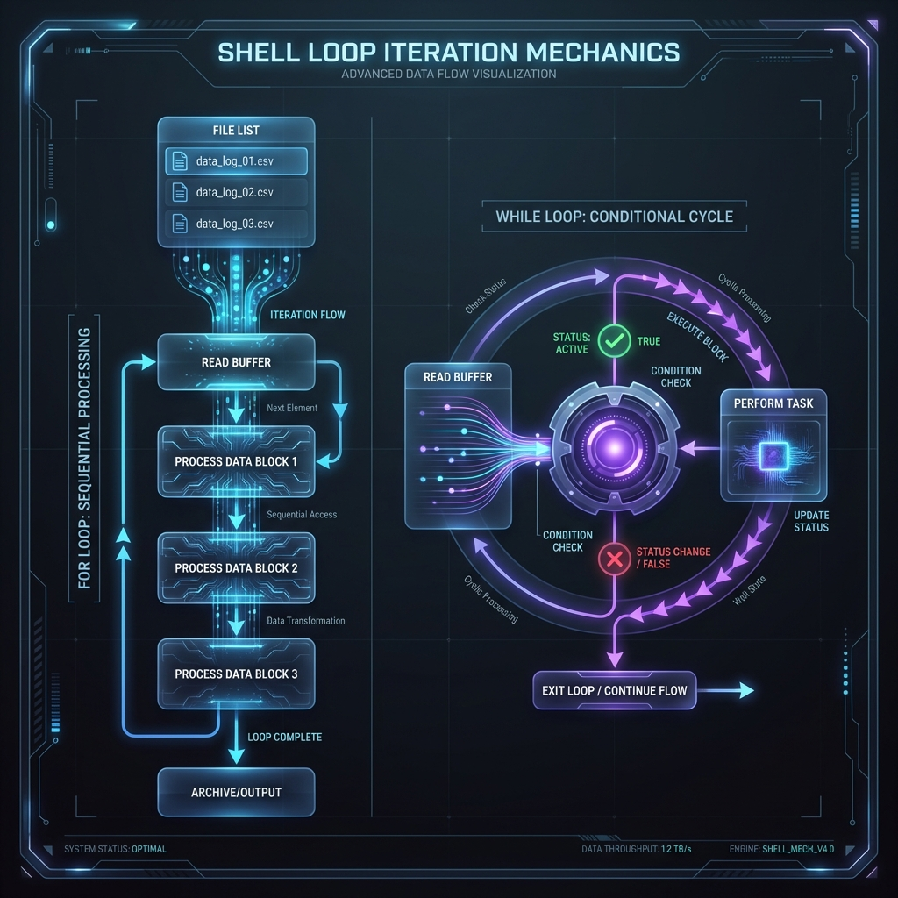
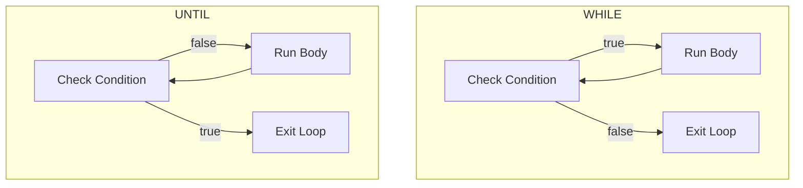

# 🔁 Loops: The Engine of Repetitive Automation

> **"If you do it more than 3 times, write a loop. If you do it more than 10 times, rewrite the loop to be parallel."**



## 📚 Overview

Automation is the art of repeating a task perfectly a thousand times. Loops are the engine of bulk processing in the shell. Whether you are checking the health of 500 microservices, renaming 10,000 log files, or waiting for a database to come online, loops give you the power of scale.

### Historical Context

In early Bourne shells, looping was limited to simple word splitting. As systems grew, Bash introduced C-style arithmetic loops, arrays, and safer input handling. Shell loops operate at the text-processing level; understanding quoting, expansion, and process model is essential to write reliable automation.

---

## 💼 The Automation Why: The Factory Line

**The Beginner's Question**: "I can just copy-paste the command 5 times for my 5 servers."

**The Answer**: **Today you have 5 servers. Tomorrow you will have 500.**
Loops are the difference between a "Pet" (manual care) and "Cattle" (mass management).

### The Assembly Line Analogy

Think of Loops as a **Factory Floor**:

1.  **`for` Loop = The Conveyor Belt**
    - usage: `for server in web01 web02...`
    - *Concept*: You know exactly how many items are coming. You process them one by one.
2.  **`while` Loop = The Water Wheel**
    - usage: `while system_is_booting...`
    - *Concept*: It keeps spinning as long as the condition (water/status) is flowing. You don't know when it will stop.
3.  **`break` / `continue` = Quality Control**
    - *Concept*: Treadmill E-Stop (`break`) or "Skip this defective unit" (`continue`).

**DevOps Rule**:
- Use `for` for **Inventory** (Lists).
- Use `while` for **Monitoring** (Streams/Polling).

---

## 🎓 Learning Objectives

By the end of this module, you will:

1. Master for-in loops, shell globbing, and arrays.
2. Implement while/read patterns for memory-safe streaming.
3. Avoid the "parse ls" trap and correctly handle filenames with whitespace.
4. Orchestrate until loops for readiness probes with timeout safeguards.
5. Use break/continue for flow control and manage parallelism safely.
6. Understand shell parsing, IFS, subshells, and process boundaries.

---

## 🏗️ Iteration Architecture: Choosing the Right Engine

### 1. The `for` Loop (Collection Processing)

The `for` loop is the workhorse when you have a known collection. To use it safely, understand how the shell parses and expands input.

How the Shell Parser Handles `for`:
- Expansion order: Brace/sequence expansion → filename globbing → parameter expansion → command substitution → word splitting (based on $IFS) → pathname expansion.
- The final token sequence is what `for` iterates over. Quoting (e.g., "${ARRAY[@]}" or "$item") prevents word splitting and preserves whitespace inside items.
- Command substitution output is split on $IFS unless the result is quoted, which makes `for f in $(ls)` brittle.

Best practices:
- Use arrays and `"${ARRAY[@]}"`.
- Prefer globbing: `for f in /etc/nginx/*.conf; do ...`.
- Avoid `for f in $(command)` unless you control output and quoting.

Examples:

```bash
servers=("web 01" "db-01" "cache")
for s in "${servers[@]}"; do
  echo "Provisioning: $s"
done

for cfg in /etc/nginx/*.conf; do
  [[ -e "$cfg" ]] || continue
  echo "Processing $cfg"
done
```

### 2. The `while` Loop (Dynamic Polling)

The `while` loop repeats a block as long as a condition returns success (exit status 0). Use it for polling and streaming.

How the Shell Parser Handles `while`:
- The condition is evaluated before each iteration. If the condition command returns 0, the body runs; otherwise the loop exits.
- When piping into a `while` (`cmd | while read ...; do`), some shells run the loop in a subshell; variable changes inside may not persist.

Canonical patterns:

- Readiness poll:

```bash
while ! nc -z localhost 5432; do
  echo "PostgreSQL not ready... retrying."
  sleep 2
done
```

- Streaming a file without subshell (preserves variables):

```bash
while IFS= read -r line; do
  process_line "$line"
done < /var/log/syslog
```

Best practices & gotchas:
- Use `IFS=` and `read -r` to preserve whitespace and backslashes.
- Redirect (`done < file`) instead of piping to avoid subshells losing state.
- Include timeout counters to avoid infinite loops.

### 3. The `until` Loop (Negated Condition Polling)

`until` is the inverse of `while`: it runs until the condition becomes true (exit status 0). It's semantically `while ! condition`, but the wording is clearer for "wait until ready" scenarios.

Parser behavior:
- The condition is tested each iteration; the body runs while the condition returns non-zero.
- Same subshell caveats apply when using pipes.

Production-ready example with timeout:

```bash
max_attempts=30
attempt=0
until curl -sf http://localhost:8080/health > /dev/null; do
  ((attempt++))
  if [[ $attempt -ge $max_attempts ]]; then
    echo "ERROR: Service failed to start within timeout." >&2
    exit 1
  fi
  echo "Attempt $attempt/$max_attempts: service not ready; sleeping 2s..."
  sleep 2
done
```

Key practices:
- Always include timeouts or external watchdogs.
- Use `-s`/`-f` flags and redirect output to keep logs clean.
- Consider exponential backoff with jitter for resiliency (see Patterns section).

### 4. The `select` Loop (Interactive Menus)

`select` prints a numbered list and prompts the user; it's for interactive shells and not CI automation.

Mechanics:
- `select var in list; do` prints items and reads user input into `$REPLY`. If a valid number is chosen, `var` is set to that element.
- Validate `$REPLY` and the selected value because invalid input yields an empty `var`.

Example:

```bash
PS3="Select environment: "
select env in dev stg prod quit; do
  case "$env" in
    dev|stg|prod) echo "Deploying to $env"; break ;;
    quit) exit 0 ;;
    *) echo "Invalid selection: $REPLY" ;;
  esac
done
```

---

## 🔬 IFS (Internal Field Separator) Deep-Dive

What is IFS?
- $IFS determines how the shell splits words during word-splitting and read operations. Default: space, tab, newline.

Common pitfalls:
- `for word in $(cat file)` will split on all IFS characters, breaking items with spaces.

Safe patterns:
- To iterate on lines safely when globbing isn't an option:

```bash
OLDIFS=$IFS
IFS=$'\n'
for line in $(cat file); do
  echo "Line: $line"
done
IFS=$OLDIFS
```

Better: avoid command substitution and use `while IFS= read -r` which handles lines exactly:

```bash
while IFS= read -r line; do
  echo "Line: $line"
done < file
```

Temporarily changing IFS:
- Use a subshell or restore IFS after change to limit scope (see example above).

---

## 🔁 Subshell vs Current Shell (The "Scope" Problem)

Why it matters in DevOps:
- Variables modified in a subshell are lost in the parent shell. This causes surprising bugs in scripts (e.g., counters that end up zero).

Comparison:

| Pattern | Runs in | Variable persistence |
|---|---:|---|
| `cat file | while read ...` | Often a subshell | No |
| `while read ...; do ... done < file` | Current shell | Yes |

Example showing the trap:

```bash
count=0
cat file | while IFS= read -r line; do
  ((count++))
done
# count may be 0 here

# Correct: redirection preserves scope
count=0
while IFS= read -r line; do
  ((count++))
done < file
# count is the actual number of lines
```

Always prefer redirection for loops that need to mutate variables in the parent shell.

---

## 🧭 Flow Diagrams

flowchart comparing while vs until logic:



sequenceDiagram for a readiness probe:

```mermaid
sequenceDiagram
  participant Loop as Script Loop
  participant K8s as K8s Service
  participant Wait as Sleep
  Loop->>K8s: GET /health
  K8s-->>Loop: 503
  Loop->>Wait: sleep 2s
  Wait-->>Loop: wake
  Loop->>K8s: GET /health
  K8s-->>Loop: 200
  Loop->>Loop: proceed
```

Image placeholders (add actual assets as needed):

- > **⚠️ Missing Image**: *loop-architecture-placeholder* ('./assets/loop-architecture.png')
- > **⚠️ Missing Image**: *flow-placeholder* ('./assets/flow-placeholder.png')

---

## 🚀 Professional Patterns for Automation

This section collects production-proven looping patterns and operational practices.

### Pattern A: The "While-Read" Performance Pattern
Stream large files line-by-line with redirection (no subshell), preserve variable scope, and avoid loading the entire file into memory.

```bash
while IFS=',' read -r ts level service message; do
  [[ "$level" == "CRITICAL" ]] && ((critical_count++))
  process_log_line "$ts" "$service" "$message"
done < system_events.csv
```

Tips:
- `IFS=` + `read -r` to preserve whitespace.
- Avoid `cat file | while read` unless you accept subshell semantics.

### Pattern B: C-Style Loops for Index Awareness

```bash
for ((i=1;i<=100;i++)); do
  printf -v node "web-%03d" "$i"
  provision_node "$node"
done
```

Use for batching, indexing, or arithmetic control.

### Pattern C: Controlled Parallelism (xargs / GNU parallel)

Use `xargs -P` or `parallel` to limit concurrency. Determine optimal `-P`:

- For CPU-bound tasks: set P ≈ number of CPU cores: $(nproc)
- For I/O-bound or network-bound tasks: P can be higher. A practical heuristic:
  - P ≈ nproc * (1 + avg_wait_time / avg_service_time)
  - Simpler rule: P = max(1, nproc * 2) for moderate I/O workloads.

Example:

```bash
# CPU-bound
nproc=$(nproc)
find logs -name '*.log' -print0 | xargs -0 -P "$nproc" -I {} gzip {}

# I/O-bound (safer to experiment)
nproc=$(nproc)
parallel -j $((nproc*2)) gzip ::: $(find logs -name '*.log')
```

Always measure and adjust; monitor CPU, I/O, and remote API rate limits.

### Pattern D: Retry Loops with Exponential Backoff + Jitter

Why jitter: prevents synchronized retries (thundering herd) by adding randomness.

Exponential backoff with full jitter example:

```bash
max_retries=6
attempt=0
base_delay=1  # seconds

until cloud_api_call; do
  ((attempt++))
  if (( attempt > max_retries )); then
    echo "ERROR: retries exhausted" >&2
    exit 1
  fi
  # exponential backoff with full jitter
  max_sleep=$(( base_delay * (1 << attempt) ))  # exponential
  sleep_time=$(( RANDOM % max_sleep ))          # full jitter
  echo "Attempt $attempt failed. Sleeping ${sleep_time}s (max ${max_sleep}s) before retry..."
  sleep "$sleep_time"
done
```

Alternative: "decorrelated jitter" is another recommended variant for large-scale systems.

### Operational Safeguards

- Always include timeouts or max-attempt counters.
- Use silent/fail modes and redirect outputs to keep logs actionable.
- Make loops idempotent and safe to re-run.
- Create backups before bulk edits; verify with linters and tests.
- Log attempts, retries, and final status for observability.

---

## 🧪 Validation & Safety

- Validate shell syntax: `bash -n script.sh`
- Validate JSON/YAML produced by loops with `jq`/`yamllint`.
- Use `set -euo pipefail` for strict scripts; however, be careful with `set -e` inside loops—trap and handle errors explicitly to avoid unexpected exits (see Quiz).

---

## ❓ Interview Preparation (Shell Loops)

Existing Qs plus three new high-level questions focused on performance and memory safety:

7. Q: How do you choose between streaming with `while read` and loading into an array?
   - A: Use streaming for large datasets to minimize memory; use arrays when random access or multiple passes are needed and data fits in memory.

8. Q: How can loops cause file descriptor exhaustion and how do you mitigate it?
   - A: Spawning many background jobs or opening files per iteration can exhaust descriptors. Limit concurrency, close descriptors, and use pooled workers.

9. Q: How does `set -e` affect loop execution and how do you handle expected command failures inside loops?
   - A: `set -e` causes the script to exit on a non-zero command. For loops where failures are expected, handle exit codes explicitly (e.g., `if cmd; then ...; else ...; fi`) or use `|| true` on specific commands.

---

## 📝 Knowledge Check (Updated)

1. Which loop type is inherently designed for polling until a status changes?
   - [x] while/until

2. What happens if you use `for f in *` and there are no files?
   - [x] It iterates over the literal `*`

3. How do you accurately count from 1 to 10?
   - [x] for i in {1..10} or for ((i=1;i<=10;i++))

4. Which variable determines how the shell splits strings?
   - [x] $IFS

5. True/False: Using `&` inside a loop runs the code in the background.
   - [x] True

6. Which statement best describes the `until` loop?
   - [x] It executes until a condition becomes true

7. What is the effect of `set -e` inside loops?
   - [ ] It always continues on error
   - [x] It may exit the script on the first failing command unless failures are handled

8. How should signal trapping be used in long-running loops?
   - [x] Trap signals (SIGINT, SIGTERM) to perform cleanup and exit gracefully

9. Is `cat file | while read` safe for updating parent-scope variables?
   - [ ] Yes
   - [x] No — it often runs in a subshell and loses variable updates

---

## 🏆 Real-World DevOps Story: The Space-in-Filename Nightmare

The junior engineer used `for f in $(ls *.conf)`; a file named `Backup Site.conf` broke the script due to word splitting. Fix: use globbing `for f in *.conf` or arrays and always quote expansions.

---

## 🔗 Next Steps

Proceed to: **[Functions & Scope](../05-functions-and-scope/readme.md)** →

---

## Assets & TODOs

- Add high-resolution images to ./assets/ (loop-architecture.png, flow-placeholder.png)
- Add example scripts to `08-Resources/01-Scripts-Code/Scripting/`:
  - exponential-backoff.sh
  - apply-ai-suggestions.sh
- Add mermaid rendering instructions to your docs build if needed.
