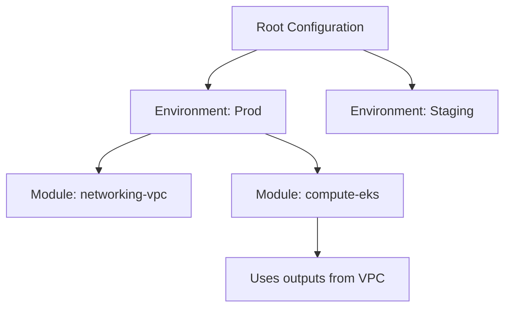
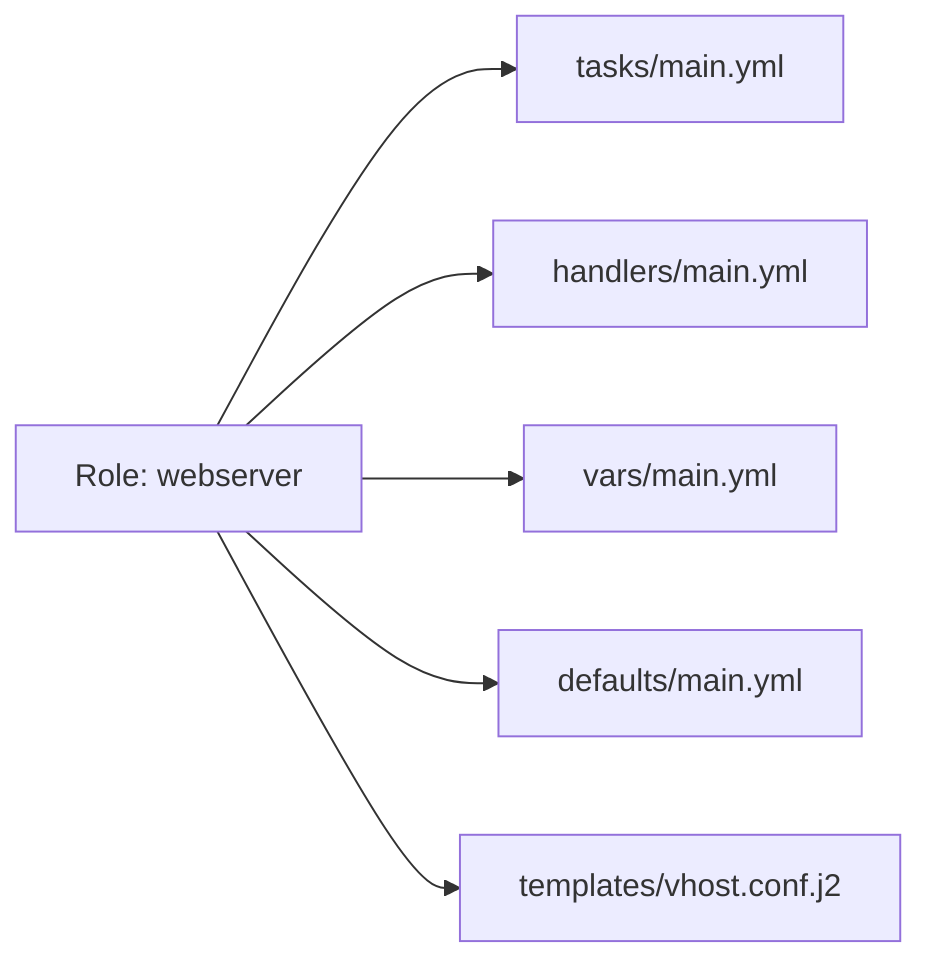

# Advanced Automation: Scaling Infrastructure & Config

Automation is more than just script execution; it's about building resilient, modular, and maintainable systems. This module focuses on enterprise-grade patterns for Ansible and Terraform.

## Core Concept: Scalable State Management
**[REFERENCE: Advanced IaC Architecture](./REFERENCE/Advanced-IaC-Architecture-Ref.md)**

Maintaining stability as infrastructure grows to thousands of resources:
- **Collaborative IaC**: Transitioning from local `apply` to a unified Management Plane (Spacelift/TFC) for shared state and security.
- **Blast Radius Isolation**: Splitting large monolithic state files into modular, service-based states using remote data sources.
- **The Reconciliation Loop**: Moving beyond one-time deployments to continuous drift detection and automated self-healing.

## Enterprise Governance: Automation Guardrails
**[REFERENCE: Enterprise Config Management](./REFERENCE/Enterprise-Config-Management-Ref.md)**

Enforcing organizational standards through automated logic:
- **Policy as Code (Rego/Sentinel)**: Blocking non-compliant infrastructure changes (e.g., unencrypted storage or costly instances) before they reach the cloud.
- **Modular Role Architecture**: Standardizing system configurations through versioned, shared Ansible Roles with enforced idempotency.
- **Dynamic Inventory**: Eliminating manual host management by integrating automation directly with cloud provider APIs.
- **Testing as Code**: Mandating molecule-based testing and linting to catch configuration regressions in the CI pipeline.

### Learning Path
1. [Advanced Terraform](./Terraform/)
2. [Advanced Ansible](./Ansible/)
3. [Spacelift & GitOps](./Spacelift/)
4. [❓ Interview Questions & Quiz](./Interview_Questions_and_Quiz.md)

---

## 🏗️ Advanced Terraform (Infrastructure as Code)

### Module Hierarchy Strategy
Instead of a single flat file, production Terraform is organized into a hierarchy to enable reuse and blast-radius isolation.



### Remote State locking
Multiple engineers cannot run `terraform apply` at the same time without risking state corruption.

**Example S3 Backend + DynamoDB Locking:**
```hcl
terraform {
  backend "s3" {
    bucket         = "my-enterprise-tf-state"
    key            = "global/s3/terraform.tfstate"
    region         = "us-east-1"
    dynamodb_table = "terraform-locks"
    encrypt        = true
  }
}
```

---

## 🚀 Collaborative IaC (Spacelift)

Standard Terraform works fine for individuals, but teams need a "Management Plane."
**[Explore the Spacelift Module](./Spacelift/README.md)** covering:
- **Stacks & Contexts**: Organizing enterprise state.
- **Policy as Code**: Writing OPA/Rego guardrails.
- **Drift Detection**: Automatic self-healing of infrastructure.

---

## ❓ Interview Questions & Quiz
**[Test your knowledge!](./Interview_Questions_and_Quiz.md)**

---

## ⚙️ Advanced Ansible (Configuration Management)

### Role Structure Architecture
Roles allow you to package variables, tasks, and templates into a logical unit.



### Complex Logic & Filters
Using advanced loops and conditional filters to manage complex system states.

**Example Dynamic Loop with Filter:**
```yaml
- name: Ensure specific users exist with custom shells
  ansible.builtin.user:
    name: "{{ item.name }}"
    shell: "{{ item.shell | default('/bin/bash') }}"
    groups: "wheel"
  loop: "{{ users }}"
  when: item.enabled | default(true)
```

---

## 💡 Key Philosophies
1. **DRY (Don't Repeat Yourself)**: If you use the same config twice, it belongs in a module.
2. **Immutability**: Prefer replacing infrastructure (Terraform) over patching it (Ansible) for core components.
3. **Automated Testing**: Use tools like `tflint`, `ansible-lint`, and `molecule` to verify your code before it hits production.

---
**EKS Automation**: See how these tools combine to build managed Kubernetes clusters in the [Advanced K8s Module](../../../README.md).
