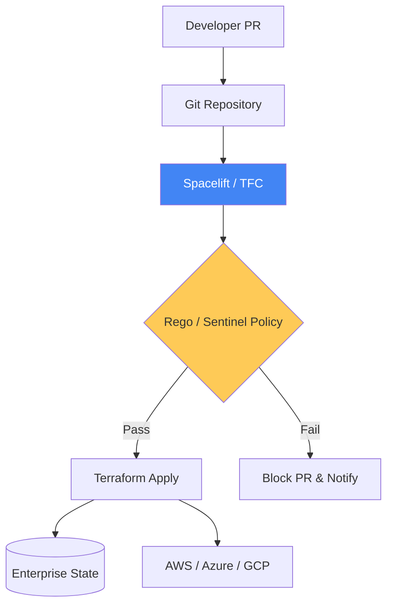

# Advanced IaC & Infrastructure Management Reference

**Doc Version:** 1.0.0
**Role:** Infrastructure Engineer / Platform Architect
**Scope:** Terraform at Scale, Collaborative IaC, and Drift Management

---

## 1. Collaborative IaC vs. Local Execution

While individual developers can run `terraform apply` locally, enterprise teams require a **Collaborative Infrastructure** model.

### The Management Plane (Spacelift/Terraform Cloud)
- **Centralized State**: State is never stored on a developer's machine but in a secure, audited backend.
- **Run Environment**: Plan and Apply operations run in temporary, isolated pods or containers, ensuring consistent tool versions.
- **Governance Gates**: Manual or automated approvals (Policy as Code) before infrastructure mutations.
- **Auditability**: A complete history of who changed what resource, when, and with what code version.

---

## 2. Advanced State Patterns

### Remote State Data Sources
Allowing different infrastructure stacks to communicate without sharing a monolithic state file.
```hcl
data "terraform_remote_state" "vpc" {
  backend = "s3"
  config = {
    bucket = "my-enterprise-tf-state"
    key    = "network/vpc.tfstate"
  }
}

# Accessing a CIDR block from another stack
resource "aws_security_group_rule" "allow_vpc" {
  cidr_blocks = [data.terraform_remote_state.vpc.outputs.vpc_cidr]
  # ...
}
```

### State Splitting & Blast Radius
A large state file (e.g., 5000 resources) is dangerous. If it corrupts or a plan takes 30 minutes, productivity stops.
- **Horizontal Splitting**: Divide by Service (e.g., `networking.tfstate`, `compute.tfstate`, `database.tfstate`).
- **Vertical Splitting**: Divide by Environment (e.g., `prod.tfstate`, `staging.tfstate`).

---

## 3. Policy as Code (Infrastructural Guardrails)

Using **OPA (Open Policy Agent)** or **Sentinel** to block non-compliant PRs.

- **Mandatory Logic**: "Fail the build if an RDS instance is created without encryption."
- **Financial Control**: "Fail the build if a change increases monthly spend by more than $500 without Senior SRE approval."
- **Security Logic**: "Fail the build if a Security Group allows 0.0.0.0/0 on sensitive ports."

---

## 4. Visualizing the IaC Management Plane



---

## 5. Drift Management and Self-Healing

Infrastructure is never static. Manual console changes or "bit rot" cause drift.

1.  **Continuous Reconciliation**: The Management Plane runs a `terraform plan` every 60 minutes.
2.  **Alerting**: If the plan is "not empty," an alert is sent to Slack.
3.  **Self-Healing**: In advanced setups, the manager can auto-apply the code to overwrite the manual change, ensuring Git remains the absolute Source of Truth.

---

## 6. Enterprise Governance Standards

- **Private Module Registry**: Centralizing approved, hardened modules that other teams must use (e.g., `Company-Approved-EKS`).
- **Tagging Law**: Automatically injecting standard tags (CostCenter, Owner, AppID) via the Management Plane's context system.
- **Environment Isolation**: Strictly separate IAM roles for Dev vs. Prod environments, ensuring a "Dev Credentials" compromise cannot destroy Production.

> **Enterprise Pattern**: Implement **Terragrunt Wrapper**. Use Terragrunt to manage remote state configuration and variable inheritance across multiple regions or environments, keeping your standard HCL modules completely "Dry" and reusable.
