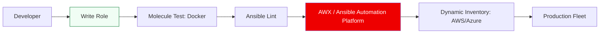

# Enterprise Configuration Management Reference

**Doc Version:** 1.0.0
**Role:** Configuration Engineer / Automation Architect
**Scope:** Ansible at Scale, Idempotency, and Modular Automation

---

## 1. Advanced Ansible Architecture

At the enterprise level, Ansible moves beyond simple playbooks into a structured **Role-Based** architecture.

### Role Hierarchy
- **Base Role**: Handles global configurations (Users, NTP, SSH Hardening) required on every server.
- **Service Role**: Handles specific technologies (e.g., `nginx-role`, `postgres-role`).
- **Application Role**: Configures the high-level business logic (e.g., `shop-backend-role`).

---

## 2. Advanced Logic & Idempotency

### The "Register" & "When" Pattern
Ensuring tasks only run when necessary, or when prerequisites are met.
```yaml
- name: Check if custom service is configured
  ansible.builtin.stat:
    path: /etc/my-service/config.json
  register: config_file

- name: Restart service if config exists
  ansible.builtin.systemd:
    name: my-service
    state: restarted
  when: config_file.stat.exists
```

### Advanced Loops & Filters
Leveraging Jinja2 filters for complex data transformations.
- **SelectAttr**: Filter list of items based on an attribute.
- **Combine**: Merge two or more dictionaries together.
- **Custom Filters**: Writing Python scripts to handle logic that is too complex for standard Jinja2.

---

## 3. Modular Testing with Molecule

Infrastructure code must be tested before it is applied to production.

- **Molecule**: The testing framework for Ansible roles.
- **Driver**: Typically Docker or Podman for fast, transient test instances.
- **Verifier**: Using **Testinfra** (Python-based) to assert that services are running, users exist, and ports are open.

---

## 4. Visualizing the Enterprise Config Pipeline



---

## 5. Security & Secret Management

- **Ansible Vault**: Encrypting sensitive variables (Passwords, API Keys) within the repository.
- **External Integration**: Fetching secrets at runtime from HashiCorp Vault or CyberArk via standard lookups.
- **Variable Precedence**: Understanding the 22 levels of variable precedence to ensure the correct "override" happens at the right time.

---

## 6. Enterprise Governance Standards

- **Idempotency Check**: Every role must be verified to have $zero$ changes when run twice against a healthy system.
- **Canonical Inventory**: Using **Dynamic Inventory** (via Cloud Plugins) rather than static host files to ensure no server is ever missed by automation.
- **Configuration as Code**: All Ansible variables (HostVars and GroupVars) must be version-controlled, enabling the team to "Roll back" a configuration change as easily as a code change.

> **Enterprise Pattern**: Implement **Tower/AWX Workflows**. Use a visual workflow orchestrator to chain multiple playbooks together with logical gates (e.g., "Step 1: Provision Infra (Terraform) -> Step 2: Configure OS (Ansible) -> Step 3: Run Security Scan").
