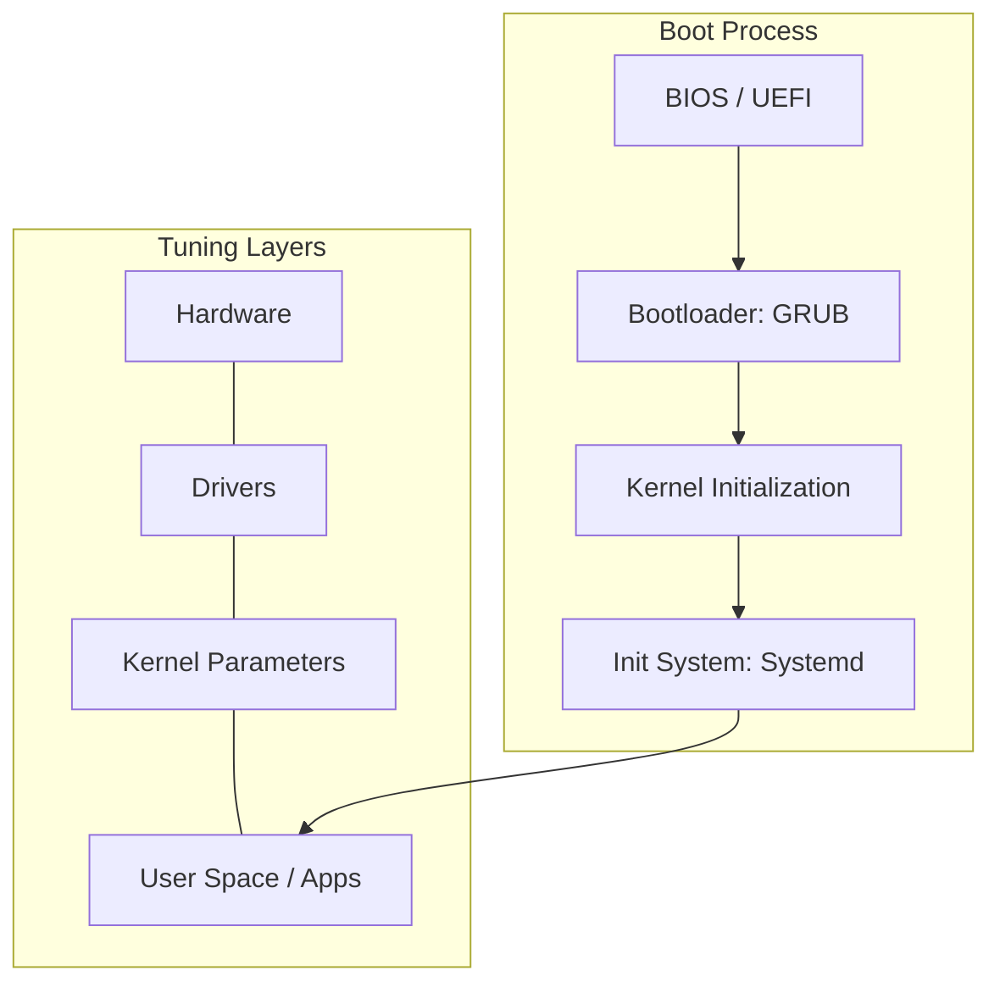

# Advanced Linux: Security, Performance & Tuning

At the advanced level, Linux is treated as a highly tunable performance engine and a hardened fortress. This module covers kernel tuning, advanced security models (SELinux/AppArmor), and deep performance tracing.

## Core Concept: The Observability Engine
**[REFERENCE: Linux Performance & Observability](./REFERENCE/Linux-Performance-Observability-Ref.md)**

Mastering the kernel's internal mechanics for peak efficiency:
- **Kernel Tuning (`sysctl`)**: Optimizing network buffers, file limits, and memory swappiness for heavy cloud workloads.
- **eBPF Tracing**: Utilizing high-performance kernel probes to diagnose latency and bottlenecks without system overhead.
- **The Performance Stack**: Moving beyond `top` to a structured analysis of system calls, context switching, and I/O wait times.

## Enterprise Governance: Hardened Infrastructure
**[REFERENCE: Linux Security Hardening](./REFERENCE/Linux-Security-Hardening-Ref.md)**

Protecting the operating system through multi-layered defense and auditability:
- **Mandatory Access Control (MAC)**: Enforcing SELinux or AppArmor policies to prevent lateral movement even if root is compromised.
- **Kernel Hardening**: Implementing filesystem integrity flags (`noexec`, `nosuid`) and disabling insecure protocols.
- **Deep Auditing (`auditd`)**: Tracking every sensitive system call and file modification for regulatory compliance (SOC2/PCI-DSS).
- **Process Whitelisting**: Utilizing daemons like `fapolicyd` to ensure only trusted, signed binaries can execute in production.

---

## 📂 Module Structure

### 🛡️ Advanced Topics
- **[Security & Hardening](./Security/)**: SELinux, AppArmor, `sysctl` hardening, and auditing.
- **[Performance & Optimization](./Performance/)**: CPU/IO tuning, `eBPF`, and observability tools (`perf`, `bpftrace`).
- **[Virtualization & WSL](./Virtualization-WSL/)**: Advanced WSL2 config, KVM/QEMU, and container runtimes.
- **[Advanced SSH](./SSH/)**: Certificates, Bastion hosts, and proxying.

---

## 🏗️ Core Concepts

### 1. Kernel Parameter Tuning (`sysctl`)
Optimizing the network stack and memory management for high-concurrency workloads.
- **`net.core.somaxconn`**: Increasing the listen queue for high-traffic web servers.
- **`vm.swappiness`**: Controlling how aggressively the kernel swaps memory to disk.
- **`fs.file-max`**: Increasing the system-wide limit for open files.

### 2. Advanced Security Models
- **SELinux (Security-Enhanced Linux)**: Label-based access control (Red Hat default).
- **AppArmor**: Path-based access control (Ubuntu/Debian default).
- **Auditd**: Tracking every system call for compliance and forensics.

### 3. Observability & Tracing
- **`perf`**: Sampling performance profiling.
- **`eBPF`**: Running sandboxed programs in the kernel for high-performance monitoring without overhead.
- **`strace`**: Intercepting and recording system calls made by a process.

---

## 📊 Linux Boot & Performance Layers

---

## ❓ Interview Questions & Quiz
**[Explore Advanced Interview Questions & Quizzes](./Interview_Questions_and_Quiz.md)**

---

## ✅ Advanced Knowledge Check
- [ ] Configure `sysctl` for network performance optimization
- [ ] Implement and troubleshoot SELinux/AppArmor policies
- [ ] Use `perf` or `bpftrace` to identify kernel-level bottlenecks
- [ ] Secure a server using `fail2ban` and advanced firewall rules
- [ ] Manage multi-tenant isolation using Linux namespaces and cgroups
- [ ] Design a secure SSH infrastructure with bastion hosts and MFA
