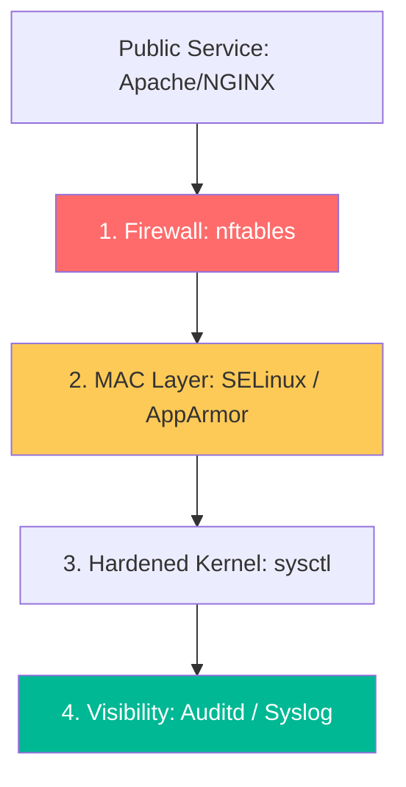

# Linux Security Hardening & Audit Reference

**Doc Version:** 1.0.0
**Role:** Security Engineer / Systems Architect
**Scope:** Hardening, Discretionary & Mandatory Access Control, and Auditing

---

## 1. The Hardening Hierarchy

Standard Linux security is additive. We start from a base OS and layer multiple defensive strategies.

1.  **Network Surface**: Disabling unused services and identifying them with `ss -tulnp`.
2.  **Kernel Hardening**: Using `sysctl` to disable IPv4 forwarding (unless a router) and protecting against ICMP redirects.
3.  **SSH Hardening**: Disabling root login, forcing Public Key auth only, and setting short idle timeouts.
4.  **Filesystem Integrity**: Mounting partitions like `/tmp` and `/var` with `noexec`, `nosuid`, and `nodev` flags.

---

## 2. Mandatory Access Control (MAC)

While standard Linux uses **DAC** (Discretionary Access Control - permissions based on user/group), Enterprise Linux uses **MAC**.

### SELinux (Security-Enhanced Linux)
- **Philosophy**: A kernel module that provides a mechanism for supporting access control security policies.
- **Labeling**: Every process, file, and port has a label (e.g., `httpd_t`).
- **Enforcement**: Even if a process is running as `root`, it can only access files with labels that the policy explicitly allows.

### AppArmor
- **Philosophy**: Path-based access control.
- **Profile**: A set of rules that defines what files and network operations a specific program is allowed to access.
- **Mode**: Can run in `Enforce` mode or `Complain` (monitoring) mode.

---

## 3. Auditing and Traceability (Auditd)

Managing logs is not enough for compliance (PCI-DSS, SOC2). You must monitor **system calls**.

- **Audit Daemon (`auditd`)**: Captures security-relevant information.
- **Key Watches**:
    - "Who changed the `/etc/passwd` file?"
    - "Who used `sudo` to run a shell?"
    - "What files were accessed by a suspicious process?"
- **`ausearch`**: Command-line tool to query the audit logs for specific events.

---

## 4. Visualizing the Linux Security Fortress

---

## 5. Secret and Key Management

- **The Linux Keyring**: A kernel-level facility to store security data (keys, passwords) in memory, accessible only to authorized processes.
- **SSH Certificate Authorities**: Moving beyond static `.ssh/authorized_keys`. Use a CA (like **Vault SSH Secrets Engine**) to issue short-lived certificates for developers.
- **MFA (Multi-Factor Authentication)**: Integrating PAM (Pluggable Authentication Modules) with Google Authenticator or Duo for SSH login.

---

## 6. Enterprise Governance Standards

- **Zero-Trust Access**: No user should have permanent `sudo` access. Use **Just-In-Time (JIT)** elevation with a clear audit trail.
- **Continuous Compliance**: Using tools like **OpenSCAP** to automatically scan every server daily against the **CIS Benchmark** (Center for Internet Security).
- **Log Centralization**: Mandatory real-time streaming of `/var/log/audit/audit.log` and `secure` logs to a centralized, write-once SIEM (Splunk/Elasticsearch).

> **Enterprise Pattern**: Implement **Process Whitelisting**. For critical production servers, use a tool like **`fapolicyd`**. This daemon verifies the checksum and path of every executable before allowing it to run, effectively preventing the execution of unauthorized scripts or malware, even if the attacker has gained shell access.
