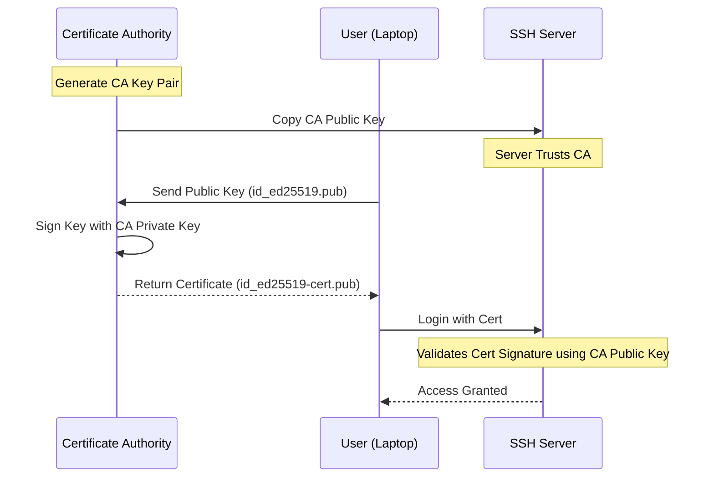

# SSH Security

Advanced SSH security hardening, monitoring, and compliance for production environments.

## Security Hardening

### SSH Server Configuration

#### Secure sshd_config
```bash
# /etc/ssh/sshd_config
Port 2222
Protocol 2
HostKey /etc/ssh/ssh_host_rsa_key
HostKey /etc/ssh/ssh_host_ed25519_key

# Authentication
PermitRootLogin no
PubkeyAuthentication yes
AuthorizedKeysFile .ssh/authorized_keys
PasswordAuthentication no
PermitEmptyPasswords no
ChallengeResponseAuthentication no
KerberosAuthentication no
GSSAPIAuthentication no

# Connection limits
MaxAuthTries 3
MaxSessions 2
MaxStartups 10:30:60
LoginGraceTime 30

# Security features
AllowUsers deploy admin
DenyUsers root guest
AllowGroups ssh-users
X11Forwarding no
AllowTcpForwarding no
GatewayPorts no
PermitTunnel no

# Monitoring
LogLevel VERBOSE
SyslogFacility AUTH
UsePAM yes

# Keep-alive
ClientAliveInterval 300
ClientAliveCountMax 2
TCPKeepAlive no
```

#### Apply Configuration
```bash
# Test configuration
sudo sshd -t

# Restart SSH service
sudo systemctl restart sshd

# Enable at boot
sudo systemctl enable sshd
```

### Firewall Configuration

#### UFW (Ubuntu/Debian)
```bash
# Allow SSH on custom port
sudo ufw allow 2222/tcp

# Limit connection attempts
sudo ufw limit 2222/tcp

# Allow from specific IP
sudo ufw allow from 192.168.1.0/24 to any port 2222

# Enable firewall
sudo ufw enable
```

#### iptables Rules
```bash
# Allow SSH from specific network
iptables -A INPUT -p tcp -s 192.168.1.0/24 --dport 2222 -j ACCEPT

# Rate limiting
iptables -A INPUT -p tcp --dport 2222 -m state --state NEW -m recent --set
iptables -A INPUT -p tcp --dport 2222 -m state --state NEW -m recent --update --seconds 60 --hitcount 4 -j DROP

# Save rules
iptables-save > /etc/iptables/rules.v4
```

## Access Control

### User Management

#### SSH User Groups
```bash
# Create SSH users group
sudo groupadd ssh-users

# Add users to group
sudo usermod -a -G ssh-users deploy
sudo usermod -a -G ssh-users admin

# Configure group in sshd_config
AllowGroups ssh-users
```

#### Sudo Configuration
```bash
# /etc/sudoers.d/ssh-users
%ssh-users ALL=(ALL) NOPASSWD: /usr/bin/systemctl restart nginx
%ssh-users ALL=(ALL) NOPASSWD: /usr/bin/systemctl status *
deploy ALL=(ALL) NOPASSWD: /opt/deploy/scripts/*
```

### Key-Based Authentication

#### Authorized Keys Management
```bash
# Centralized key management script
#!/bin/bash
# manage-keys.sh

USERS=("deploy" "admin" "monitoring")
KEY_DIR="/etc/ssh/authorized_keys"

for user in "${USERS[@]}"; do
    mkdir -p "$KEY_DIR/$user"
    chown "$user:$user" "$KEY_DIR/$user"
    chmod 700 "$KEY_DIR/$user"
    
    # Update sshd_config
    echo "Match User $user" >> /etc/ssh/sshd_config
    echo "    AuthorizedKeysFile $KEY_DIR/$user/authorized_keys" >> /etc/ssh/sshd_config
done
```

#### Key Validation
```bash
#!/bin/bash
# validate-keys.sh

KEY_FILE="$1"

if [[ ! -f "$KEY_FILE" ]]; then
    echo "Key file not found: $KEY_FILE"
    exit 1
fi

# Check key format
if ssh-keygen -l -f "$KEY_FILE" &>/dev/null; then
    echo "✓ Valid SSH key format"
else
    echo "✗ Invalid SSH key format"
    exit 1
fi

# Check key strength
KEY_BITS=$(ssh-keygen -l -f "$KEY_FILE" | awk '{print $1}')
if [[ "$KEY_BITS" -ge 2048 ]]; then
    echo "✓ Key strength acceptable ($KEY_BITS bits)"
else
    echo "✗ Key strength insufficient ($KEY_BITS bits)"
    exit 1
fi
```

## Monitoring and Alerting

### SSH Log Analysis

#### Real-time Monitoring
```bash
#!/bin/bash
# ssh-monitor.sh

LOG_FILE="/var/log/auth.log"
ALERT_EMAIL="admin@example.com"

tail -f "$LOG_FILE" | while read line; do
    if echo "$line" | grep -q "Failed password"; then
        IP=$(echo "$line" | grep -oE '[0-9]+\.[0-9]+\.[0-9]+\.[0-9]+')
        USER=$(echo "$line" | awk '{print $9}')
        
        echo "Failed login attempt: $USER from $IP"
        
        # Block IP after 5 failed attempts
        ATTEMPTS=$(grep "$IP" "$LOG_FILE" | grep "Failed password" | wc -l)
        if [[ "$ATTEMPTS" -ge 5 ]]; then
            iptables -A INPUT -s "$IP" -j DROP
            echo "Blocked IP: $IP" | mail -s "SSH Security Alert" "$ALERT_EMAIL"
        fi
    fi
done
```

#### Log Analysis Script
```bash
#!/bin/bash
# analyze-ssh-logs.sh

LOG_FILE="/var/log/auth.log"
REPORT_FILE="/tmp/ssh-report-$(date +%Y%m%d).txt"

echo "SSH Security Report - $(date)" > "$REPORT_FILE"
echo "=================================" >> "$REPORT_FILE"

# Failed login attempts
echo -e "\nFailed Login Attempts:" >> "$REPORT_FILE"
grep "Failed password" "$LOG_FILE" | awk '{print $11}' | sort | uniq -c | sort -nr >> "$REPORT_FILE"

# Successful logins
echo -e "\nSuccessful Logins:" >> "$REPORT_FILE"
grep "Accepted password\|Accepted publickey" "$LOG_FILE" | awk '{print $9, $11}' | sort | uniq -c >> "$REPORT_FILE"

# Invalid users
echo -e "\nInvalid User Attempts:" >> "$REPORT_FILE"
grep "Invalid user" "$LOG_FILE" | awk '{print $8, $10}' | sort | uniq -c | sort -nr >> "$REPORT_FILE"

# Top attacking IPs
echo -e "\nTop Attacking IPs:" >> "$REPORT_FILE"
grep "Failed password" "$LOG_FILE" | grep -oE '[0-9]+\.[0-9]+\.[0-9]+\.[0-9]+' | sort | uniq -c | sort -nr | head -10 >> "$REPORT_FILE"

cat "$REPORT_FILE"
```

### Intrusion Detection

#### Fail2ban Configuration
```bash
# Install fail2ban
sudo apt install fail2ban -y

# /etc/fail2ban/jail.local
[DEFAULT]
bantime = 3600
findtime = 600
maxretry = 3
backend = systemd

[sshd]
enabled = true
port = 2222
logpath = /var/log/auth.log
maxretry = 3
bantime = 3600

# Start fail2ban
sudo systemctl enable fail2ban
sudo systemctl start fail2ban

# Check status
sudo fail2ban-client status sshd
```

#### Custom IDS Script
```bash
#!/bin/bash
# ssh-ids.sh

THRESHOLD=5
TIME_WINDOW=300  # 5 minutes
BLOCK_TIME=3600  # 1 hour

while true; do
    # Get recent failed attempts
    RECENT_FAILS=$(grep "Failed password" /var/log/auth.log | \
                   awk -v window="$TIME_WINDOW" '
                   BEGIN { cmd="date +%s"; cmd | getline now; close(cmd) }
                   {
                       cmd="date -d \"" $1 " " $2 " " $3 "\" +%s 2>/dev/null"
                       if ((cmd | getline timestamp) > 0 && (now - timestamp) <= window) {
                           match($0, /[0-9]+\.[0-9]+\.[0-9]+\.[0-9]+/)
                           if (RSTART > 0) {
                               ip = substr($0, RSTART, RLENGTH)
                               count[ip]++
                           }
                       }
                       close(cmd)
                   }
                   END { for (ip in count) if (count[ip] >= '$THRESHOLD') print ip }')
    
    for IP in $RECENT_FAILS; do
        # Check if already blocked
        if ! iptables -L INPUT -n | grep -q "$IP"; then
            echo "Blocking suspicious IP: $IP"
            iptables -A INPUT -s "$IP" -j DROP
            
            # Schedule unblock
            echo "iptables -D INPUT -s $IP -j DROP" | at now + $BLOCK_TIME seconds
        fi
    done
    
    sleep 60
done
```

## Certificate-Based Authentication

### SSH Certificate Authority

Certificate-based authentication scales better than managing thousands of `authorized_keys`. It uses a "Trust Chain" model similar to HTTPS.



#### Create CA Key
```bash
# Generate CA key
ssh-keygen -t ed25519 -f ssh_ca -C "SSH CA"

# Secure CA key
chmod 600 ssh_ca
chown root:root ssh_ca
```

#### Sign User Certificates
```bash
#!/bin/bash
# sign-user-cert.sh

USER="$1"
PUBLIC_KEY="$2"
VALIDITY="52w"  # 1 year

if [[ -z "$USER" || -z "$PUBLIC_KEY" ]]; then
    echo "Usage: $0 <username> <public_key_file>"
    exit 1
fi

# Sign certificate
ssh-keygen -s ssh_ca \
           -I "$USER" \
           -n "$USER" \
           -V "+$VALIDITY" \
           "$PUBLIC_KEY"

echo "Certificate created: ${PUBLIC_KEY}-cert.pub"
```

#### Configure Server for Certificates
```bash
# /etc/ssh/sshd_config
TrustedUserCAKeys /etc/ssh/ssh_ca.pub
AuthorizedPrincipalsFile /etc/ssh/auth_principals/%u

# Create principals file
mkdir -p /etc/ssh/auth_principals
echo "deploy" > /etc/ssh/auth_principals/deploy
echo "admin" > /etc/ssh/auth_principals/admin
```

## Compliance and Auditing

### Security Compliance

#### CIS Benchmark Compliance
```bash
#!/bin/bash
# cis-ssh-audit.sh

echo "SSH CIS Benchmark Audit"
echo "======================"

# Check SSH protocol version
if grep -q "^Protocol 2" /etc/ssh/sshd_config; then
    echo "✓ SSH Protocol 2 enabled"
else
    echo "✗ SSH Protocol 2 not configured"
fi

# Check root login
if grep -q "^PermitRootLogin no" /etc/ssh/sshd_config; then
    echo "✓ Root login disabled"
else
    echo "✗ Root login not disabled"
fi

# Check password authentication
if grep -q "^PasswordAuthentication no" /etc/ssh/sshd_config; then
    echo "✓ Password authentication disabled"
else
    echo "✗ Password authentication enabled"
fi

# Check empty passwords
if grep -q "^PermitEmptyPasswords no" /etc/ssh/sshd_config; then
    echo "✓ Empty passwords disabled"
else
    echo "✗ Empty passwords not disabled"
fi

# Check host-based authentication
if grep -q "^HostbasedAuthentication no" /etc/ssh/sshd_config; then
    echo "✓ Host-based authentication disabled"
else
    echo "✗ Host-based authentication not disabled"
fi
```

### Audit Logging

#### Enhanced SSH Logging
```bash
# /etc/ssh/sshd_config
LogLevel VERBOSE
SyslogFacility AUTHPRIV

# /etc/rsyslog.d/ssh.conf
authpriv.*    /var/log/ssh.log

# Restart rsyslog
sudo systemctl restart rsyslog
```

#### Audit Script
```bash
#!/bin/bash
# ssh-audit.sh

AUDIT_LOG="/var/log/ssh-audit.log"
SSH_LOG="/var/log/ssh.log"

{
    echo "SSH Audit Report - $(date)"
    echo "=========================="
    
    echo -e "\nActive SSH Sessions:"
    who | grep pts
    
    echo -e "\nRecent Connections (last 24h):"
    grep "$(date --date='1 day ago' '+%b %d')" "$SSH_LOG" | grep "Accepted"
    
    echo -e "\nFailed Attempts (last 24h):"
    grep "$(date --date='1 day ago' '+%b %d')" "$SSH_LOG" | grep "Failed"
    
    echo -e "\nKey Usage Statistics:"
    grep "Accepted publickey" "$SSH_LOG" | awk '{print $9}' | sort | uniq -c
    
} >> "$AUDIT_LOG"
```

This comprehensive SSH security guide provides enterprise-grade hardening, monitoring, and compliance capabilities for production environments.