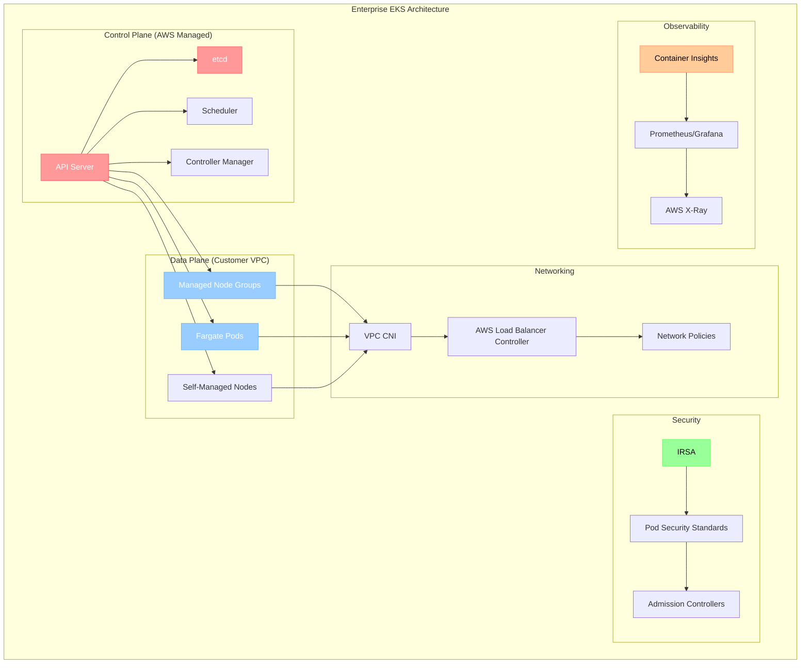

# Enterprise Container Orchestration: Interview Questions, Quiz & Scenarios

Master production-grade container orchestration with AWS EKS and enterprise patterns.

---

## ❓ Interview Questions (Enterprise Container Orchestration)

1. **What are the key differences between EKS, ECS, and Fargate?**
   - *Answer*: **EKS** runs Kubernetes with managed control plane. **ECS** is AWS's proprietary container orchestration. **Fargate** is serverless compute for both EKS and ECS, eliminating node management.

2. **How does IAM Roles for Service Accounts (IRSA) work in EKS?**
   - *Answer*: IRSA allows pods to assume IAM roles without storing credentials. It uses OpenID Connect (OIDC) identity provider and service account annotations to map Kubernetes service accounts to IAM roles.

3. **Explain the EKS cluster architecture and control plane components.**
   - *Answer*: EKS control plane runs across 3 AZs with managed API server, etcd, scheduler, and controller manager. Worker nodes run in customer VPC with kubelet, kube-proxy, and container runtime.

4. **What are the different EKS node group types and their use cases?**
   - *Answer*: **Managed Node Groups** (AWS-managed lifecycle), **Self-managed nodes** (full control), **Fargate** (serverless), and **Spot instances** (cost optimization for fault-tolerant workloads).

5. **How do you implement cluster autoscaling in EKS?**
   - *Answer*: Deploy Cluster Autoscaler or Karpenter. Cluster Autoscaler scales node groups based on pending pods. Karpenter provisions nodes directly based on pod requirements with better efficiency.

6. **What is the AWS Load Balancer Controller and how does it work?**
   - *Answer*: It provisions ALB/NLB for Kubernetes Ingress and LoadBalancer services. It integrates with AWS services, supports advanced routing, and provides better performance than classic ELB.

7. **Explain EKS networking with VPC CNI and its benefits.**
   - *Answer*: VPC CNI assigns VPC IP addresses directly to pods, enabling native VPC networking. Benefits include security group support, VPC flow logs, and simplified network troubleshooting.

8. **How do you implement pod-level security in EKS?**
   - *Answer*: Use Pod Security Standards, Network Policies, RBAC, service accounts with IRSA, security contexts, and admission controllers like OPA Gatekeeper or Falco for runtime security.

9. **What are the best practices for EKS cluster upgrades?**
   - *Answer*: Plan upgrade path, test in non-production, upgrade control plane first, then node groups, use blue-green deployments, backup etcd, and validate applications after upgrade.

10. **How do you implement multi-tenancy in EKS?**
    - *Answer*: Use namespaces, RBAC, resource quotas, network policies, separate node groups, and consider cluster-per-tenant for strong isolation. Implement admission controllers for policy enforcement.

11. **Explain EKS logging and monitoring best practices.**
    - *Answer*: Enable control plane logs to CloudWatch, use Container Insights, deploy Prometheus/Grafana, implement distributed tracing with X-Ray, and use Fluent Bit for log forwarding.

12. **What is Karpenter and how does it improve upon Cluster Autoscaler?**
    - *Answer*: Karpenter is a node provisioner that directly launches EC2 instances based on pod requirements. It's faster, more efficient, supports mixed instance types, and provides better bin packing.

13. **How do you handle persistent storage in EKS?**
    - *Answer*: Use EBS CSI driver for block storage, EFS CSI driver for shared storage, FSx for high-performance workloads, and implement proper storage classes with appropriate reclaim policies.

14. **What are the security considerations for container images in production?**
    - *Answer*: Scan images for vulnerabilities, use minimal base images, implement image signing, use private registries, enforce image policies, and regularly update base images.

15. **How do you implement disaster recovery for EKS clusters?**
    - *Answer*: Multi-AZ deployment, cross-region replication, backup etcd and persistent volumes, use GitOps for configuration management, and implement automated failover procedures.

16. **Explain the role of service mesh in enterprise container orchestration.**
    - *Answer*: Service mesh (Istio, Linkerd, App Mesh) provides service-to-service communication, security (mTLS), observability, traffic management, and policy enforcement without changing application code.

17. **What are the cost optimization strategies for EKS?**
    - *Answer*: Use Spot instances, right-size nodes, implement HPA/VPA, use Fargate for variable workloads, optimize resource requests/limits, and leverage Reserved Instances for predictable workloads.

18. **How do you implement CI/CD pipelines for containerized applications?**
    - *Answer*: Use GitOps with ArgoCD/Flux, implement automated testing, security scanning, image building with multi-stage Dockerfiles, and progressive deployment strategies (canary, blue-green).

19. **What are the challenges of running stateful applications in Kubernetes?**
    - *Answer*: Data persistence, ordered deployment/scaling, stable network identities, backup/restore complexity, and storage performance. Use StatefulSets, persistent volumes, and specialized operators.

20. **How do you troubleshoot networking issues in EKS?**
    - *Answer*: Check VPC CNI logs, verify security groups and NACLs, use kubectl networking commands, analyze VPC flow logs, test connectivity with network debugging pods, and validate DNS resolution.

---

## 🧠 Enterprise Container Orchestration Quiz (20+ Questions)

<b>1. What is the default CNI plugin for EKS?</b>

Show Answer

Answer: Amazon VPC CNI

<b>2. Which service provides managed Kubernetes control plane in AWS?</b>

Show Answer

Answer: Amazon EKS (Elastic Kubernetes Service)

<b>3. What does IRSA stand for in EKS?</b>

Show Answer

Answer: IAM Roles for Service Accounts

<b>4. Which tool is recommended for node provisioning in EKS over Cluster Autoscaler?</b>

Show Answer

Answer: Karpenter

<b>5. What is the maximum number of pods per node in EKS with VPC CNI?</b>

Show Answer

Answer: Depends on instance type and available ENI/IP addresses

<b>6. Which AWS service provides serverless containers for EKS?</b>

Show Answer

Answer: AWS Fargate

<b>7. What is the purpose of AWS Load Balancer Controller?</b>

Show Answer

Answer: Provisions ALB/NLB for Kubernetes Ingress and LoadBalancer services

<b>8. Which storage class is used for EBS volumes in EKS?</b>

Show Answer

Answer: ebs-csi-driver storage classes (gp3, gp2, io1, etc.)

<b>9. What is the recommended way to manage EKS cluster configuration?</b>

Show Answer

Answer: GitOps with tools like ArgoCD or Flux

<b>10. Which tool is used to create and manage EKS clusters from command line?</b>

Show Answer

Answer: eksctl

<b>11. What is the purpose of Pod Security Standards in Kubernetes?</b>

Show Answer

Answer: Define security policies for pods (privileged, baseline, restricted)

<b>12. Which AWS service provides container image vulnerability scanning?</b>

Show Answer

Answer: Amazon ECR image scanning

<b>13. What is the difference between Horizontal and Vertical Pod Autoscaling?</b>

Show Answer

Answer: HPA scales replicas, VPA adjusts resource requests/limits

<b>14. Which component handles DNS resolution in Kubernetes?</b>

Show Answer

Answer: CoreDNS

<b>15. What is the purpose of Network Policies in Kubernetes?</b>

Show Answer

Answer: Control network traffic between pods and services

<b>16. Which AWS service provides managed Prometheus for EKS?</b>

Show Answer

Answer: Amazon Managed Service for Prometheus (AMP)

<b>17. What is the recommended approach for secrets management in EKS?</b>

Show Answer

Answer: AWS Secrets Manager with CSI driver or External Secrets Operator

<b>18. Which deployment strategy provides zero-downtime updates?</b>

Show Answer

Answer: Rolling updates or blue-green deployments

<b>19. What is the purpose of admission controllers in Kubernetes?</b>

Show Answer

Answer: Intercept and validate/mutate API requests before persistence

<b>20. Which tool provides policy-as-code for Kubernetes?</b>

Show Answer

Answer: Open Policy Agent (OPA) Gatekeeper

<b>21. What is the benefit of using Spot instances in EKS?</b>

Show Answer

Answer: Significant cost savings (up to 90%) for fault-tolerant workloads

<b>22. Which AWS service provides distributed tracing for containerized applications?</b>

Show Answer

Answer: AWS X-Ray

<b>23. What is the purpose of Pod Disruption Budgets?</b>

Show Answer

Answer: Ensure minimum number of pods remain available during disruptions

<b>24. Which component is responsible for container runtime in EKS?</b>

Show Answer

Answer: containerd (default) or Docker (deprecated)

<b>25. What is the recommended way to handle configuration in containerized applications?</b>

Show Answer

Answer: ConfigMaps for non-sensitive data, Secrets for sensitive data

---

## 🏗️ Real-Life Enterprise Scenarios

### Scenario 1: Multi-Region EKS Disaster Recovery
**Problem**: Financial services company needs RTO < 15 minutes for critical trading applications.
**Solution**: Implemented active-passive EKS clusters across regions with automated failover using Route 53 health checks, cross-region data replication, and GitOps-based configuration synchronization.
**Result**: Achieved 12-minute RTO with automated failover and zero data loss.

### Scenario 2: Cost Optimization for Variable Workloads
**Problem**: E-commerce platform with 300% traffic spikes during sales events, high infrastructure costs.
**Solution**: Implemented Karpenter with mixed instance types, Spot instances for batch jobs, HPA for application scaling, and Fargate for unpredictable workloads.
**Result**: 60% cost reduction while maintaining performance during peak traffic.

### Scenario 3: Security Compliance for Healthcare Application
**Problem**: Healthcare startup needed HIPAA compliance for containerized patient data processing.
**Solution**: Implemented Pod Security Standards, Network Policies, encrypted storage with EBS/EFS, IRSA for fine-grained permissions, and runtime security monitoring with Falco.
**Result**: Achieved HIPAA compliance certification and passed security audits.

### Scenario 4: Legacy Application Modernization
**Problem**: Insurance company with monolithic .NET application needed cloud migration.
**Solution**: Containerized application using Windows containers on EKS, implemented gradual decomposition to microservices, used service mesh for communication, and maintained backward compatibility.
**Result**: 40% performance improvement and enabled rapid feature development.

### Scenario 5: Global Scale Multi-Tenant Platform
**Problem**: SaaS provider needed to serve customers globally with tenant isolation.
**Solution**: Deployed EKS clusters in multiple regions, implemented namespace-based multi-tenancy with RBAC, used Istio for traffic management, and automated tenant provisioning.
**Result**: Reduced latency by 70% globally and achieved 99.99% uptime SLA.

---

## 📊 Enterprise Container Orchestration Architecture

---

## ✅ Enterprise Knowledge Check
- [ ] Understand EKS architecture and AWS integration
- [ ] Master IRSA and security best practices
- [ ] Implement cluster autoscaling with Karpenter
- [ ] Configure advanced networking with VPC CNI
- [ ] Set up comprehensive monitoring and logging
- [ ] Design disaster recovery and multi-region strategies
- [ ] Optimize costs with mixed instance types and Spot instances
- [ ] Implement GitOps and CI/CD for containerized applications