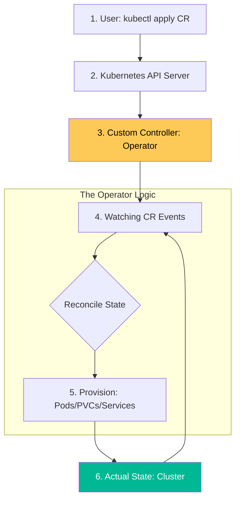

# Kubernetes Operators & CRD Architecture Reference

**Doc Version:** 1.0.0
**Role:** Cloud-Native Architect / Kubernetes Software Engineer
**Scope:** Custom Resources, Controller Pattern, and Operator Lifecycle

---

## 1. Extending the Kubernetes API (CRDs)

**Custom Resource Definitions (CRDs)** allow you to define your own objects in the Kubernetes API, extending the cluster's capabilities beyond standard Pods and Deployments.

- **Custom Resource (CR)**: An instance of the CRD.
- **Kind/Version/Group**: The identifiers that define the API endpoint for your custom resource.
- **Validation**: Using OpenAPI v3 schemas to ensure CRs are correctly formatted before being accepted by the API server.

---

## 2. The Operator Pattern

An **Operator** is a custom controller that uses CRDs to manage applications and their components. It follows the standard Kubernetes reconciliation loop but carries "operational knowledge."

### How it Works:
1.  **Observe**: Watch for changes in the Custom Resource (e.g., a "Database" CR).
2.  **Analyze**: Determine the difference between the actual state (no database) and desired state (a 3-node HA database).
3.  **Act**: Perform complex operations like initializing storage, creating secrets, and configuring clusters.

**Goal**: Automate "Day 2" operations like backups, scaling, and upgrades that a standard Deployment cannot handle.

---

## 3. Operator Framework Tools

| Tool | Language | Best For |
| :--- | :--- | :--- |
| **Operator SDK** | Go, Ansible, Helm | The industry standard for building robust, high-performance operators. |
| **KubeBuilder** | Go | The underlying toolkit used by the Operator SDK for generating boilerplate. |
| **Metacontroller** | Any | A lightweight way to build simple operators using webhooks. |

---

## 4. Visualizing the Operator Loop

---

## 5. Status and Subresources

Effective CRDs use **Subresources** to manage status independently of the specification.
- **`/status`**: Allows the operator to report the health and progress of the resource without user modification.
- **`/scale`**: Enables standard tools like HPA to scale the custom resource.

---

## 6. Enterprise Governance Standards

- **Finalizers**: Ensuring resources are correctly cleaned up. For example, a "CloudDatabase" operator should delete the real database in AWS before the CR is removed from Kubernetes.
- **Namespace Scoped vs. Cluster Scoped**: Restricting operators to specific namespaces unless they require cluster-wide visibility.
- **Leader Election**: Running high-availability operators where only one pod at a time is actively reconciling to prevent race conditions.
- **Dynamic Client vs. Typed Client**: Using the correct client library to handle CRD versioning and discovery.

> **Enterprise Pattern**: Implement **Sidecar Lifecycle Management**. Use an operator to automatically inject management sidecars (like logging agents or security proxies) into any pod within a specific namespace, ensuring that all workloads are automatically compliant without developer intervention.
