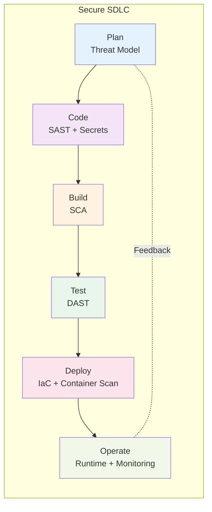
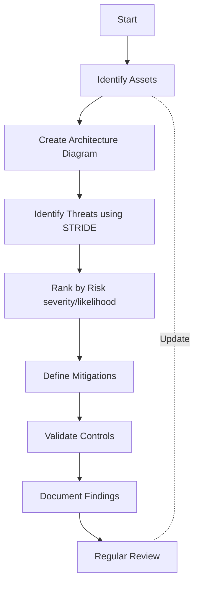

# Security Fundamentals

Understanding core DevSecOps principles and methodologies is essential before implementing tools and practices.

## What is DevSecOps?

**DevSecOps** extends DevOps by integrating security practices throughout the entire software development lifecycle (SDLC). It's a cultural shift where security becomes everyone's responsibility.

### Core Principles

1. **Security as Code**
   - Security policies version-controlled like application code
   - Automated, repeatable, and auditable
   - Infrastructure and security configurations deployable via code

2. **Shift-Left Security**
   - Catch security issues early in development
   - Cheaper and faster to fix
   - Better security posture

3. **Continuous Security**
   - Security testing at every pipeline stage
   - Automated vulnerability scanning
   - Real-time security monitoring

4. **Shared Responsibility**
   - Developers write secure code
   - Security teams provide tools and guidance
   - Operations secure infrastructure

## Security in the SDLC



### Stage-by-Stage Security

#### 1. Planning Stage
**Activities**:
- Threat modeling
- Security requirements definition
- Risk assessment
- Attack surface mapping

**Tools**:
- OWASP Threat Dragon
- Microsoft Threat Modeling Tool
- IriusRisk

**Deliverables**:
- Threat model diagrams
- Security requirements document
- Risk register

#### 2. Development Stage
**Activities**:
- Secure coding practices
- Static code analysis (SAST)
- Secret scanning
- Pre-commit hooks

**Tools**:
- SonarQube, Semgrep (SAST)
- GitGuardian, Gitleaks (Secrets)
- IDE security plugins

**Deliverables**:
- Secure code
- SAST reports
- No hardcoded secrets

#### 3. Build Stage
**Activities**:
- Software Composition Analysis (SCA)
- Dependency vulnerability scanning
- License compliance checking
- Build artifact signing

**Tools**:
- Snyk, OWASP Dependency-Check
- Trivy, Grype
- Cosign (artifact signing)

**Deliverables**:
- Clean dependency scan
- License compliance report
- Signed artifacts

#### 4. Testing Stage
**Activities**:
- Dynamic Application Security Testing (DAST)
- API security testing
- Penetration testing
- Security regression testing

**Tools**:
- OWASP ZAP, Burp Suite
- Postman (API testing)
- Metasploit (pentesting)

**Deliverables**:
- DAST scan results
- Penetration test reports
- Security test results

#### 5. Deployment Stage
**Activities**:
- Container image scanning
- Infrastructure as Code (IaC) scanning
- Configuration validation
- Deployment approval gates

**Tools**:
- Trivy, Clair (container)
- Checkov, tfsec (IaC)
- OPA (policy validation)

**Deliverables**:
- Scanned container images
- Validated IaC templates
- Deployment approval

#### 6. Operations Stage
**Activities**:
- Runtime security monitoring
- Compliance auditing
- Incident response
- Security metrics collection

**Tools**:
- Falco (runtime)
- Prometheus + Grafana (monitoring)
- OPA Gatekeeper (policy)

**Deliverables**:
- Security dashboards
- Compliance reports
- Incident response logs

## Threat Modeling Basics

### STRIDE Framework

Common approach for identifying threats:

| Threat Type | Description | Example |
|-------------|-------------|---------|
| **S**poofing | Impersonating something or someone | Fake authentication tokens |
| **T**ampering | Modifying data or code | SQL injection, code manipulation |
| **R**epudiation | Claiming you didn't do something | Lack of audit logs |
| **I**nformation Disclosure | Exposing information | Data leaks, exposed secrets |
| **D**enial of Service | Preventing service availability | DDoS attacks |
| **E**levation of Privilege | Gaining unauthorized access | Privilege escalation exploits |

### Threat Modeling Process



## Security Mindset for Developers

### Think Like an Attacker

1. **Input Validation**: Never trust user input
2. **Authentication**: Verify identity properly
3. **Authorization**: Check permissions at every level
4. **Data Protection**: Encrypt sensitive data
5. **Error Handling**: Don't leak information in errors
6. **Logging**: Log security events for auditing

### Secure Coding Principles

#### 1. Least Privilege
```python
# ❌ Bad: Running with root privileges
FROM ubuntu
USER root
RUN apt-get update

# ✅ Good: Non-root user
FROM ubuntu
RUN useradd -m appuser
USER appuser
```

#### 2. Defense in Depth
```yaml
# Multiple security layers
apiVersion: v1
kind: Pod
metadata:
  name: secure-app
spec:
  securityContext:
    runAsNonRoot: true
    runAsUser: 1000
    fsGroup: 2000
  containers:
  - name: app
    image: myapp:latest
    securityContext:
      allowPrivilegeEscalation: false
      capabilities:
        drop:
          - ALL
    resources:
      limits:
        memory: "512Mi"
        cpu: "500m"
```

#### 3. Fail Securely
```javascript
// ❌ Bad: Exposing error details
app.get('/api/user/:id', (req, res) => {
  try {
    const user = db.query(`SELECT * FROM users WHERE id = ${req.params.id}`);
    res.json(user);
  } catch (error) {
    res.status(500).json({ error: error.message }); // Leaks info
  }
});

// ✅ Good: Generic error message
app.get('/api/user/:id', (req, res) => {
  try {
    const user = db.prepare('SELECT * FROM users WHERE id = ?').get(req.params.id);
    res.json(user);
  } catch (error) {
    logger.error('Database error:', error); // Log internally
    res.status(500).json({ error: 'Internal server error' }); // Generic to user
  }
});
```

## Common Vulnerabilities

### OWASP Top 10 (2021)

1. **Broken Access Control**: Users can access unauthorized resources
2. **Cryptographic Failures**: Weak or missing encryption
3. **Injection**: SQL, NoSQL, OS command injection
4. **Insecure Design**: Fundamental design flaws
 5. **Security Misconfiguration**: Default configs, unnecessary features
6. **Vulnerable Components**: Using libraries with known vulnerabilities
7. **Authentication Failures**: Weak password policies, session management
8. **Software and Data Integrity**: Unsigned code, insecure CI/CD
9. **Logging and Monitoring Failures**: Insufficient logging
10. **Server-Side Request Forgery (SSRF)**: Fetching remote resources without validation

## Security Testing Types

### Comparison Matrix

| Type | When | What It Tests | Tools | Pros | Cons |
|------|------|---------------|-------|------|------|
| **SAST** | Build | Source code | SonarQube, Semgrep | Early detection, low cost | False positives, no runtime context |
| **DAST** | Test | Running app | OWASP ZAP, Burp | Real vulnerabilities, no code needed | Late stage, slower |
| **IAST** | Test | Instrumented app | Contrast, Seeker | Low false positives | Requires code changes |
| **SCA** | Build | Dependencies | Snyk, Dependency-Check | Known vulnerabilities | Only checks libraries |
| **Secrets** | Code | Hardcoded secrets | GitGuardian, Gitleaks | Prevents leaks | Needs tuning |

## Best Practices Checklist

### Development
- [ ] Use security linters in IDE
- [ ] Never commit secrets to version control
- [ ] Validate and sanitize all inputs
- [ ] Use prepared statements for SQL
- [ ] Implement proper error handling
- [ ] Follow principle of least privilege
- [ ] Keep dependencies updated

### Build & Deploy
- [ ] Scan container images before deployment
- [ ] Validate Infrastructure as Code
- [ ] Sign and verify artifacts
- [ ] Implement security gates in CI/CD
- [ ] Use immutable infrastructure
- [ ] Enable security headers

### Operations
- [ ] Monitor for security events
- [ ] Implement runtime protection
- [ ] Maintain audit logs
- [ ] Regular security patching
- [ ] Incident response plan
- [ ] Regular security reviews

## Getting Started

### Quick Wins

Start with these high-impact, low-effort security improvements:

1. **Enable Secret Scanning**: Prevent credential leaks
   ```bash
   # Install gitleaks
   brew install gitleaks
   
   # Scan repository
   gitleaks detect --source . --verbose
   ```

2. **Add Container Scanning**: Find vulnerabilities
   ```bash
   # Install trivy
   curl -sfL https://raw.githubusercontent.com/aquasecurity/trivy/main/contrib/install.sh | sh
   
   # Scan image
   trivy image nginx:latest
   ```

3. **Implement Pre-commit Hooks**: Catch issues early
   ```bash
   # Install pre-commit
   pip install pre-commit
   
   # Add .pre-commit-config.yaml
   # Run on all files
   pre-commit run --all-files
   ```

## Next Steps

1. **Deep Dive**: Read [Shift-Left Security](Shift-Left-Security.md) for implementation strategies
2. **Tools**: Explore [Security Tools](../../../../README.md) for detailed tool guides
3. **Practice**: Implement security in [CI/CD Pipeline](../../../../README.md)

## Resources

- [OWASP](https://owasp.org/) - Web application security
- [CWE Top 25](https://cwe.mitre.org/top25/) - Most dangerous software weaknesses
- [NIST Secure SDLC](https://csrc.nist.gov/projects/ssdf) - Secure development framework
- [DevSecOps Manifesto](https://www.devsecops.org/) - Core principles

---

**[← Back to Security Overview](../README.md)** | **[Next: Security Tools →](../../../../README.md)**
