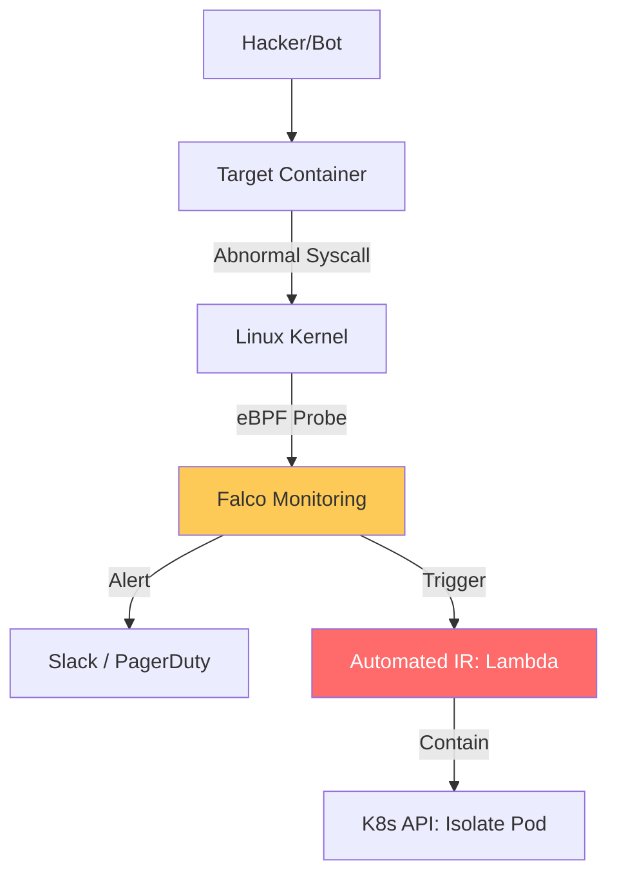

# Runtime Security & Incident Response Reference

**Doc Version:** 1.0.0
**Role:** DevSecOps Lead / SRE Security Officer
**Scope:** Runtime Monitoring, eBPF, and Automated Containment

---

## 1. The Runtime Gap

Traditional scanners (SAST/SCA) find vulnerabilities *before* code runs. Runtime security finds attacks *while* code runs.

### What is monitored?
- **System Calls**: A process trying to execute `execve` (spawn a shell) in a web server.
- **Filesystem Activity**: A database process reading `/etc/shadow`.
- **Network Anomalies**: A container suddenly scanning internal IP addresses.

---

## 2. eBPF for Deep Visibility

eBPF (Extended Berkeley Packet Filter) is the revolutionary technology used for high-performance runtime monitoring.

- **Non-Invasive**: Monitors the kernel without modifying application code or impacting performance.
- **Tools**: **Falco** (the de-facto standard for K8s runtime security).
- **Functionality**: Replaces "Black Box" containers with "Glass Box" visibility by intercepting every kernel event.

---

## 3. Automated Incident Response (SOAR)

In the cloud, attacks happen in milliseconds. Manual response is too slow.

### The Response Loop:
1.  **Alert**: Falco detects a "Shell spawned in container."
2.  **Enactment**: A serverless function (Lambda) or Kubernetes controller is triggered.
3.  **Containment**:
    - **Isolate**: Apply a NetworkPolicy to block all traffic to/from the pod.
    - **Cordon**: Mark the node as unschedulable.
    - **Kill**: Terminate the pod (if stateless).
    - **Snapshot**: Capture memory and disk for forensics before deletion.

---

## 4. Visualizing the Runtime Defense

---

## 5. Drift and Immutability in Runtime

A "Secure" runtime is an **Immutable** runtime.
- **Drift Detection**: Any file modification in the container's root filesystem (e.g., adding a binary to `/tmp`) should trigger a security alert.
- **Read-Only Root**: Mandating `readOnlyRootFilesystem: true` in Kubernetes to prevent attackers from writing persistence scripts.

---

## 6. Enterprise Governance Standards

- **SIEM Integration**: Streaming all high-priority runtime events to a central dashboard for correlation with cloud provider logs (CloudTrail).
- **Forensic Readiness**: Training teams to use tools like `kubectl cp` to extract logs and artifacts from compromised pods *before* they are deleted by the auto-healer.
- **Threat Hunting**: Proactively searching runtime logs for "Low and Slow" Indicators of Compromise (IoC) that didn't trigger an automatic alert.

> **Enterprise Pattern**: Implement **Network-to-Process Correlation**. Use Cilium with Hubble to see exactly which process ID (PID) inside which container initiated a specific network connection. This allows you to conclusively prove that a "Data Exfiltration" event was caused by a specific compromised binary rather than a misconfigured legitimate service.
