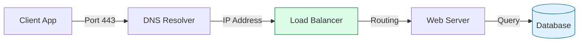

# 🌐 Networking Foundations: The Global Postal Service

> **"Listen up, Junior. Every packet is a piece of mail, every IP is an address, and every router is a post office. If you don't understand how the mail gets delivered, you'll never be able to build a global delivery system."**

---

## 🧠 The Mental Model: The Global Postal Service

**The Junior Struggle**: "Why do I need to learn about IP addresses, ports, and protocols? I just want to deploy my app to the cloud!"

**The Engineer Solution**: You realize that the cloud is just someone else's computer connected by a very long wire.
- **IP Address**: The house address. (Where does the mail go?)
- **Port**: The specific door or mailbox at that address. (Which application gets the mail?)
- **Protocol (TCP/UDP)**: The delivery rules. (Do I need a signature for this package, or can I just throw it over the fence?)
- **Router**: The local post office that knows which neighborhood (subnet) the mail belongs to.

---

## 🆚 Junior Way vs. Engineer Way

| Feature | The Junior Way (Problematic) | The Engineer Way (Strategic) |
|:---|:---|:---|
| **Troubleshooting** | "The site is down, I'll restart it." | **Layered Debugging** (Is it DNS? Is it the Port?) |
| **Security** | Opening all ports to "just make it work." | **Principle of Least Privilege** (Firewalls/SG) |
| **Addressing** | Using random IP ranges. | **CIDER & Subnet Planning** (Avoid collisions) |
| **Connectivity** | "I can ping it, so it's fine." | **Checking Port-Level Health** (TCP Handshake) |
| **Design** | Single server, no redundancy. | **High Availability & DNS Failover** |

---

---

## 🎯 Junior's Mission: The Connectivity Crisis
**Scenario**: A developer reports that their new microservice can't reach the database. `ping` works, but the app still fails.
**Your Goal**: Identify if the blockage is at the **Network Layer** (Routing), the **Security Layer** (Firewalls), or the **Application Layer** (Wrong Port).

---

## 🏗️ Operational Reality: Production Hazards
In a high-scale environment, networking is rarely about "plugging in cables." It's about overcoming these common pitfalls:
1.  **CIDER Overlap**: Mistakenly using the same IP range for two VPCs, making it impossible to peer them.
2.  **DNS Propagation Lag**: Dealing with TTL (Time to Live) during a failover.
3.  **Security Group "Sprawl"**: Opening too many ports for troubleshooting and forgetting to close them.
4.  **MTU Mismatch**: Large packets getting dropped because they exceed the "Maximum Transmission Unit" of a VPN tunnel.

---

## 🛠️ The Networking Toolbelt (Essential Commands)
| Command | Why it matters |
| :--- | :--- |
| `dig <domain>` | Is DNS resolving to the correct IP? |
| `telnet <ip> <port>` | A quick "Handshake" check. Is the port actually listening? |
| `ip addr show` | Check local interface configuration and CIDR. |
| `mtr <ip>` | A combined Ping + Traceroute. Where exactly is the packet dropping? |
| `curl -v <url>` | Verbose HTTP check. Is it a connection error or a 403 Forbidden? |

---

## 🎯 The Automation Why: Networking as Code
**For Juniors**: In the old days, you had to manually plug cables into switches. In the DevOps world, **Software-Defined Networking (SDN)** means we write code to build networks.
- **VPCs & Subnets**: Created via Terraform.
- **Load Balancers**: Managed via Cloud APIs.
- **DNS Records**: Updated automatically during deployments.

**Mastering networking is the difference between an app that 'works on my machine' and a system that scales globally.**

---

## 🏗️ Visual: The Packet Journey

---

## 🗺️ Learning Path

1. **[Network Fundamentals](./01-network-fundamentals/readme.md)**: Physical topologies, network types, and core terminology.
2. **[Network Models](./02-network-models/readme.md)**: Deep dive into the OSI and TCP/IP models.
3. **[IP Addressing](./03-ip-addressing/readme.md)**: IPv4, IPv6, subnetting, and planning.
4. **[Basic Protocols](./04-basic-protocols/readme.md)**: HTTP, DNS, DHCP, TCP/UDP, and ICMP.
5. **[Network Devices](./05-network-devices/readme.md)**: Routers, switches, firewalls, and load balancers.
6. **[Basic Troubleshooting](./06-basic-troubleshooting/readme.md)**: Methodology and tools for diagnosing network issues.
7. **[Troubleshooting Labs](./07-network-troubleshooting-labs/)**: Practical Python scripts for network connectivity and DNS testing.

---

## 🏢 Reference Library

*   **[Network Models](./reference/network-models-ref.md)**: OSI and TCP/IP layers.
*   **[IP Addressing & Subnetting](./reference/ip-addressing-subnetting-ref.md)**: IPv4/v6, CIDR, and NAT manual.
*   **[Network Protocols](./reference/network-protocols-ref.md)**: HTTP, DNS, DHCP guide.
*   **[Devices & Hardware](./reference/network-devices-hardware-ref.md)**: Infrastructure manual.
*   **[Diagnostic & Troubleshooting](./reference/network-troubleshooting-ref.md)**: SRE playbook.

---
**Next Step**: Start with [Network Fundamentals](./01-network-fundamentals/readme.md), Junior!
