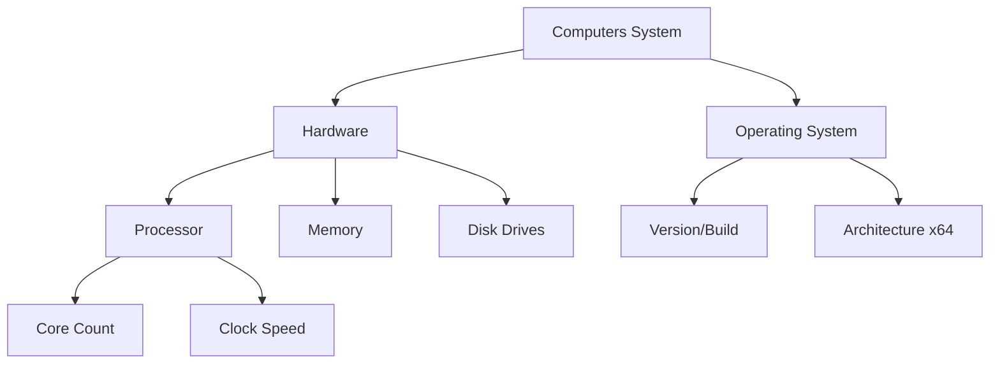

# Beginner: Hardware & OS Inventory

> **Getting to Know Your Machine: The First Step in Auditing**

This module focuses on the fundamental skill of **Discovery**. Before you can secure or optimize a system, you must know exactly what it is. We will use native PowerShell `Get-CimInstance` commands to build a complete picture of the hardware and operating system.

## 🎯 Learning Objectives

1.  Understand the WMI/CIM structure.
2.  Extract CPU, RAM, and Disk details programmatically.
3.  Format audit data into readable reports.

## 📊 System Component Hierarchy

## 🛠️ Practical Exercises

### 1. Basic System Report
Run the `Get-SystemInventory.ps1` script to generate a JSON report of your local machine.

### 2. Disk Space Auditor
Use the `Get-DiskUsage.ps1` script to find volumes that are running low on space.

---

**[⬅️ Back to Windows Basics](../readme.md)** | **[Next Level: Intermediate Auditing](readme.md)**
