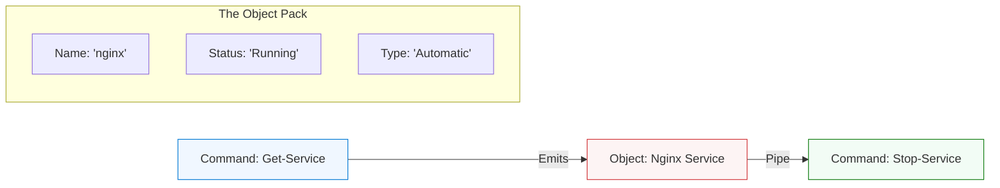

# 🪟 Windows & PowerShell: The Managed Corporate Campus

> **"In Linux, everything is a file. In Windows, everything is an Object. If you treat PowerShell like Bash, you will fight the system; if you treat it like a .NET engine, you will dominate the enterprise."**

---

## 🧠 The Mental Model: The Managed Corporate Campus

**The Newbie Struggle**: "I'm a Linux fan, why do I have to learn Windows for DevOps? Every time I want to change a setting, I have to click through five buried menus or search the 'Registry'. PowerShell commands are a mile long—`Get-Service`, `Set-ExecutionPolicy`—it feels so wordy compared to `ls` or `ps`. I feel like I'm trying to drive a bus when I just wanted a bike."

**The Engineer Solution**: You realize that Windows is built for **Centralized Control**. In a campus with 10,000 employees, you don't give everyone a bike; you build a tram system. You learn that **PowerShell** doesn't pass text (like Bash); it passes **Objects**. You stop using `grep` to find a string and start asking the Object for its properties. You realize that **Active Directory** is the most powerful "Phone Book" on earth, and once you master it, you can control a million computers with a single script.

### 🏗️ The Windows Analogy

| Concept | Campus Analogy | Windows Equivalent |
|:--------|:---------------|:-------------------|
| **Active Directory** | The HR Database | The Identity System (AD DS) |
| **The Registry** | The Master Blueprints | Central Config Database |
| **PowerShell** | The Automated Tram | Object-Oriented Shell |
| **Services** | The Security & Cleaning Staff | Background Processes |
| **Group Policy** | The Employee Handbook | Fleet Configuration Management |
| **WSL** | A Linux Office inside the Campus | Windows Subsystem for Linux |

---

## 📚 Why This Module Matters for Newbies

**Before this module**, you might think:
- "Windows is just for gaming and office work."
- "PowerShell is just CMD with a different color."
- "I only need to learn Linux for DevOps."

**After this module**, you'll understand:
- **Object-Oriented Automation**: Why passing data as objects prevents 'Parsing Nightmares'.
- **Active Directory**: Managing 50,000 users without losing your mind.
- **Package Management**: Using `winget` and `Chocolatey` to install software via CLI.
- **Enterprise Fleet Management**: Deploying updates to a global infrastructure.

**The Difference**: You move from "Clicking through menus" to **"Architecting the Enterprise."**

---

---

## 🎯 Junior's Mission: The Fleet Freeze
**Scenario**: Your company has 100 Windows-based build nodes, and they all need a specific security update installed by noon. Doing this manually via Remote Desktop is impossible.
**Your Goal**: Use **PowerShell** to query all nodes, identify which ones are missing the update, and execute a remote install script to "Unfreeze" the fleet.

---

## 🏗️ Operational Reality: Production Hazards
Windows in an automated environment has unique "Gotchas" that can kill a deployment.
1.  **Reboot Loops**: An update requires a reboot, but the automation tool tries to keep working, leading to a "File in Use" error and a crashed pipeline.
2.  **Execution Policy Lock**: A script fails not because the code is wrong, but because the default Windows policy prohibits running unassigned local scripts.
3.  **Path Length Limit**: Legacy Windows has a 260-character limit for file paths. Deeply nested Git repos or Node.js projects will crash if this isn't tuned in the Registry.
4.  **Service Accounts**: A service runs fine when *you* are logged in, but fails in the background because the "Service Account" doesn't have permission to write to its own logs.

---

## 🛠️ The Windows Toolbelt (Essential Commands)
| Command | Why it matters |
| :--- | :--- |
| `Get-Service | Where-Object Status -eq "Stopped"` | Find exactly which critical services have crashed. |
| `Get-Content -Wait -Tail 20` | Power-user way to watch a log file live (like `tail -f`). |
| `gpupdate /force` | Force-apply the latest "Employee Handbook" (Group Policy) rules. |
| `Stop-Process -Name "processname" -Force` | Killing a "Zombie" application that won't close. |
| `Get-EventLog -LogName System -Newest 10` | The "Black Box" recorder. Why did the server reboot? |

---

## 🎯 Learning Objectives
By the end of this module, you will:

- ✅ **Master Verb-Noun Logic**: Thinking in PowerShell (`Get`, `Set`, `New`, `Invoke`).
- ✅ **Handle Objects**: Extracting properties and methods without using Regex.
- ✅ **Navigate the Registry**: safely auditing and updating system settings.
- ✅ **Manage Local Systems**: Standardizing users, groups, and permissions.
- ✅ **Automate Fleet Tuning**: Using "Golden Scripts" to optimize performance.

---

---

## 🏗️ The Object-Oriented Flow

PowerShell doesn't just send text; it sends the "Whole Package."

---

## 📂 Curriculum Roadmap

1.  **[PowerShell Automation](./part-1-powershell-automation)**: The Core Engine (Objects, Pipes, Scripts).
2.  **[WSL Integration](./part-2-wsl-linux-integration)**: Bridging the gap (Running Linux on Windows).
3.  **[Package Management](./part-3-package-management)**: CLI-based software installs (Winget).
4.  **[Server Administration](./part-4-server-administration)**: Roles, Features, and Fleet Control.
5.  **[Performance Tuning](./part-7-performance-tuning)**: SRE-level Kernel and Registry optimization.

---

## 🏆 Real-World DevOps Story: The Password Reset Pandemic

**The Incident**: A company with 5,000 employees had a security policy update that locked everyone out of their accounts simultaneously. The Helpdesk was overwhelmed.
**The Failure**: A Newbie tried to reset them manually. At 5 minutes per user, it would have taken 400 hours.
**The Fix**: An engineer wrote a 5-line PowerShell script using the **Active Directory Module**. It queried all locked users and reset their "Must-Change-Password" flag.
**The Outcome**: All 5,000 accounts were unfrozen in 12 seconds. The Newbie realized that in Windows, if you aren't using PowerShell, you aren't really an Admin.

---

## ❓ Interview Preparation (Windows)

### 🎯 Core Concepts

1. **Q: Why is PowerShell better than Bash for Windows?**
    *   *Answer: Bash is text-oriented; you spend half your time using `awk` and `grep` to extract strings. PowerShell is object-oriented; you can access `service.Name` or `process.CPU` directly. This makes scripts more reliable and easier to read.*
2. **Q: What is the Registry?**
    *   *Answer: A hierarchical database that stores all configurations for the OS and applications. It is the single source of truth for the Windows Kernel.*
3. **Q: What is 'Execution Policy'?**
    *   *Answer: A safety feature that determines which PowerShell scripts can run. It isn't a security boundary, but a guardrail to prevent Newbies from accidentally running malicious files from the internet.*

---

## 📝 Knowledge Check

1. **What is the standard naming convention for PowerShell commands?**
    * [ ] a) Subject-Action
    * [x] b) Verb-Noun (e.g., `Get-Process`)
    * [ ] c) Lowercase-Only
2. **True or False: WSL2 allows you to run a real Linux Kernel inside Windows.**
    * [x] a) True
    * [ ] b) False
3. **Which tool is used for command-line package management on Windows?**
    * [ ] a) apt-get
    * [x] b) winget
    * [ ] c) brew

---

**Next Step**: Start with **[PowerShell Automation](./part-1-powershell-automation/readme.md)**

---
## 🧭 Additional Modules
- [Part 6 System Auditing](part-6-system-auditing/readme.md)
