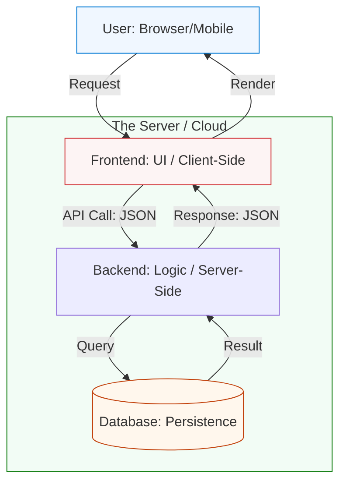

# 🥞 Software Stack Foundations: The 3-Tiered Cake

> **"An application is not a single file; it is a stack of specialized workers. If you don't understand the layers, you won't know where the fire is when the 'Stack' starts burning. In DevOps, we don't just write code; we architect the bridge between Front and Back."**

---

## 🧠 The Mental Model: The Tiered Cake

**The Newbie Struggle**: "I'm overwhelmed by acronyms. LAMP, MERN, MEAN, JAMStack... people talk about 'The Stack' like it's a fixed thing. I don't know the difference between a 'Language' and a 'Framework', or why I need a 'Runtime' if the code is already written. I feel like I'm trying to build a house without knowing what a brick is!"

**The Engineer Solution**: You realize that every modern app follows the same **3-Tiered Pattern**. You have the **Frosting** (Frontend), the **Cake** (Backend), and the **Plate** (Infrastructure/Storage). You stop trying to memorize stacks and start understanding **Responsibilities**. You learn that a "Framework" is just a set of pre-built tools so you don't have to reinvent the wheel every time you want to save a password.

### 🏗️ The Software Analogy

| Layer | Cake Analogy | Software Equivalent |
|:------|:-------------|:--------------------|
| **Frontend** | The Frosting (The visual part) | HTML, CSS, React, Vue |
| **Backend** | The Layers (Internal flavor) | Python, Node.js, Java, Go |
| **Database** | The Filling (The persistent part) | SQL, MongoDB, Redis |
| **Runtime** | The Oven (What makes it 'Live') | JVM, Python Interpreter |
| **Framework** | The Box/Mold (The Structure) | Django, Spring, Express |

---

## 📚 Why This Module Matters for Newbies

**Before this module**, you might think:
- "A website is just one big file."
- "Python and Django are the same thing."
- "The database is inside the backend code."

**After this module**, you'll understand:
- **Separation of Concerns**: Why the Frontend shouldn't talk directly to the Database.
- **Microservices**: Why we sometimes break the cake into 100 tiny cupcakes.
- **Statelessness**: Why the Backend should never 'remember' who you are without a token.
- **The API Contract**: How the layers talk to each other using the "Currency" of JSON.

**The Difference**: You move from "Writing scripts" to **"Architecting Systems."**

---

---

## 🎯 Junior's Mission: The Stack Audit
**Scenario**: You are handed a legacy Python app and asked to containerize it. You don't know what database it uses or what version of Python it needs.
**Your Goal**: "Audit the Stack" by reading the `requirements.txt` and `dockerfile` to map out the **Dependencies**, the **Runtime**, and the **Database** type.

---

## 🏗️ Operational Reality: Production Hazards
In a high-tier SRE environment, you are the one responsible for the "Glue" between the layers.
1.  **Dependency Hell**: One library update breaks the entire backend because it's incompatible with the OS version.
2.  **Stateful Traps**: Keeping user images on the server's local disk instead of S3. If the server is deleted, the images are gone forever.
3.  **The "Slow Query" Death**: The app is slow not because the code is bad, but because the database doesn't have an "Index" on a common search term.
4.  **Version Drift**: The developer uses Python 3.12 on their laptop, but the server is running 3.8. The code crashes instantly upon deployment.

---

## 🛠️ The Stack Toolbelt (Essential Commands)
| Command | Why it matters |
| :--- | :--- |
| `pip list` / `npm list` | See exactly which library versions are currently installed. |
| `docker inspect <container>` | "X-Ray" vision for your stack. Where are the files stored? |
| `tail -f /var/log/app.log` | Watching the "Mental State" of the backend in real-time. |
| `env` | List the environment variables. This is where secrets and DB URLs live. |
| `netstat -plnt` | See which part of the stack is listening on which port. |

---

## 🎯 Learning Objectives
By the end of this module, you will:

- ✅ **Map the Tiers**: Identifying Frontend, Backend, and Database layers.
- ✅ **Identify Runtimes**: Understanding how different languages "run" on a server.
- ✅ **Compare Frameworks**: Choosing the right tool for the job.
- ✅ **Analyze Request Flow**: Tracing a user click from the browser to the disk.
- ✅ **Audit Dependencies**: Understanding how third-party libraries define your stack.

---

---

## 🏗️ The 3-Tier Architecture

This is the standard pattern for 90% of the internet.

---

## 🏆 Real-World DevOps Story: The Billion Dollar "Leak"

**The Incident**: A major social media app started showing random users' private photos to strangers.
**The Failure**: A Newbie developer put "Database Logic" directly into the **Frontend** (Frosting). They thought it would be 'faster' to let the browser query the database directly.
**The Fix**: A Senior Architect moved all database access behind the **Backend** (Cake) layer. The Backend now "Authenticates" the user before asking the database for any data.
**The Outcome**: The security hole was plugged. The team learned that the "Cake" layer isn't just for logic; it's the **Security Gatekeeper** of the entire stack.

---

## ❓ Interview Preparation (Software Stacks)

### 🎯 Core Concepts

1. **Q: What is a 'Full Stack' engineer?**
    *   *Answer: An engineer who can work on both the Frontend (UI) and the Backend (Logic/Database). In DevOps, we often act as 'Full Stack Operators' managing the infrastructure for all layers.*
2. **Q: SQL vs NoSQL?**
    *   *Answer: SQL is like a structured spreadsheet (Good for money/users). NoSQL is like a folder of flexible documents (Good for big data/logs). Professionals pick the right tool for the specific data type.*
3. **Q: What is an 'API'?**
    *   *Answer: The 'Order Window' of the Backend. The Frontend sends a request (the order), and the Backend returns a response (the food) in a standard format like JSON.*

---

## 📝 Knowledge Check

1. **Which layer is responsible for the 'Business Logic' (e.g., calculating tax)?**
    * [ ] a) Frontend
    * [x] b) Backend
    * [ ] c) Database
2. **What is the standard data format used for communication between tiers?**
    * [ ] a) YAML
    * [x] b) JSON
    * [ ] c) XML
3. **True or False: The Framework and the Runtime are the same thing.**
    * [ ] a) True
    * [x] b) False (Runtime is the engine; Framework is the template).

---

**Next Step**: Move to **[Web Design & Frameworks](../06-web-design/readme.md)**
