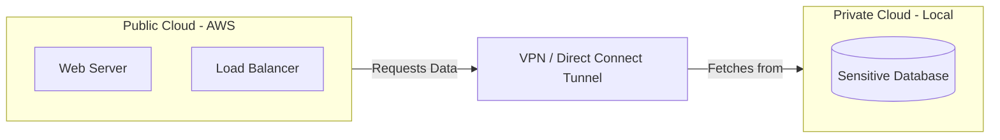

# 🏗️ Cloud Deployment Models: The Housing Market

> **"Listen up, Junior. You wouldn't buy a skyscraper just to host a lemonade stand, and you wouldn't use a public park to store your company's secret gold. Choosing a deployment model is about knowing where to put your data based on privacy, cost, and control."**

---

## 🧠 The Mental Model: The Housing Market

**The Junior Struggle**: "Why can't we just use AWS for everything? Is 'Private Cloud' just a server in my basement? What the heck is 'Hybrid'? It feels like different ways of saying 'computer in a room'."

**The Engineer Solution**: You realize that Deployment Models are about **Ownership and Boundaries**. You use **The Housing Analogy**:
- **Public Cloud**: An Apartment Complex. You share the plumbing and security with others (tenants), but your unit is your own. It's cheap and easy.
- **Private Cloud**: A Mansion. You own the land, the walls, and the guards. It's expensive and hard to maintain, but you have absolute control.
- **Hybrid Cloud**: Having a Townhouse and a Vacation Rental. You keep your secrets in the townhouse (On-prem) but use the rental (Public) when you have guests (Traffic spike).
- **Multi-Cloud**: Having apartments in 3 different cities so if one landlord fails, you have a backup.

---

## 🆚 Junior Way vs. Engineer Way

| Feature | The Junior Way (Problematic) | The Engineer Way (Strategic) |
|:---|:---|:---|
| **Selection** | "Everyone uses AWS, so we will too." | Analyzes **Compliance (GDPR/HIPAA)** and **Latency**. |
| **Hybrid** | Manually copies files from a local server to S3. | Sets up a **VPN/Direct Connect** tunnel for seamless flow. |
| **Multi-Cloud** | Manually creates resources in AWS and Azure. | Uses **Terraform** to manage multiple providers with one script. |
| **Private Cloud** | Thinks it's just a regular server. | Uses **OpenStack** or **VMware** to make it "Cloud-like" (Elastic). |

---

## 🎯 The Automation Why: The Borderless Infrastructure

**For Juniors**: You might think these are just business categories.
**For Engineers**: These define the **Scope of your Automation**.
- **Cross-Cloud DR**: You can write a script that detects if AWS is down and automatically "switches on" your infrastructure in Azure.
- **Cloud Bursting**: Your automation can detect when your private server is at 90% capacity and automatically "rent" more power from the Public Cloud.
- **Data Sovereignty**: Your code can automatically ensure that German user data stays on a Private Cloud in Berlin while US data goes to a Public Cloud in Virginia.

---

## 🏗️ The 4 Major Models

### 1. Public Cloud (The Apartment)
- **Who**: AWS, Azure, GCP.
- **Pros**: Zero upfront cost, infinite scale, no hardware to fix.
- **Cons**: You don't control the hardware; others share the same physical "pipes."

### 2. Private Cloud (The Mansion)
- **Who**: Your own data center running OpenStack or VMware.
- **Pros**: Maximum security, total control, physical isolation.
- **Cons**: Extremely expensive, you fix the hardware when it breaks.

### 3. Hybrid Cloud (The Townhouse + Rental)
- **Who**: A mix of AWS and On-Premises.
- **Pros**: "Best of both worlds." Keep secrets private, but scale the public parts.
- **Cons**: Very complex to manage; networking is hard.

### 4. Multi-Cloud (Multiple Apartments)
- **Who**: Using AWS for Compute + GCP for Big Data + Azure for AD.
- **Pros**: No "Vendor Lock-in." If one provider fails, you're safe.
- **Cons**: High management overhead; data transfer costs are high.

---

## 🏗️ Visual Architecture: The Hybrid Bridge

---

## 🏆 Real-World Scenario: The Banking Bridge

**The Situation**: A major bank wants to move to the cloud, but the law says "Financial Records must stay on physical hardware inside the country."

**The Junior Idea**: "We can't use the cloud then."
**The Engineer Solution**: **Hybrid Cloud**. 
1. The **Web Frontend** goes to AWS (Public) because it needs to be fast for global users.
2. The **Sensitive Database** stays in the bank's basement (Private).
3. They connect them with a **high-speed private tunnel**.
**The Result**: The bank gets the speed of the cloud while staying 100% legal.

---

## ❓ Interview Preparation

1. **Q: What is "Cloud Bursting"?**
   *A: It's a Hybrid Cloud strategy where an application runs in a private cloud or data center and "bursts" into a public cloud when the demand for computing capacity spikes. This prevents downtime without having to buy permanent hardware for rare spikes.*

2. **Q: Why would a company choose Multi-Cloud?**
   *A: To avoid "Vendor Lock-in," to take advantage of specialized services (like GCP's AI tools vs AWS's global reach), and for higher resiliency—if an entire cloud provider has a global outage, the business can still function.*

3. **Q: Is a VPC (Virtual Private Cloud) a "Private Cloud" deployment model?**
   *A: No. A VPC is a "Private Slice" of a **Public Cloud**. You are still using the public provider's hardware, but you are logically isolated. A true Private Cloud involves dedicated physical hardware for one organization.*

---

## 📝 Knowledge Check

1. **Which model involves using BOTH public and private infrastructure?**
   - [ ] a) Public
   - [ ] b) Multi-Cloud
   - [x] c) Hybrid

2. **What is the biggest disadvantage of a Private Cloud?**
   - [ ] a) Security
   - [x] b) Cost (Upfront CapEx)
   - [ ] c) Customization

3. **True or False: In a Multi-Cloud strategy, you are usually trying to avoid "Vendor Lock-in".**
   - [x] a) True
   - [ ] b) False

---

**Next Step**: Learn the different **[Service Models (IaaS/PaaS/SaaS) →](../service-models/readme.md)**
