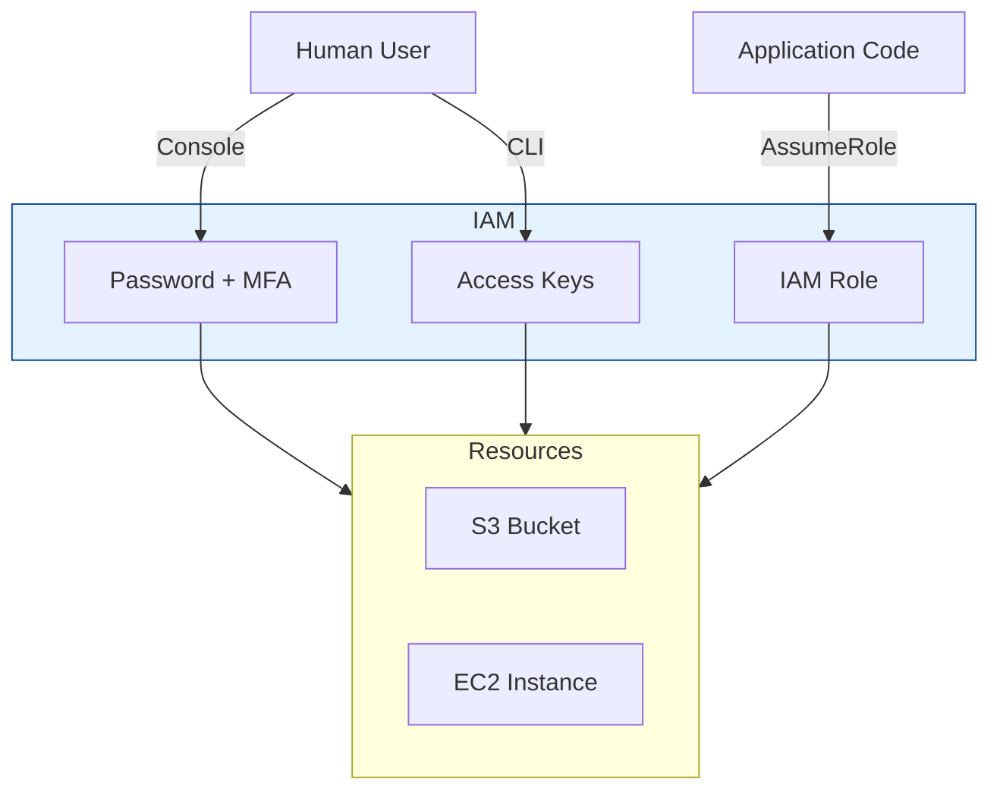

# AWS Identity (IAM & Cognito)

Managing access to AWS resources and applications.

## Identity Architecture

## Real World Scenarios
### Scenario: Mobile App Login
**Context:** You are building a mobile game. You don't want to manage a database of usernames/passwords. You want users to sign in with Facebook or Google.
**Solution:**
- **Cognito User Pools:** Handle sign-up/sign-in and social federation (Google/FB).
- **Cognito Identity Pools:** Exchange the login token for temporary AWS credentials to allow the app to upload saves to S3 directly.
**Benefit:** Offloads security/auth complexity to AWS.

<b>1. IAM stands for:</b>

Show Answer

Answer: A) Identity and Access Management</b>

<b>2. An IAM Role is designed for:</b>

Show Answer

Answer: A) Machines/Services or Federated Users (Temporary credentials)</b>

<b>3. The "Root Account" should be:</b>

Show Answer

Answer: B) Locked away and protected with MFA, only used for billing/account setup</b>

<b>4. Which policy type is attached directly to a User/Role?</b>

Show Answer

Answer: A) Identity-based policy (Inline or Managed)</b>

<b>5. Cognito User Pools are for:</b>

Show Answer

Answer: A) Authentication (Sign-up, Sign-in)</b>

<b>6. Cognito Identity Pools are for:</b>

Show Answer

Answer: A) Authorization (Exchanging tokens for AWS Credentials)</b>

<b>7. IAM Groups are:</b>

Show Answer

Answer: A) Collections of Users (for permission management)</b>

<b>8. "Principle of Least Privilege" means:</b>

Show Answer

Answer: A) Giving only the permissions needed for the task and no more</b>

<b>9. IAM is scoped to:</b>

Show Answer

Answer: A) Global</b>

<b>10. Service Control Policies (SCPs) are used in:</b>

Show Answer

Answer: A) AWS Organizations (Multi-account governance)</b>

<b>11. Can IAM Roles have long-term credentials (Access Keys)?</b>

Show Answer

Answer: A) No, they use temporary STS tokens</b>

<b>12. To allow cross-account access, you generally use:</b>

Show Answer

Answer: A) IAM Roles (AssumeRole)</b>

<b>13. AWS Directory Service is use for:</b>

Show Answer

Answer: A) Managed Microsoft Active Directory</b>

<b>14. IAM Access Analyzer helps:</b>

Show Answer

Answer: A) Identify resources shared externally (public/cross-account)</b>

<b>15. Multi-Factor Authentication (MFA) adds:</b>

Show Answer

Answer: A) Something you have (Token/Phone) to something you know (Password)</b>

<b>16. JSON Policy Structure: "Effect" can be:</b>

Show Answer

Answer: A) Allow or Deny</b>

<b>17. Which takes precedence: Explicit Deny or Explicit Allow?</b>

Show Answer

Answer: A) Explicit Deny (always wins)</b>

<b>18. Can you customize the login URL for IAM users?</b>

Show Answer

Answer: A) Yes (using account alias)</b>

<b>19. IAM Credential Report:</b>

Show Answer

Answer: A) Lists all users and the status of their credentials (MFA, password age)</b>

<b>20. Permission Boundaries:</b>

Show Answer

Answer: A) Set the maximum permissions an entity can have (Guardrails)</b>

<b>21. Single Sign-On (SSO) / IAM Identity Center allows:</b>

Show Answer

Answer: A) One login for multiple AWS accounts and apps</b>

---
## 🧭 Additional Modules
- [Cognito](cognito/readme.md)
