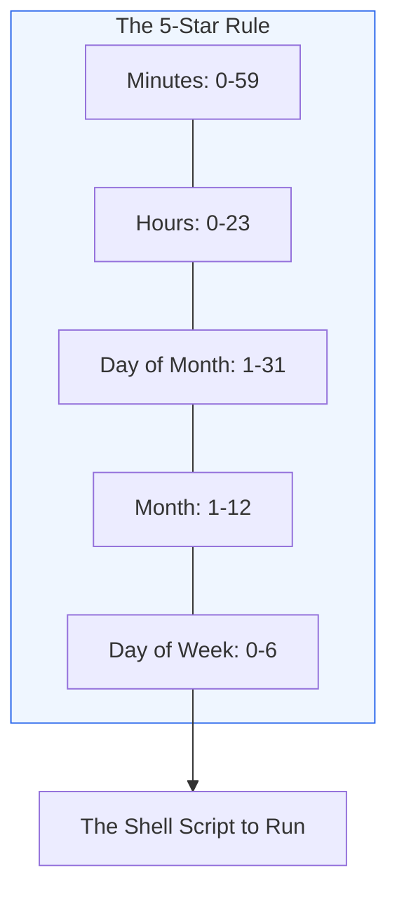

# 🍼 Level 01: Beginner Cron Basics

> **"If you can read a clock, you can write a crontab. It's the simplest way to make a computer do exactly what you want, exactly when you want it."**



## 📚 Overview

The foundation of job scheduling on Linux is the `cron` daemon. It reads a configuration file called a `crontab` and executes tasks in the background. For a beginner, the most important skill is mastering the "Timing String"—the sequence of five numbers or asterisks that defines the schedule.

## 🎓 Learning Objectives

- ✅ Understand the `* * * * *` syntax.
- ✅ Create, edit, and list user-level jobs with `crontab -e` and `crontab -l`.
- ✅ Understand system-wide cron in `/etc/crontab`.
- ✅ Create a basic automated backup script triggered by cron.

---

## 🛠️ The Crontab Syntax

```text
*  *  *  *  *   command_to_run
|  |  |  |  |
|  |  |  |  +----- Day of the Week (0-6) (Sunday=0)
|  |  |  +------- Month (1-12)
|  |  +--------- Day of the Month (1-31)
|  +----------- Hour (0-23)
+------------- Minute (0-59)
```

### Examples

- `30 2 * * *`: Every day at 2:30 AM.
- `0 0 * * 1`: Every Monday at midnight.
- `*/15 * * * *`: Every 15 minutes.

---

## 🏗️ Boilerplate: Midnight Backup Script

This script creates a compressed archive of your documents and is designed to be run via cron.

**Filename**: `midnight-backup.sh`

```bash
#!/bin/bash
# Simple midnight backup script

SOURCE_DIR="/home/user/documents"
BACKUP_DIR="/home/user/backups"
TIMESTAMP=$(date +%Y%m%d_%H%M%S)
FILE_NAME="backup_$TIMESTAMP.tar.gz"

# Create backup directory if it doesn't exist
mkdir -p "$BACKUP_DIR"

# Create the compressed backup
tar -czf "$BACKUP_DIR/$FILE_NAME" "$SOURCE_DIR"

echo "Backup completed: $FILE_NAME"
```

### 🚀 Implementation

1. Copy the script to your server.
2. Make it executable: `chmod +x midnight-backup.sh`
3. Open your crontab: `crontab -e`
4. Add the following line at the bottom:
   `0 0 * * * /path/to/midnight-backup.sh`

---

## ❓ Interview Preparation (Beginner)

1. **Q: What command do you use to view your existing cron jobs?**
   *A: `crontab -l` (list).*

2. **Q: What happens if your computer is turned off when a cron job is scheduled to run?**
   *A: The job is skipped. It will not run until the next scheduled occurrence. To solve this for intermittent machines, tools like `anacron` are used.*

3. **Q: How do you schedule a job to run every hour at the half-hour mark?**
   *A: `30 * * * *`.*

---

## 📝 Practice Challenge

Alter the syntax to run your backup script **every Friday at 11:00 PM**.
*(Answer: 0 23 * * 5)*

---

Proceed to: **[02. Intermediate Automation Scheduling](readme.md)** →
Node: Moving to robust execution patterns.
