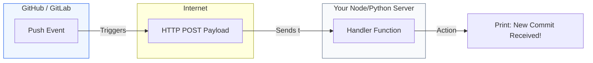

# 🍼 Level 01: Beginner Webhook Basics

> **"A webhook is like a doorbell for your server. When a visitor (an event) arrives, they press the button (the HTTP POST), and you decide how to answer."**



## 📚 Overview

For a beginner, a webhook is simply an **HTTP POST** request sent by one service to another. Instead of your browser asking a website for information (GET), a service like GitHub "Tells" your server that something happened by sending data in a format called **JSON**.

## 🎓 Learning Objectives

- ✅ Understand the difference between **Polling** and **Webhooks**.
- ✅ Identify the anatomy of a Webhook payload (Headers + Body).
- ✅ Set up a simple HTTP listener to receive and log JSON data.
- ✅ Understand HTTP Status Codes for webhooks (Why 200 OK matters).

---

## 🏗️ Boilerplate: Simple Python Receiver (Flask)

This script creates a web server that listens for webhooks on port 5000. It's the simplest way to see what an event looks like.

**Filename**: `app.py`
```python
from flask import Flask, request, jsonify

app = Flask(__name__)

@app.route('/webhook', methods=['POST'])
def handle_webhook():
    # 1. Capture the data sent by the service
    data = request.json
    
    # 2. Print it to the console so we can see it
    print(f"Received Webhook: {data}")
    
    # 3. Always return a 200 OK fast so the sender knows you got it
    return jsonify({"status": "success"}), 200

if __name__ == '__main__':
    app.run(port=5000)
```

### 🚀 How to test it locally
1. Install Flask: `pip install flask`
2. Run the script: `python app.py`
3. In a new terminal, simulate a webhook with `curl`:
   ```bash
   curl -X POST -H "Content-Type: application/json" \
        -d '{"action": "completed", "user": "ganil"}' \
        http://localhost:5000/webhook
   ```

---

## ❓ Interview Preparation (Beginner)

1. **Q: How does a Webhook differ from an API request?**
   *A: It's the "Direction" of the call. In a standard API request, you (the client) call the service. In a Webhook, the service calls you.*

2. **Q: Why is it important to return an HTTP 200 status code immediately?**
   *A: Many services (like GitHub) will retry sending the webhook if they don't get a 200 success code quickly. If your processing takes too long, you might receive the same webhook multiple times.*

3. **Q: What format is most common for webhook payloads?**
   *A: JSON (JavaScript Object Notation), though some older services still use XML.*

---

## 📝 Practice Challenge
Modify the `app.py` script to print only the name of the user if the JSON contains a key called `"user"`.

---

Proceed to: **[02. Intermediate Implementation & Security](readme.md)** →
*Note: Corrected link in actual file to point to 002-Intermediate-Implementation-Security.*
 Node: Moving to secure, production-grade endpoints.
