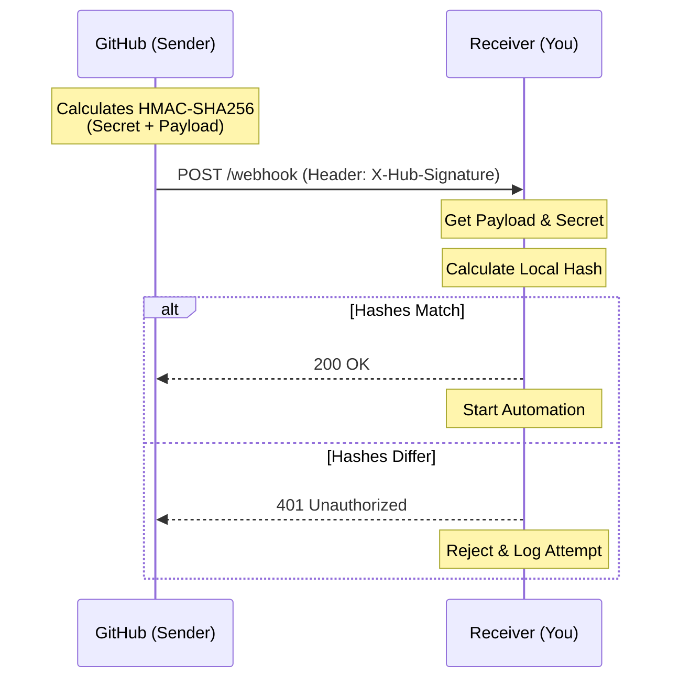

# 🏗️ Level 02: Intermediate Implementation & Security

> **"If your webhook endpoint isn't secured, it's not a feature—it's an open door for hackers. Trust nothing that doesn't provide a digital signature."**



## 📚 Overview

Intermediate webhook implementation is about **Defense in Depth**. Once you move beyond basic testing, you must ensure that:
1. The data actually came from the trusted source (Security).
2. The data hasn't been modified in transit (Integrity).
3. If you get the same message twice, your system doesn't break (Idempotency).

## 🎓 Learning Objectives

- ✅ Implement **HMAC Signature Verification** (SHA-256).
- ✅ Handle **Shared Secrets** securely using environment variables.
- ✅ Understand the concept of **Idempotency** in distributed events.
- ✅ Implement **Filtering**: Only act on the events you care about.

---

## 🏗️ Boilerplate: Secure GitHub Webhook Receiver

This script uses the `hmac` and `hashlib` libraries to verify that a request truly came from GitHub.

**Filename**: `secure_receiver.py`
```python
import hmac
import hashlib
import os
from flask import Flask, request, abort

app = Flask(__name__)

# Load secret from environment variable
WEBHOOK_SECRET = os.environ.get('WEBHOOK_SECRET', 'my_default_secret')

def verify_signature(payload, signature):
    """Verify that the payload matches the GitHub HMAC signature."""
    if not signature:
        return False
    
    # GitHub signatures look like 'sha256=xxx...'
    sha_name, signature_hash = signature.split('=')
    if sha_name != 'sha256':
        return False

    local_hash = hmac.new(WEBHOOK_SECRET.encode(), payload, hashlib.sha256).hexdigest()
    return hmac.compare_digest(local_hash, signature_hash)

@app.route('/webhook', methods=['POST'])
def handle_webhook():
    signature = request.headers.get('X-Hub-Signature-256')
    
    if not verify_signature(request.data, signature):
        abort(401, "Invalid Signature")

    # If we are here, the request is trusted!
    data = request.json
    print(f"Verified Event: {data.get('action')}")
    
    return "OK", 200

if __name__ == '__main__':
    app.run(port=5000)
```

---

## 🚀 Professional Pattern: The "Double Check" (Idempotency)

Sometimes, due to network issues, a source will send the same webhook twice. This is called a **Duplicate**. If your webhook triggers a payment or a resource creation, this can be disastrous.

**The Pro Standard**:
1. **The ID**: Every event usually has a unique ID (e.g., `X-GitHub-Delivery`).
2. **The Store**: Store this ID in a fast database like Redis for 24 hours.
3. **The Logic**: When a webhook arrives, check if the ID is already in the store. 
4. **The Outcome**: If it exists, return `200 OK` but **do not execute the action again**.

---

## ❓ Interview Preparation (Intermediate)

1. **Q: Why use hmac.compare_digest() instead of a standard '==' comparison?**
   *A: To prevent 'Timing Attacks'. Standard comparisons can leak information about how many characters match based on how long the check takes. `compare_digest` takes a constant amount of time regardless of content.*

2. **Q: What is a 'Shared Secret' in webhooks?**
   *A: It's a string known only to the sender and the receiver used to sign and verify payloads.*

3. **Q: How do you handle webhooks that take more than 10 seconds to process?**
   *A: You don't process them inside the HTTP request. You save the payload to a queue and return a success status immediately to unblock the sender.*

---

Proceed to: **[03. Advanced Event-Driven Pipelines](readme.md)** →
 Node: Moving to high-scale asynchronous orchestration.
