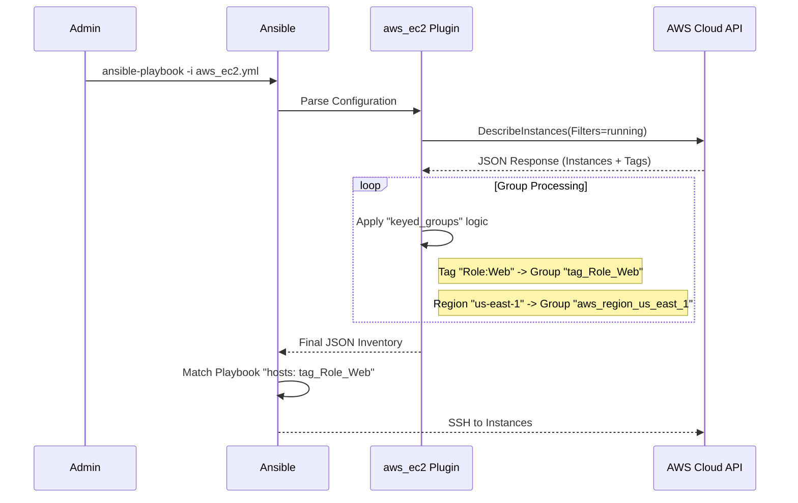

# 🟡 Level 2: Plugin-Based Inventory Management

## 📖 Overview

**Inventory Plugins** are the modern, standard way to do dynamic inventory. Unlike old scripts (which were just executable files), Plugins are integrated into the Ansible core. They are faster, easier to configure, and maintained by the Ansible community.

While `aws_ec2` is the most popular, plugins exist for **Azure, GCP, VMware, OpenStack, Docker, and Kubernetes**.

### The "Single Source of Truth" Strategy

Instead of updating a text file when you launch a server, you tag the server in the cloud. Ansible reads the tag and places the server in the correct group.

---

## 🏗️ Architecture & Flow

How does a plugin turn an API response into an inventory?



---

## 🛠️ The `aws_ec2` Plugin (Deep Dive)

The file **must** end in `.aws_ec2.yml` or `.aws_ec2.yaml` for Ansible to recognize it.

### 1. Basic Configuration

```yaml
plugin: aws_ec2
regions:
  - us-east-1
filters:
  # Only pick up instances that are actually alive
  instance-state-name: running
hostnames:
  # Use the private IP for SSH (Best for internal networks)
  - private-ip-address
```

### 2. The Power Feature: `keyed_groups`

This is how you organize chaos. You can create complex group structures dynamically.

```yaml
keyed_groups:
  # Create groups like "tag_Role_Web", "tag_Role_DB"
  - prefix: tag
    key: tags

  # Create groups based on Region: "aws_region_us_east_1"
  - prefix: aws_region
    key: placement.region

  # Create groups combining OS and Arch: "os_linux_x86_64"
  # This requires jinja2 parsing inside the key
  - prefix: os
    key: 'image.platform_details | default("unknown")'
```

### 3. Using `compose` (Advanced)

You can define Ansible variables *during* the discovery phase.

```yaml
compose:
  # Set the ansible_user dynamically based on the OS tag
  ansible_user: "'ubuntu' if tags.OS == 'Ubuntu' else 'ec2-user'"
```

---

## ☁️ Multi-Cloud Examples

The concepts are identical across providers, only the plugin name changes.

### Azure (`azure_rm`)

```yaml
plugin: azure_rm
auth_source: auto
include_vm_resource_groups:
  - my-resource-group
keyed_groups:
  - prefix: location
    key: location
```

### Google Cloud (`gcp_compute`)

```yaml
plugin: gcp_compute
projects:
  - my-gcp-project-id
auth_kind: serviceaccount
service_account_file: /path/to/json
```

---

## 🚀 Hands-On Lab: Test the Plugin

If you don't have active AWS credentials, you can simulate this by looking at the output of a `mock` run (or just trust the theory). If you DO have AWS access:

1. **Install Requirements**:
    ```bash
    pip install boto3 botocore
    ```
2. **Export Credentials**:
    ```bash
    export AWS_ACCESS_KEY_ID=AKIA...
    export AWS_SECRET_ACCESS_KEY=secret...
    ```
3. **Run the Graph**:
    ```bash
    ansible-inventory -i my.aws_ec2.yml --graph
    ```

**Expected Output**:

```text
@all:
  |--@aws_region_us_east_1:
  |  |--10.0.1.50
  |  |--10.0.1.51
  |--@tag_Role_Web:
  |  |--10.0.1.50
```

---

## ❓ Interview Preparation

1. **Q: Define `keyed_groups` in the context of Ansible Dynamic Inventory.**
   - **A:** It is a configuration directive that tells the inventory plugin how to map meta-data (like tags, regions, or OS info) into Ansible Groups. It allows dynamic grouping without manual definition.

2. **Q: How do you handle authentication securely?**
   - **A:** Never put keys in the YAML file. Use Environment Variables (`AWS_PROFILE`) or IAM Instance Roles if the control node is running in the cloud.

---

**Next Step**: [Level 3: Custom Inventory Scripts & Caching](../../part-003-advanced-strategies/01-custom-inventory-scripts-and-caching/) 🔴
