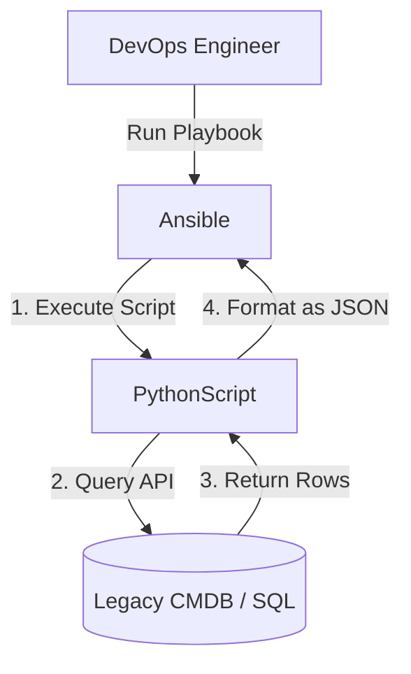
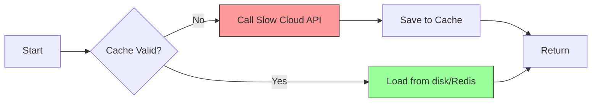

# 🔴 Level 3: Custom Inventory Scripts & Caching

## 📖 Overview

Sometimes, the "Standard Way" isn't enough.

-   What if your "cloud" is a custom SQL database?
-   What if your "inventory" is a spreadsheet managed by the finance team? (It happens!)
-   What if your API takes 30 seconds to respond, and you run Ansible every minute?

This level teaches you how to **Build Your Own Source of Truth** and **Make it Fast**.

---

## 🐍 Custom Inventory Scripts (Python)

If you can write code that outputs JSON, you can build an inventory.

### The Contract

Ansible will execute your script with arguments. You must handle them.

| Argument | Responsibility | Return Format |
| :--- | :--- | :--- |
| `--list` | Return **EVERYTHING**. Groups, hosts, and variables. | Huge JSON Object |
| `--host <name>` | Return variables for **ONE** specific host. | Small JSON Object |

> **Pro Tip**: If your `--list` output includes a `_meta` block with `hostvars`, Ansible will **never** call `--host`. This is highly recommended for performance.

### 🏗️ Script Architecture



### 🚀 Boilerplate: The "Perfect" Script

Save this as `my_inventory.py` and make it executable (`chmod +x`).

```python
#!/usr/bin/env python3
import json
import argparse
import sys

# Simulation of a slow Legacy DB call
def fetch_legacy_data():
    return [
        {"hostname": "legacy-web-01", "ip": "192.168.99.10", "role": "web"},
        {"hostname": "legacy-db-01", "ip": "192.168.99.20", "role": "db"}
    ]

def get_inventory():
    data = fetch_legacy_data()
    inventory = {
        "legacy_servers": {"hosts": [], "vars": {"provider": "on_prem"}},
        "_meta": {"hostvars": {}}
    }
    
    for server in data:
        # Add to group list
        inventory["legacy_servers"]["hosts"].append(server["hostname"])
        
        # Add variables to _meta (AVOIDS the N+1 API call issue)
        inventory["_meta"]["hostvars"][server["hostname"]] = {
            "ansible_host": server["ip"],
            "server_role": server["role"]
        }
    
    return inventory

def main():
    parser = argparse.ArgumentParser()
    parser.add_argument('--list', action='store_true')
    parser.add_argument('--host', action='store')
    args = parser.parse_args()

    if args.list:
        print(json.dumps(get_inventory(), indent=2))
    elif args.host:
        print(json.dumps({})) # Not needed because we used _meta
    else:
        sys.exit(1)

if __name__ == "__main__":
    main()
```

---

## ⚡ Inventory Caching (Performance Tuning)

If your inventory script/plugin takes 10 seconds to run, every `ansible` command waits 10 seconds. This is painful. Caching solves this.

### The Caching Workflow



### 🛠️ Converting your Configuration

Enable caching in your `ansible.cfg` or directly in the plugin file.

**Option A: ansible.cfg (Global)**

```ini
[inventory]
cache = True
cache_plugin = jsonfile
cache_connection = /tmp/ansible_inventory_cache
cache_timeout = 3600  # Cache remains valid for 1 hour
```

**Option B: Plugin-Specific (Better)**

Inside `aws_ec2.yml`:

```yaml
plugin: aws_ec2
# ... details ...
cache: yes
cache_plugin: jsonfile
cache_timeout: 7200
cache_connection: ./aws_inventory_cache
```

### 🧹 Cache Management commands

-   **Flush Cache**: `ansible-inventory -i aws_ec2.yml --flush-cache`
-   **Debug Cache**: Look at the file inside `cache_connection`. It's just JSON!

---

## 🧠 Debugging Dynamic Inventory

When things go wrong (and they will), use these tools.

1.  **The Graph View**:
    `ansible-inventory -i my_script.py --graph`
    *Does the hierarchy look right?*

2.  **The List View**:
    `ansible-inventory -i my_script.py --list`
    *Are variables appearing in `hostvars`?*

3.  **Verbose Mode**:
    `ansible-inventory -i aws_ec2.yml --list -vvv`
    *Seeing `Skipping: ...` warnings? This tells you why hosts were ignored (e.g., wrong region).*

---

## 🎓 Practice Challenge

**The Task:**

1.  Copy the python script above to `custom_inventory.py`.
2.  Modify the script to add a new group called `"database_servers"`.
3.  Modify the script to ensure `legacy-db-01` is in BOTH `"legacy_servers"` and `"database_servers"`.
4.  Run `ansible-inventory -i custom_inventory.py --graph` to verify.

---

**Completion**: You have completed the **Dynamic Inventory** module! You now possess the skills to manage 10 servers or 10,000 servers with equal ease.

Return to the [Module Index](../../readme.md) to continue your journey. 🏆
